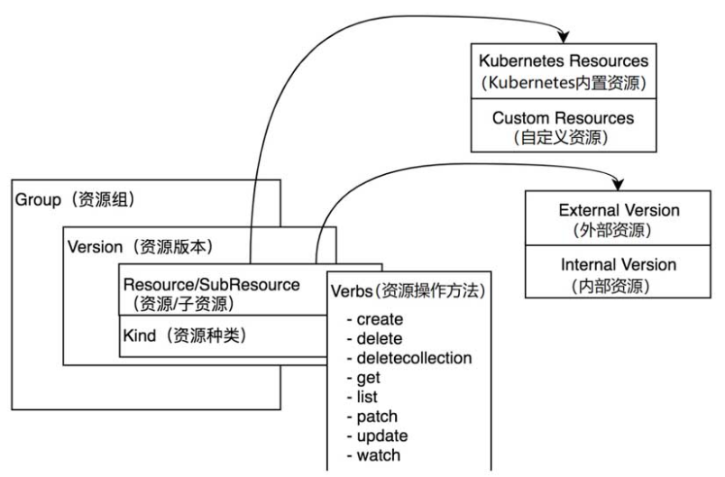

### 一、k8s中的核心数据结构

> 在k8s中整个生态都围绕着资源运作，k8s系统本质上是一个资源管理控制系统——注册、管理、调度资源并维护资源的状态。

#### 1.  Group、Version、Resource核心数据结构

在 k8s 中将资源进行了分组以及版本化，形成Group（资源组）、Resource（资源）、Version（资源版本），并通过下面四种数据结构来描述这些资源：

- Group：被称为资源组，在 kubernetes API Server 中可以称其为 APIGroup。
- Version：被称为资源版本，在 kubernetes API Server 中可以被其称为 APIVersion。
- Resource：被称为资源，在 kubernetes API Server 中也可被称为 APIResource。
- Kind：资源种类，描述 Resource 的种类，与 Resource 为同一级别。



在 k8s 中支持多个 Group，每个 Group 支持多个 Version，每个 Version 支持多个 Resource，其中部分资源会拥有自己的子资源，比如 Deployment 资源拥有 Status 子资源。资源组、资源版本、资源、子资源的完整表现形式为：`<group>/<version>/<resource>/<subresource>`，以 Deployment 为例，其表现形式为：`apps/v1/deployment/status`。

k8s 源码中通过实例化资源对象（Resource Object）来表达一个资源对象，资源对象由`"资源组+资源版本+资源种类"组成，比如 Deployment 资源实例化后拥有资源组、资源版本以及资源种类，其表现形式为`<group>/<version> Kind=<kind>`， 例如`apps/v1, Kind=Deployment`。

每一个资源都拥有一定数量的资源操作方法，在源码中叫 Verbs，资源方法用于 Rtcd 集群存储中对资源对象的增、删、改、查操作，目前支持8中资源操作方法：`create、delete、deletecollection、get、list、patch、update、watch`。

k8s 中资源版本被分为两类，分别是外部版本（External Version）和内部版本（Internal Version）。 外部版本用于对外暴露给用户请求的接口所使用的资源对象。内部版本不对外暴露，仅在 Kubernetes API Server 内部使用。

k8s 中资源也被分为两类，分别是 Kubernetes Resource（Kubernetes 内置资源）和 Custom Resource（自定义资源），开发者通过CRD（Custom Resource Definitions）实现自定义资源，它允许用户将自己定义的资源添加到 Kubernetes 系统中，并像使用 Kubernetes 内置资源一样使用他们。


```go
// APIResourceList is a list of APIResource, it is used to expose the name of the
// resources supported in a specific group and version, and if the resource
// is namespaced.
type APIResourceList struct {
	TypeMeta `json:",inline"`
	// groupVersion is the group and version this APIResourceList is for.
	GroupVersion string `json:"groupVersion" protobuf:"bytes,1,opt,name=groupVersion"`
	// resources contains the name of the resources and if they are namespaced.
	APIResources []APIResource `json:"resources" protobuf:"bytes,2,rep,name=resources"`
}

// APIResource specifies the name of a resource and whether it is namespaced.
type APIResource struct {
	// name is the plural name of the resource.
	Name string `json:"name" protobuf:"bytes,1,opt,name=name"`
	// singularName is the singular name of the resource.  This allows clients to handle plural and singular opaquely.
	// The singularName is more correct for reporting status on a single item and both singular and plural are allowed
	// from the kubectl CLI interface.
	SingularName string `json:"singularName" protobuf:"bytes,6,opt,name=singularName"`
	// namespaced indicates if a resource is namespaced or not.
	Namespaced bool `json:"namespaced" protobuf:"varint,2,opt,name=namespaced"`
	// group is the preferred group of the resource.  Empty implies the group of the containing resource list.
	// For subresources, this may have a different value, for example: Scale".
	Group string `json:"group,omitempty" protobuf:"bytes,8,opt,name=group"`
	// version is the preferred version of the resource.  Empty implies the version of the containing resource list
	// For subresources, this may have a different value, for example: v1 (while inside a v1beta1 version of the core resource's group)".
	Version string `json:"version,omitempty" protobuf:"bytes,9,opt,name=version"`
	// kind is the kind for the resource (e.g. 'Foo' is the kind for a resource 'foo')
	Kind string `json:"kind" protobuf:"bytes,3,opt,name=kind"`
	// verbs is a list of supported kube verbs (this includes get, list, watch, create,
	// update, patch, delete, deletecollection, and proxy)
	Verbs Verbs `json:"verbs" protobuf:"bytes,4,opt,name=verbs"`
	// shortNames is a list of suggested short names of the resource.
	ShortNames []string `json:"shortNames,omitempty" protobuf:"bytes,5,rep,name=shortNames"`
	// categories is a list of the grouped resources this resource belongs to (e.g. 'all')
	Categories []string `json:"categories,omitempty" protobuf:"bytes,7,rep,name=categories"`
	// The hash value of the storage version, the version this resource is
	// converted to when written to the data store. Value must be treated
	// as opaque by clients. Only equality comparison on the value is valid.
	// This is an alpha feature and may change or be removed in the future.
	// The field is populated by the apiserver only if the
	// StorageVersionHash feature gate is enabled.
	// This field will remain optional even if it graduates.
	// +optional
	StorageVersionHash string `json:"storageVersionHash,omitempty" protobuf:"bytes,10,opt,name=storageVersionHash"`
}

type Verbs []string
```


