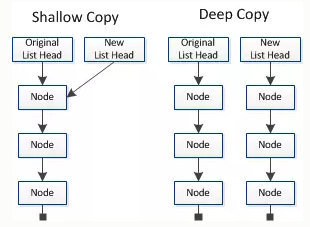

#### 1.  数据赋值

在编程语言中数据分为基本数据类型（int、string、float64....）和引用数据类型(指针)，基础数据类型是直接存储在栈中的数据，引用数据类型存储的是该对象在栈中的引用，真实的数据存放在堆内存中，引用数据类型在栈中存储了指针，该指针指向堆中该实体的起始地址，当解释器寻找引用值时，会首先检索其在栈中的地址，取得地址后从堆中获得实体。

我们在工作中会遇到很多的赋值操作，有时候我们只是想获取一个对象的值，有时候我们想应用一个对象，这两种不同的处理方式分别对应了`深拷贝和浅拷贝`。

#### 2. 深拷贝和浅拷贝

**浅拷贝**只是复制指向某个对象的指针，而不复制对象本身，新旧对象还是共享同一块内存。而**深拷贝**会另外创建一个一摸一样的对象，新旧对象不共享内存，因此两者的修改不会相互影响。

下图是深拷贝和浅拷贝对比的一张图：



需要注意的是深拷贝和浅拷贝只是针对 `struct` 和 `slice` 、`map`这样的引用数据类型。

#### 3. 举个例子

```go
package main

import "fmt"

func main() {
	var m = make(map[int]string)
	m[1] = "Hello World"
	m1 := m
	m1[1] = "m1"
	// map 的直接赋值是浅拷贝，m1 的修改会影响到m
	fmt.Println("m:", m, "m1:", m1)
	// 初始化 m2 用来对 m 深拷贝
	var m2 = make(map[int]string)
	for key, value := range m {
		m2[key] = value
	}
	m2[1] = "m2"
	// 深拷贝不会影响 m，它是一个新的对象
	fmt.Println("m:", m, "m2:", m2)

	var s struct {
		Message string
	}
	s.Message = "Hello World"
	s1 := s
	s1.Message = "s1"
	// struct 直接赋值是深拷贝，浅拷贝直接取地址
	fmt.Println("s:", s, "s1:", s1)

	var slice = []int{1, 2, 3}
	slice2 := slice
	slice2 = append(slice2, 4)
	// slice 直接赋值是深拷贝，浅拷贝直接取地址
	fmt.Println("slice:", slice, "slice2:", slice2)
}
```

