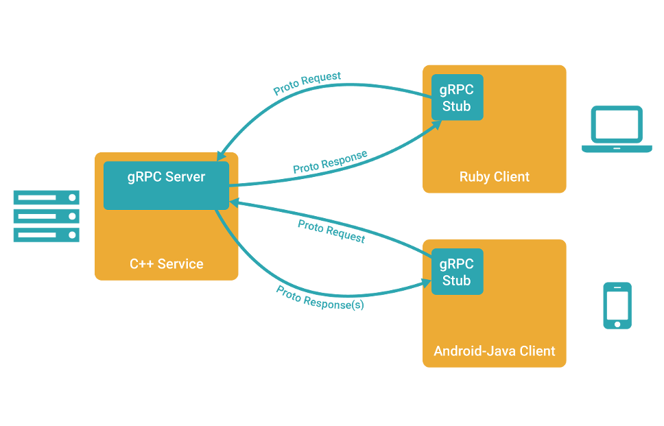

### 一、gRPC 入门

#### 1. RPC 原理

RPC 框架的目标就是让远程服务调用更加简单、透明，RPC 框架负责屏蔽底层的传输方式（TCP 或者 UDP）、序列化方式（XML/Json/ 二进制）和通信细节。服务调用者可以像调用本地接口一样调用远程的服务提供者，而不需要关心底层通信细节和调用过程。

RPC 框架的调用原理图如下所示：


业界主流的 RPC 框架整体上分为三类：

- 支持多语言的 RPC 框架，比较成熟的有 Google 的 gRPC、Apache（Facebook）的 Thrift；
- 只支持特定语言的 RPC 框架，例如新浪微博的 Motan；
- 支持服务治理等服务化特性的分布式服务框架，其底层内核仍然是 RPC 框架, 例如阿里的 Dubbo。

随着微服务的发展，基于语言中立性原则构建微服务，逐渐成为一种主流模式，例如对于后端并发处理要求高的微服务，比较适合采用 Go 语言构建，而对于前端的 Web 界面，则更适合 Java 和 JavaScript。因此，基于多语言的 RPC 框架来构建微服务，是一种比较好的技术选择。例如 Netflix，API 服务编排层和后端的微服务之间就采用 gRPC 进行通信。

#### 2. gRPC 是什么

> 在 gRPC 里*客户端*应用可以像调用本地对象一样直接调用另一台不同的机器上*服务端*应用的方法，使得您能够更容易地创建分布式应用和服务。与许多 RPC 系统类似，gRPC 也是基于以下理念：定义一个*服务*，指定其能够被远程调用的方法（包含参数和返回类型）。在服务端实现这个接口，并运行一个 gRPC 服务器来处理客户端调用。在客户端拥有一个*存根*能够像服务端一样的方法。



gRPC 客户端和服务端可以在多种环境中运行和交互 - 从 google 内部的服务器到你自己的笔记本，并且可以用任何 gRPC [支持的语言](http://doc.oschina.net/grpc?t=58008#quickstart)来编写。所以，你可以很容易地用 Java 创建一个 gRPC 服务端，用 Go、Python、Ruby 来创建客户端。此外，Google 最新 API 将有 gRPC 版本的接口，使你很容易地将 Google 的功能集成到你的应用里。

**gRPC 具有以下特点：**

- 多语言：语言中立，支持多种语言。
- 轻量级、高性能：序列化支持 PB(Protocol Buffer)和 JSON，PB 是一种语言无关的高性能序列化框架。
- 可插拔。

- IDL：基于文件定义服务，通过 proto3 工具生成指定语言的数据结构、服务端接口以及客户端 Stub。

- 移动端：基于标准的 HTTP2设计，支持双向流、消息头压缩、单 TCP 的多路复用、服务端推送等特性，这些特性使得 gRPC 在移动端设备上更加省电和节省网络流量。

#### 3. protocol buffers

gRPC 默认使用 protocol buffers，这是 Google 开源的一套成熟的结构数据序列化机制（当然也可以使用其他数据格式如 JSON）。正如你将在下方例子里所看到的，你用 proto files 创建 gRPC 服务，用 protocol buffers 消息类型来定义方法参数和返回类型。你可以在 [Protocol Buffers 文档](http://doc.oschina.net/https：//developers.google.com/protocol-buffers/docs/overview)找到更多关于 Protocol Buffers 的资料。

举个例子，我们定义一个接口文档，内容如下：

```protobuf
syntax = "proto3";

// 指定 go 语言包名
option go_package = ".;main";

package helloworld;

// The greeter service definition.
service Greeter {
  // Sends a greeting
  rpc SayHello (HelloRequest) returns (HelloReply) {}
}

// The request message containing the user's name.
message HelloRequest {
  string name = 1;
}

// The response message containing the greetings
message HelloReply {
  string message = 1;
}
```

我们通过命令生成 Go 程序：

```bash
$ protoc --go_out=. --go_opt=paths=source_relative --go-grpc_out=. --go-grpc_opt=paths=source_relative helloworld.proto
```

编写 Go 服务端程序实现接口：

```go
package main

import (
	"context"
	"log"
	"net"
	"google.golang.org/grpc"
)

const (
	port = ":50051"
)

// server is used to implement helloworld.GreeterServer.
type server struct {
	UnimplementedGreeterServer
}

// SayHello implements helloworld.GreeterServer
func (s *server) SayHello(ctx context.Context, in *HelloRequest) (*HelloReply, error) {
	log.Printf("Received: %v", in.GetName())
	return &HelloReply{Message: "Hello " + in.GetName()}, nil
}

func main() {
	lis, err := net.Listen("tcp", port)
	if err != nil {
		log.Fatalf("failed to listen: %v", err)
	}
	s := grpc.NewServer()
	RegisterGreeterServer(s, &server{})
	if err := s.Serve(lis); err != nil {
		log.Fatalf("failed to serve: %v", err)
	}
}
```

编写 Go 客户端程序：

```go
package main

import (
	"context"
	"log"
	"os"
	"time"
	"google.golang.org/grpc"
)

const (
	address     = "localhost:50051"
	defaultName = "world"
)

func main() {
	// Set up a connection to the server.
	conn, err := grpc.Dial(address, grpc.WithInsecure(), grpc.WithBlock())
	if err != nil {
		log.Fatalf("did not connect: %v", err)
	}
	defer conn.Close()
	c := NewGreeterClient(conn)

	// Contact the server and print out its response.
	name := defaultName
	if len(os.Args) > 1 {
		name = os.Args[1]
	}
	ctx, cancel := context.WithTimeout(context.Background(), time.Second)
	defer cancel()
	r, err := c.SayHello(ctx, &HelloRequest{Name: name})
	if err != nil {
		log.Fatalf("could not greet: %v", err)
	}
	log.Printf("Greeting: %s", r.GetMessage())
}
```

<font color=red size=4>关于 Go 语言如何配置 protocol buffers 环境，可以参考我的另一篇博客：[Windows系统安装 protocol buffers](https://blog.csdn.net/random_w/article/details/108194927)</font>

#### 4. protoc 常用命令介绍

### 二、服务端创建和调用

#### 1. 服务端

编写 proto 文件定义一个服务：

```protobuf
syntax = "proto3";

option go_package = ".;main";

package helloworld;

// The greeter service definition.
service Greeter {
  // Sends a greeting
  rpc SayHello (HelloRequest) returns (HelloReply) {}
}

// The request message containing the user's name.
message HelloRequest {
  string name = 1;
}

// The response message containing the greetings
message HelloReply {
  string message = 1;
}
```

生成服务端代码：

```bash
$ protoc --go_out=. \ 
  --go_opt=paths=source_relative \
  --go-grpc_out=. \
  --go-grpc_opt=paths=source_relative helloworld.proto
```


#### 2. 服务端调用流程

gRPC 服务端创建采用 Build 模式，对底层服务绑定、transportServer 和 NettyServer 的创建和实例化做了封装和屏蔽，让服务调用者不用关心 RPC 调用细节，整体上分为三个过程：

- 创建 HTTP/2 服务端；
- 将需要调用的服务端接口实现类注册到内部的 Registry 中，RPC 调用时，可以根据 RPC 请求消息中的服务定义信息查询到服务接口实现类；
- 创建 gRPC Server，它是 gRPC 服务端的抽象，聚合了各种 Listener，用于 RPC 消息的统一调度和处理。

下面我们看下 gRPC 服务端创建流程：


#### 3. 服务端 service 调用流程

gRPC 的客户端请求消息由 Netty Http2ConnectionHandler 接入，由 gRPC 负责将 PB 消息（或者 JSON）反序列化为 POJO 对象，然后通过服务定义查询到该消息对应的接口实例，发起本地 Java 接口调用，调用完成之后，将响应消息序列化为 PB（或者 JSON），通过 HTTP2 Frame 发送给客户端。流程并不复杂，但是细节却比较多，整个 service 调用可以划分为如下四个过程：

- gRPC 请求消息接入；
- gRPC 消息头和消息体处理；内
- 部的服务路由和调用；
- 响应消息发送。

### 三、客户端创建和调用

#### 1. 客户端调用总体流程


### 四、gRPC 线程模型

#### 1. RPC 性能三原则

影响 RPC 框架性能的三个核心要素如下：

- I/O 模型：用什么样的通道将数据发送给对方，BIO、NIO 或者 AIO，IO 模型在很大程度上决定了框架的性能；
- 协议：采用什么样的通信协议，Rest+ JSON 或者基于 TCP 的私有二进制协议，协议的选择不同，性能模型也不同，相比于公有协议，内部私有二进制协议的性能通常可以被设计的更优；
- 线程：数据报如何读取？读取之后的编解码在哪个线程进行，编解码后的消息如何派发，通信线程模型的不同，对性能的影响也非常大。

以上三个要素中，线程模型对性能的影响非常大。随着硬件性能的提升，CPU 的核数越来越越多，很多服务器标配已经达到 32 或 64 核。通过多线程并发编程，可以充分利用多核 CPU 的处理能力，提升系统的处理效率和并发性能。但是如果线程创建或者管理不当，频繁发生线程上下文切换或者锁竞争，反而会影响系统的性能。线程模型的优劣直接影响了 RPC 框架的性能和并发能力，它也是大家选型时比较关心的技术细节之一。

gRPC 的线程模型主要包括服务端线程模型和客户端线程模型，服务端线程模型主要包括：

- 服务端监听和客户端接入线程（HTTP /2 Acceptor）
- 网络 I/O 读写线程
- 服务接口调用线程

客户端线程模型主要包括：

- 客户端连接线程（HTTP/2 Connector）
- 网络 I/O 读写线程
- 接口调用线程
- 响应回调通知线程

#### 2. 客户端线程模型


#### 3. 客户端线程模型

### 五、gRPC 服务调用原理

### 六、gRPC 安全性设计

### 七、gRPC 序列化机制


**Reference:**

- http://doc.oschina.net/grpc?t=58010
- https://www.grpc.io/docs/what-is-grpc/core-concepts/