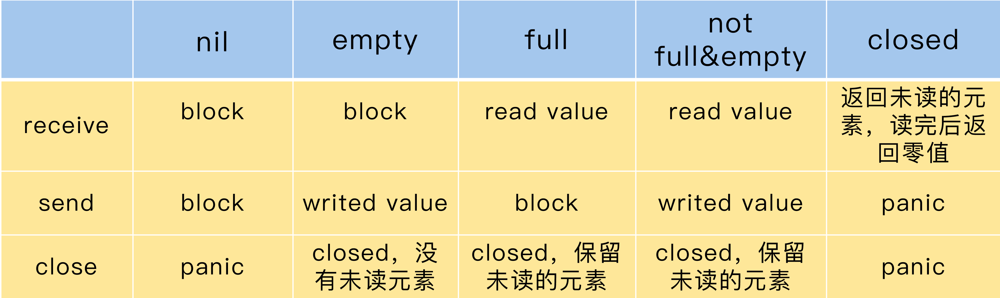

### 一、并发和并行

#### 1. 并发（Concurrent）

> 当有多个线程在操作时,如果系统只有一个CPU,则它根本不可能真正同时进行一个以上的线程，它只能把CPU运行时间划分成若干个时间段,再将时间 段分配给各个线程执行，在一个时间段的线程代码运行时，其它线程处于挂起状。.这种方式我们称之为并发(Concurrent)。

操作系统并发程序执行的特点:

并发环境下，由于程序的封闭性被打破，出现了新的特点：

- 程序与计算不再一一对应，一个程序副本可以有多个计算

- 并发程序之间有相互制约关系，直接制约体现为一个程序需要另一个程序的计算结果，间接制约体现为多个程序竞争某一资源，如处理机、缓冲区等。

- 并发程序在执行中是走走停停，断续推进的。

#### 2. 并行（Parallellism）

> 当系统有一个以上CPU时,则线程的操作有可能非并发。当一个CPU执行一个线程时，另一个CPU可以执行另一个线程，两个线程互不抢占CPU资源，可以同时进行，这种方式我们称之为并行(Parallellism)。


#### 3. 并发和并行的区别

**并发**和**并行**是即相似又有区别的两个概念，**并行**是指两个或者多个事件在同一时刻发生；而并发是指两个或多个事件在同一时间间隔内发生。在多道程序环境下，并发性是指在一段时间内宏观上有多个程序在同时运行，但在单处理机系统中，每一时刻却仅能有一道程序执行，故微观上这些程序只能是分时地交替执行。倘若在计算机系统中有多个处理机，则这些可以并发执行的程序便可被分配到多个处理机上，实现并行执行，即利用每个处理机来处理一个可并发执行的程序，这样，多个程序便可以同时执行。

### 二、Goroutine 最佳实践

#### 1. Goroutine

#### 2. 优雅的处理 panic

#### 3. 把并行扔给调用者

这里是官方对 Go 语言内存模型的解读: https://golang.org/ref/mem

### 三、Go 语言内存模型

#### 1. happen-before

> happens-before，这是用来描述两个时间的顺序关系的。如果某些操作能提供 happens-before 关系，那么，我们就可以 100% 保证它们之间的顺序。happens-before 关系指在一个 goroutine 内部，程序的执行顺序和它们的代码指定的顺序是一样的，即使编译器或者 CPU 重排了读写顺序，从行为上来看，也和代码指定的顺序一样。

#### 2. 同步

#### 3. 底层的 memory recordering(可以挖一挖 cpu cacline、锁总线、mesi、memory barrier)

### 四、Go语言并发原语

#### 1. 锁 

在 Go 语言并发编程中我们经常会通过锁的方式处理**数据竞争**带来的并发不安全的问题，那么什么是**数据竞争**呢？看下面的例子：

```go
package main

import "fmt"

func main() {
	fmt.Println(getNumber())
}

func getNumber() int {
	var i int
	go func() {
		i = 5
	}()
	return i
}
```

我们通过`-race`参数检测程序是否存在数据竞争：

```bash
$ go run -race main.go
0
==================
WARNING: DATA RACE
Write at 0x00c00000c0e0 by goroutine 6:
  main.getNumber.func1()
      F:/A_StudyDocument/Code/Golang/Study/study/main.go:12 +0x3f

Previous read at 0x00c00000c0e0 by main goroutine:
  main.getNumber()
      F:/A_StudyDocument/Code/Golang/Study/study/main.go:14 +0x8f
  main.main()
      F:/A_StudyDocument/Code/Golang/Study/study/main.go:6 +0x3a

Goroutine 6 (running) created at:
  main.getNumber()
      F:/A_StudyDocument/Code/Golang/Study/study/main.go:11 +0x81
  main.main()
      F:/A_StudyDocument/Code/Golang/Study/study/main.go:6 +0x3a
==================
Found 1 data race(s)
exit status 66
```

可以看到这个程序中存在数据竞争，这段程序的`getNumber`函数开启了一个单独的`goroutine`设置变量`i`的值，同时在不知道开启的`goroutine`是否已经执行完成的情况下返回了`i`。所以现在正在发生两个操作：

- 变量`i`的值正在被设置成5。
- 函数`getNumber`返回了变量`i`的值。

`getNumber`返回的值根据操作1或操作2中的哪一个最先完成而不同，这就是为什么它被称为数据竞争。

我们可以通过加锁的方式避免数据竞争的发生，在 Go 语言中有两种锁：

**Mutex 互斥锁**适用于同一时刻只能有一个读或写的场景。

**RWMutex 读写锁**允许有多个读锁，但只能有一个写锁。适用于“多读少写”场景。

#### 3. sync.WaitGroup

#### 4. sync.Cond

#### 5. sync.Once

#### 6. sync.map

#### 7. sync.Pool

#### 8. context

### 五、原子操作

#### 1. 原子操作

#### 2. atomic 应用场景

#### 3. atomic 提供的方法

#### 4. atomic 第三方扩展库

### 六、Channel

#### 1.  为什么会有Channel

 1978 年计算机科学家 Tony Hoare 发表的论文中（你可能不熟悉 Tony Hoare 这个名字，但是你一定很熟悉排序算法中的 Quicksort 算法，他就是 Quicksort 算法的作者，图灵奖的获得者）提出了 **CSP（ Communicating Sequential Process：通信顺序进程）** 这个概念。最初，论文中提出的 CSP 版本在本质上不是一种进程演算，而是一种并发编程语言，但之后又经过了一系列的改进，最终发展并精炼出 CSP 的理论。CSP 允许使用进程组件来描述系统，它们独立运行，并且只通过消息传递的方式通信。

CSP 允许使用进程组件来描述系统，它们独立运行，并且只通过消息传递的方式通信。就像 Go 的创始人之一 Rob Pike 所说的：“每一个计算机程序员都应该读一读 Tony Hoare 1978 年的关于 CSP 的论文。”他和 Ken Thompson 在设计 Go 语言的时候也深受此论文的影响，并将 CSP 理论真正应用于语言本身（Russ Cox 专门写了一篇文章记录这个历史），通过引入 Channel 这个新的类型，来实现 CSP 的思想。

#### 2. Channel 基本使用

在 Go 语言中 Channel 分为三类：

- 只能发送的Channel：`chan<- ElementType`
- 只能接收的Channel： `<-chan ElementType`
- 即可以发送又能接收的Channel：`chan ElementType`

我们把既能接收又能发送的 chan 叫做双向的 chan，把只能发送和只能接收的 chan 叫做单向的 chan。使用`make`初始化一个Channel:

```go
// 即可以发送又能接收的Channel
var Channel1 = make(chan string)
// 只能接收的Channel
var Channel2 = make(chan<- string)
// 只能发送的Channel
var Channel3 = make(<-chan string)
```

<font color=red size=3>注意：`<-`有个规则，总是尽量和左边的 chan 结合（The <- operator associates with the leftmost chan possible:）。</font>

Channel 可以用来进行数据的发送与接收，通过`select`关键字监控Channel中是否有数据：：

```go
func main() {
	var Channel1 = make(chan string)
	go func() {
		Channel1 <- "hello world"
	}()

	select {
	case msg := <-Channel1:
		fmt.Println(msg)
	}
}
```

我们也可以通过`for range` 遍历Channel中的值：

```go
for v := range Channel1 {
    fmt.Println(v) 
}
```

我们也可以通过下面的方式清空Channel:

```go
for range Channel1 { }
```

关闭Channel:

```go
close(Channel1)
```

知道了 Channel 的基本操作后，我们需要注意使用 Channel 的正确姿势，我们来看下面的程序：

```go
func main() {
	var Channel1 = make(chan string)
	Channel1 <- "hello world"
	fmt.Println(<-Channel1)
}
```

学完Channel的基本只用你可能会像我一样急忙测试一下，结果，这样的代码居然会`panic`:

```bash
$ go run main.go
fatal error: all goroutines are asleep - deadlock!

goroutine 1 [chan send]:
main.main()
        F:/A_StudyDocument/Code/Golang/Study/study/main.go:10 +0x60
exit status 2
```

为什么会这样呢，首先我们这里通过make(chan chan)，开辟的通道是一种无缓冲通道，所以当对这个缓冲通道写的时候，会一直阻塞等到某个协程对这个缓冲通道读，因此执行完写操作 main 函数就会被阻塞，他无法执行到`fmt.Println(<-Channel1)"`，因此产生了死锁。我们可以通过起一个 Goroutine 的方式解决这个问题：

```go
func main() {
	var Channel1 = make(chan string)
	go func() {
		Channel1 <- "hello world"
	}()
	fmt.Println(<-Channel1)
}
```

我们再看一个例子：

```go
func main() {
	var Channel1 = make(chan string)
	go func() {
		for i := 0; i < 3; i++ {
			Channel1 <- fmt.Sprintf("hello world-%d", i+1)
		}
	}()
	for msg := range Channel1 {
		fmt.Println(msg)
	}
}
```

执行这个程序后仍然会报死锁的问题：

```go
$ go run main.go
hello world-1
hello world-2
hello world-3
fatal error: all goroutines are asleep - deadlock!

goroutine 1 [chan receive]:
main.main()
        F:/A_StudyDocument/Code/Golang/Study/study/main.go:24 +0xfc
exit status 2
```

原因是我们创建的 Goroutine 停止写数据后，Channel 会同样阻塞，导致main函数无法退出，从而产生死锁，我们这时候可以通过关闭Channel的方式，避免 main函数被阻塞：

```go
func main() {
	var Channel1 = make(chan string)
	go func() {
		for i := 0; i < 3; i++ {
			Channel1 <- fmt.Sprintf("hello world-%d", i+1)
		}
		close(Channel1)
	}()
	for msg := range Channel1 {
		fmt.Println(msg)
	}
}
```

有一个值得注意的点是，只要一个 chan 还有未读的数据，即使把它 close 掉，你还是可以继续把这些未读的数据消费完，之后才是读取零值数据，如下图：



#### 3. Channel 的应用场景

在 2015 年的一次 Gopher 会议中 Rob Pike 提到说过：`Don’t communicate by sharing memory, share memory by communicating. `虽然有一点绕，但也指出了使用 Go 语言的哲学，这句话大概的意思是：“执行业务处理的 goroutine 不要通过共享内存的方式通信，而是要通过 Channel 通信的方式分享数据。”

“communicate by sharing memory”和“share memory by communicating”是两种不同的并发处理模式。“communicate by sharing memory”是传统的并发编程处理方式，就是指，共享的数据需要用锁进行保护，goroutine 需要获取到锁，才能并发访问数据。

“share memory by communicating”则是类似于 CSP 模型的方式，通过通信的方式，一个 goroutine 可以把数据的“所有权”交给另外一个 goroutine（虽然 Go 中没有“所有权”的概念，但是从逻辑上说，你可以把它理解为是所有权的转移）。

从 Channel 的历史和设计哲学上，我们就可以了解到，Channel 类型和基本并发原语是有竞争关系的，它应用于并发场景，涉及到 goroutine 之间的通讯，可以提供并发的保护，等等。

在第二节中我们学习了Channel的基本使用，我们可以通过`select`关键字监听Channel中的数据，这种只适用于少量的Channel，试想一下，如果有一万个Channel需要监听，我们该如何做呢？

**使用反射操作 Channel**

通过 reflect.Select 函数，你可以将一组运行时的 case clause 传入，当作参数执行。Go 的 select 是伪随机的，它可以在执行的 case 中随机选择一个 case，并把选择的这个 case 的索引（chosen）返回，如果没有可用的 case 返回，会返回一个 bool 类型的返回值，这个返回值用来表示是否有 case 成功被选择。如果是 recv case，还会返回接收的元素。Select 的方法如下：

```go
func Select(cases []SelectCase) (chosen int, recv Value, recvOK bool)
```


**Channel** 的应用场景主要分为下面五种：

**数据交流**：当作并发的 buffer 或者 queue，解决生产者 - 消费者问题。多个 goroutine 可以并发当作生产者（Producer）和消费者（Consumer）。

如下面这个例子：

```go

```

**数据传递**：一个 goroutine 将数据交给另一个 goroutine，相当于把数据的拥有权 (引用) 托付出去。

下面举个例子，我们通过 Channel 控制 goroutine，按顺序输出1、2、3、4：

```go
type Token struct{}

func newWorker(id int, ch chan Token, nextCh chan Token) {
	for {
		token := <-ch         // 取得令牌
		fmt.Println((id + 1)) // id从1开始
		time.Sleep(time.Second)
		nextCh <- token
	}
}
func main() {
	chs := []chan Token{make(chan Token), make(chan Token), make(chan Token), make(chan Token)}
	// 创建4个worker
	for i := 0; i < 4; i++ {
		go newWorker(i, chs[i], chs[(i+1)%4])
	}

	//首先把令牌交给第一个worker
	chs[0] <- struct{}{}

	select {}
}
```


**信号通知**：一个 goroutine 可以将信号 (closing、closed、data ready 等) 传递给另一个或者另一组 goroutine 。

下面举个例子，我们通过 Channel 监控系统关闭信号：

```go
func main() {
    var closing = make(chan struct{})
    var closed = make(chan struct{})

    go func() {
        // 模拟业务处理
        for {
            select {
            case <-closing:
                return
            default:
                // ....... 业务计算
                time.Sleep(100 * time.Millisecond)
            }
        }
    }()

    // 处理CTRL+C等中断信号
    termChan := make(chan os.Signal)
    signal.Notify(termChan, syscall.SIGINT, syscall.SIGTERM)
    <-termChan

    close(closing)
    // 执行退出之前的清理动作
    go doCleanup(closed)

    select {
    case <-closed:
    case <-time.After(time.Second):
        fmt.Println("清理超时，不等了")
    }
    fmt.Println("优雅退出")
}

func doCleanup(closed chan struct{}) {
    time.Sleep((time.Minute))
    close(closed)
}
```


**锁**：利用 Channel 也可以实现互斥锁的机制。要想使用 chan 实现互斥锁，至少有两种方式。一种方式是先初始化一个 capacity 等于 1 的 Channel，然后再放入一个元素。这个元素就代表锁，谁取得了这个元素，就相当于获取了这把锁。另一种方式是，先初始化一个 capacity 等于 1 的 Channel，它的“空槽”代表锁，谁能成功地把元素发送到这个 Channel，谁就获取了这把锁。

下面举个例子：

```go

// 使用chan实现互斥锁
type Mutex struct {
    ch chan struct{}
}

// 使用锁需要初始化
func NewMutex() *Mutex {
    mu := &Mutex{make(chan struct{}, 1)}
    mu.ch <- struct{}{}
    return mu
}

// 请求锁，直到获取到
func (m *Mutex) Lock() {
    <-m.ch
}

// 解锁
func (m *Mutex) Unlock() {
    select {
    case m.ch <- struct{}{}:
    default:
        panic("unlock of unlocked mutex")
    }
}

// 尝试获取锁
func (m *Mutex) TryLock() bool {
    select {
    case <-m.ch:
        return true
    default:
    }
    return false
}

// 加入一个超时的设置
func (m *Mutex) LockTimeout(timeout time.Duration) bool {
    timer := time.NewTimer(timeout)
    select {
    case <-m.ch:
        timer.Stop()
        return true
    case <-timer.C:
    }
    return false
}

// 锁是否已被持有
func (m *Mutex) IsLocked() bool {
    return len(m.ch) == 0
}


func main() {
    m := NewMutex()
    ok := m.TryLock()
    fmt.Printf("locked v %v\n", ok)
    ok = m.TryLock()
    fmt.Printf("locked %v\n", ok)
}
```


**任务编排**：可以让一组 goroutine 按照一定的顺序并发或者串行的执行，这就是编排的功能。chan 的编排方式，总共 5 种，分别是 Or-Done 模式、扇入模式、扇出模式、Stream 和 map-reduce。

**Or-Done模式：**Or-Done 模式是信号通知模式中更宽泛的一种模式。我们会使用**“信号通知”**实现某个任务执行完成后的通知机制，在实现时，我们为这个任务定义一个类型为 chan struct{}类型的 done 变量，等任务结束后，我们就可以 close 这个变量，然后，其它 receiver 就会收到这个通知。这是有一个任务的情况，如果有多个任务，只要有任意一个任务执行完，我们就想获得这个信号，这就是 Or-Done 模式。

下面举个例子，比如，你发送同一个请求到多个微服务节点，只要任意一个微服务节点返回结果，就算成功：

```go

func or(channels ...<-chan interface{}) <-chan interface{} {
    // 特殊情况，只有零个或者1个chan
    switch len(channels) {
    case 0:
        return nil
    case 1:
        return channels[0]
    }

    orDone := make(chan interface{})
    go func() {
        defer close(orDone)

        switch len(channels) {
        case 2: // 2个也是一种特殊情况
            select {
            case <-channels[0]:
            case <-channels[1]:
            }
        default: //超过两个，二分法递归处理
            m := len(channels) / 2
            select {
            case <-or(channels[:m]...):
            case <-or(channels[m:]...):
            }
        }
    }()

    return orDone
}
```

**扇入模式：**扇入借鉴了数字电路的概念，它定义了单个逻辑门能够接受的数字信号输入最大量的术语。一个逻辑门可以有多个输入，一个输出。在软件工程中，模块的扇入是指有多少个上级模块调用它。而对于我们这里的 Channel 扇入模式来说，就是指有多个源 Channel 输入、一个目的 Channel 输出的情况。扇入比就是源 Channel 数量比 1。每个源 Channel 的元素都会发送给目标 Channel，相当于目标 Channel 的 receiver 只需要监听目标 Channel，就可以接收所有发送给源 Channel 的数据。

**扇出模式：**扇出模式只有一个输入源 Channel，有多个目标 Channel，扇出比就是 1 比目标 Channel 数的值，经常用在设计模式中的观察者模式中（观察者设计模式定义了对象间的一种一对多的组合关系。这样一来，一个对象的状态发生变化时，所有依赖于它的对象都会得到通知并自动刷新）。在观察者模式中，数据变动后，多个观察者都会收到这个变更信号。

下面是一个扇出模式的实现。从源 Channel 取出一个数据后，依次发送给目标 Channel。在发送给目标 Channel 的时候，可以同步发送，也可以异步发送：

```go

func fanOut(ch <-chan interface{}, out []chan interface{}, async bool) {
    go func() {
        defer func() { //退出时关闭所有的输出chan
            for i := 0; i < len(out); i++ {
                close(out[i])
            }
        }()

        for v := range ch { // 从输入chan中读取数据
            v := v
            for i := 0; i < len(out); i++ {
                i := i
                if async { //异步
                    go func() {
                        out[i] <- v // 放入到输出chan中,异步方式
                    }()
                } else {
                    out[i] <- v // 放入到输出chan中，同步方式
                }
            }
        }
    }()
}
```

**Stream：**我们可以把 Channel 当作流式管道的方式来使用，也就是把 Channel 看作流（Stream），提供跳过几个元素，或者是只取其中的几个元素等方法。

**map-reduce:**  map-reduce 是一种处理数据的方式，最早是由 Google 公司研究提出的一种面向大规模数据处理的并行计算模型和方法，开源的版本是 hadoop，前几年比较火。map-reduce 分为两个步骤，第一步是映射（map），处理队列中的数据，第二步是规约（reduce），把列表中的每一个元素按照一定的处理方式处理成结果，放入到结果队列中。

#### 4. Channel 基本原理

#### 5. 如何保证读写的顺序

### 七、扩展并发原语

#### 1. Semaphore

> 信号量的概念是荷兰计算机科学家 Edsger Dijkstra 在 1963 年左右提出来的，广泛应用在不同的操作系统中。在系统中，会给每一个进程一个信号量，代表每个进程目前的状态。未得到控制权的进程，会在特定的地方被迫停下来，等待可以继续进行的信号到来。

最简单的信号量就是一个变量加一些并发控制的能力，这个变量是 0 到 n 之间的一个数值。当 goroutine 完成对此信号量的等待（wait）时，该计数值就减 1，当 goroutine 完成对此信号量的释放（release）时，该计数值就加 1。当计数值为 0 的时候，goroutine 调用 wait 等待该信号量是不会成功的，除非计数器又大于 0，等待的 goroutine 才有可能成功返回。更复杂的信号量类型，就是使用抽象数据类型代替变量，用来代表复杂的资源类型。

**P/V 操作：**Dijkstra 在他的论文中为信号量定义了两个操作 P 和 V。P 操作（descrease、wait、acquire）是减少信号量的计数值，而 V 操作（increase、signal、release）是增加信号量的计数值。

我们可以通过下面的方式实现P/V操作：

- 初始化信号量：设定初始的资源的数量。
- P 操作：将信号量的计数值减去 1，如果新值已经为负，那么调用者会被阻塞并加入到等待队列中。否则，调用者会继续执行，并且获得一个资源。
- V 操作：将信号量的计数值加 1，如果先前的计数值为负，就说明有等待的 P 操作的调用者。它会从等待队列中取出一个等待的调用者，唤醒它，让它继续执行。

信号量可以分为计数信号量（counting semaphre）和二进位信号量（binary semaphore）。计数信号量是指它的计数可以是任意一个整数。而在特殊的情况下，如果计数值只能是 0 或者 1，那么，这个信号量就是二进位信号量，提供了互斥的功能（要么是 0，要么是 1），所以，有时候互斥锁也会使用二进位信号量来实现。我们一般用信号量保护一组资源，比如数据库连接池、一组客户端的连接、几个打印机资源，等等。如果信号量蜕变成二进位信号量，那么，它的 P/V 就和互斥锁的 Lock/Unlock 一样了。

**信号量在 Go 官方扩展库的实现:**  在 Go 语言内部通过信号量的方式控制 Goroutine 的阻塞和唤醒，信号量的 P/V 操作是通过函数实现的：

```go
func runtime_Semacquire(s *uint32)
func runtime_SemacquireMutex(s *uint32, lifo bool, skipframes int)
func runtime_Semrelease(s *uint32, handoff bool, skipframes int)
```

但这些方法并没有对外暴漏出来，只会给 Go 内部运行时使用，但是 Go 语言官方[扩展包 golang.org/x/sync/semaphore](https://godoc.org/golang.org/x/sync/semaphore)中提供了相关的方法：

- func NewWeighted(n int64) *Weighted

  > NewWeighted 函数会为并发访问创建一个具有给定最大组合权重的新加权信号量。

- func (s *Weighted) Acquire(ctx context.Context, n int64) error

  > Acquire 方法：相当于 P 操作，你可以一次获取多个资源，如果没有足够多的资源，调用者就会被阻塞。它的第一个参数是 Context，这就意味着，你可以通过 Context 增加超时或者 cancel 的机制。如果是正常获取了资源，就返回 nil；否则，就返回 ctx.Err()，信号量不改变。

- func (s *Weighted) Release(n int64)

  > Release 方法：相当于 V 操作，可以将 n 个资源释放，返还给信号量。

- func (s *Weighted) TryAcquire(n int64) bool

  > TryAcquire 方法：尝试获取 n 个资源，但是它不会阻塞，要么成功获取 n 个资源，返回 true，要么一个也不获取，返回 false。

下面举个例子：

```go
package main

import (
	"context"
	"fmt"
	"golang.org/x/sync/semaphore"
	"log"
	"runtime"
	"time"
)

// 我们创建和 CPU 核数一样多的 Worker，让它们去处理一个 4 倍数量的整数 slice。
// 每个 Worker 一次只能处理一个整数，处理完之后，才能处理下一个。
var (
	maxWorkers = runtime.GOMAXPROCS(0)                    // worker数量
	sema       = semaphore.NewWeighted(int64(maxWorkers)) // 信号量
	task       = make([]int, maxWorkers*4)                // 任务数，是worker的四倍
)

func main() {
	ctx := context.Background()

	for i := range task {
		// 如果没有worker可用，会阻塞在这里，直到某个worker被释放
		if err := sema.Acquire(ctx, 1); err != nil {
			break
		}

		// 启动worker goroutine
		go func(i int) {
			defer sema.Release(1)
			time.Sleep(100 * time.Millisecond) // 模拟一个耗时操作
			task[i] = i + 1
		}(i)
	}

	// 请求所有的worker,这样能确保前面的worker都执行完
	if err := sema.Acquire(ctx, int64(maxWorkers)); err != nil {
		log.Printf("获取所有的worker失败: %v", err)
	}

	fmt.Println(task)
}
```


**使用信号量的常见错误及使用规则: **保证信号量不出错的前提是正确地使用它，否则，公平性和安全性就会受到损害，导致程序 panic。

在使用信号量时，最常见的几个错误如下：

- 请求了资源，但是忘记释放它；
- 释放了从未请求的资源；
- 长时间持有一个资源，即使不需要它；
- 不持有一个资源，却直接使用它。

就 Go 扩展库实现的信号量来说，在调用 Release 方法的时候，你可以传递任意的整数。但是，如果你传递一个比请求到的数量大的错误的数值，程序就会 panic。如果传递一个负数，会导致资源永久被持有。如果你请求的资源数比最大的资源数还大，那么，调用者可能永远被阻塞。所以，**使用信号量遵循的原则就是请求多少资源，就释放多少资源。**

**其他信号量的实现:** 除了官方扩展库中实现的信号量的方法外，我们还可以通过一个 buffer 为 n 的 channel 实现信号量。

```go

  // Semaphore 数据结构，并且还实现了Locker接口
  type semaphore struct {
    sync.Locker
    ch chan struct{}
  }
  
  // 创建一个新的信号量
  func NewSemaphore(capacity int) sync.Locker {
    if capacity <= 0 {
      capacity = 1 // 容量为1就变成了一个互斥锁
    }
    return &semaphore{ch: make(chan struct{}, capacity)}
  }
  
  // 请求一个资源
  func (s *semaphore) Lock() {
    s.ch <- struct{}{}
  }
  
  // 释放资源
  func (s *semaphore) Unlock() {
    <-s.ch
  }
```

与官方的扩展库相比，官方的实现方式可以一次请求多个资源，这是通过 Channel 实现的信号量所不具备的。

还有一个第三方库也实现了信号量的功能：`github.com/marusama/semaphore/v2`，这个库可以实现动态修改信号量的功能。

#### 2. SingleFlight

SingleFlight（请求合并） 是 Go 开发组提供的一个扩展并发原语。它的作用是，在处理多个 goroutine 同时调用同一个函数的时候，只让一个 goroutine 去调用这个函数，等到这个 goroutine 返回结果的时候，再把结果返回给这几个同时调用的 goroutine，这样可以减少并发调用的数量。

sync.Once 和 SingleFlight 有些类似，但本质上是不相同的，sync.Once 主要用于程序的初始化操作，而 SingleFlight 主要用在合并并发请求的场景中，尤其是缓存场景。比如在秒杀系统中，你可以通过 SingleFlight 将这些请求合并为一个请求，这样，你就可以将后端服务的压力从 n 降到 1。尤其是在面对后端是数据库这样的服务的时候，采用 SingleFlight 可以极大地提高性能。

Go 标准库的代码中就有一个 SingleFlight 的[实现](https://github.com/golang/go/blob/50bd1c4d4eb4fac8ddeb5f063c099daccfb71b26/src/internal/singleflight/singleflight.go)，而扩展库中的 SingleFlight 就是在标准库的代码基础上改的，逻辑几乎一模一样。SingleFlight 使用互斥锁 Mutex 和 Map 来实现。Mutex 提供并发时的读写保护，Map 用来保存同一个 key 的正在处理（in flight）的请求。SingleFlight 的数据结构是 Group，它提供了三个方法。

- **Do：**这个方法执行一个函数，并返回函数执行的结果。你需要提供一个 key，对于同一个 key，在同一时间只有一个在执行，同一个 key 并发的请求会等待。第一个执行的请求返回的结果，就是它的返回结果。函数 fn 是一个无参的函数，返回一个结果或者 error，而 Do 方法会返回函数执行的结果或者是 error，shared 会指示 v 是否返回给多个请求。

- **DoChan：**类似 Do 方法，只不过是返回一个 chan，等 fn 函数执行完，产生了结果以后，就能从这个 chan 中接收这个结果。
- **Forget：**告诉 Group 忘记这个 key。这样一来，之后这个 key 请求会执行 f，而不是等待前一个未完成的 fn 函数的结果。

**SingleFlight 的应用场景：**

在官方标准库中就有使用 SingleFlight 的例子，第一个是在net/lookup.go中，如果同时有查询同一个 host 的请求，lookupGroup 会把这些请求 merge 到一起，只需要一个请求就可以了：

```go
// lookupGroup merges LookupIPAddr calls together for lookups for the same
// host. The lookupGroup key is the LookupIPAddr.host argument.
// The return values are ([]IPAddr, error).
lookupGroup singleflight.Group
```

第二个是 Go 在查询仓库版本信息时，将并发的请求合并成 1 个请求：

```go

```

需要注意的是，这里涉及到了缓存的问题。上面的代码会把结果放在缓存中，这也是常用的一种解决缓存击穿的例子。设计缓存问题时，我们常常需要解决缓存穿透、缓存雪崩和缓存击穿问题。缓存击穿问题是指，在平常高并发的系统中，大量的请求同时查询一个 key 时，如果这个 key 正好过期失效了，就会导致大量的请求都打到数据库上。这就是缓存击穿。

在 Go 生态圈知名的缓存框架 groupcache 中，就使用了较早的 Go 标准库的 SingleFlight 实现。接下来，我就来给你介绍一下 groupcache 是如何使用 SingleFlight 解决缓存击穿问题的。groupcache 中的 SingleFlight 只有一个方法：

```go
// SingleFlight 的作用是，在加载一个缓存项的时候，合并对同一个 key 的 load 的并发请求：
func (g *Group) Do(key string, fn func() (interface{}, error)) (interface{}, error)
```

**你觉得，SingleFlight 能不能合并并发的写操作呢？**

#### 3. CyclicBarrier

循环栅栏（CyclicBarrier），它常常应用于重复进行一组 goroutine 同时执行的场景中。CyclicBarrier允许一组 goroutine 彼此等待，到达一个共同的执行点。同时，因为它可以被重复使用，所以叫循环栅栏。具体的机制是，大家都在栅栏前等待，等全部都到齐了，就抬起栅栏放行。

CyclicBarrier 和 WaitGroup 的功能有点类似，不过，CyclicBarrier 更适合用在“固定数量的 goroutine 等待同一个执行点”的场景中，而且在放行 goroutine 之后，CyclicBarrier 可以重复利用，WaitGroup 更适合用在“一个 goroutine 等待一组 goroutine 到达同一个执行点”的场景中，或者是不需要重用的场景中。

**实现原理：**我们看一下第三方库`"github.com/marusama/cyclicbarrier`，是如何实现循环栅栏的。

循环栅栏的使用也很简单。循环栅栏的参与者只需调用 Await 等待，等所有的参与者都到达后，再执行下一步。当执行下一步的时候，循环栅栏的状态又恢复到初始的状态了，可以迎接下一轮同样多的参与者。

**应用场景：**引入问题，有一个名叫大自然的搬运工的工厂，生产一种叫做一氧化二氢的神秘液体。这种液体的分子是由一个氧原子和两个氢原子组成的，也就是水。这个工厂有多条生产线，每条生产线负责生产氧原子或者是氢原子，每条生产线由一个 goroutine 负责。这些生产线会通过一个栅栏，只有一个氧原子生产线和两个氢原子生产线都准备好，才能生成出一个水分子，否则所有的生产线都会处于等待状态。也就是说，一个水分子必须由三个不同的生产线提供原子，而且水分子是一个一个按照顺序产生的，每生产一个水分子，就会打印出 HHO、HOH、OHH 三种形式的其中一种。HHH、OOH、OHO、HOO、OOO 都是不允许的。生产线中氢原子的生产线为 2N 条，氧原子的生产线为 N 条。

首先，我们来定义一个 H2O 辅助数据类型，它包含两个信号量的字段和一个循环栅栏：

```go

package water
import (
  "context"
  "github.com/marusama/cyclicbarrier"
  "golang.org/x/sync/semaphore"
)
// 定义水分子合成的辅助数据结构
type H2O struct {
  semaH *semaphore.Weighted // 氢原子的信号量
  semaO *semaphore.Weighted // 氧原子的信号量
  b     cyclicbarrier.CyclicBarrier // 循环栅栏，用来控制合成
}
func New() *H2O {
  return &H2O{
    semaH: semaphore.NewWeighted(2), // 氢原子需要两个
    semaO: semaphore.NewWeighted(1), // 氧原子需要一个
    b:     cyclicbarrier.New(3),  // 需要三个原子才能合成
  }
}
```

流水线分为氢原子处理流水线和氧原子处理流水线，首先，我们先看一下氢原子的流水线：如果有可用的空槽，氢原子的流水线的处理方法是 hydrogen，hydrogen 方法就会占用一个空槽（h2o.semaH.Acquire），输出一个 H 字符，然后等待栅栏放行。等其它的 goroutine 填补了氢原子的另一个空槽和氧原子的空槽之后，程序才可以继续进行：

```go
func (h2o *H2O) hydrogen(releaseHydrogen func()) {
  h2o.semaH.Acquire(context.Background(), 1)

  releaseHydrogen() // 输出H
  h2o.b.Await(context.Background()) //等待栅栏放行
  h2o.semaH.Release(1) // 释放氢原子空槽
}
```

然后是氧原子的流水线。氧原子的流水线处理方法是 oxygen， oxygen 方法是等待氧原子的空槽，然后输出一个 O，就等待栅栏放行。放行后，释放氧原子空槽位：

```go
func (h2o *H2O) oxygen(releaseOxygen func()) {
  h2o.semaO.Acquire(context.Background(), 1)

  releaseOxygen() // 输出O
  h2o.b.Await(context.Background()) //等待栅栏放行
  h2o.semaO.Release(1) // 释放氢原子空槽
}
```

在栅栏放行之前，只有两个氢原子的空槽位和一个氧原子的空槽位。只有等栅栏放行之后，这些空槽位才会被释放。栅栏放行，就意味着一个水分子组成成功。

测试一下：

```go
package water

import (
    "math/rand"
    "sort"
    "sync"
    "testing"
    "time"
)

func TestWaterFactory(t *testing.T) {
    //用来存放水分子结果的channel
    var ch chan string
    releaseHydrogen := func() {
        ch <- "H"
    }
    releaseOxygen := func() {
        ch <- "O"
    }

    // 300个原子，300个goroutine,每个goroutine并发的产生一个原子
    var N = 100
    ch = make(chan string, N*3)


    h2o := New()

    // 用来等待所有的goroutine完成
    var wg sync.WaitGroup
    wg.Add(N * 3)
   
    // 200个氢原子goroutine
    for i := 0; i < 2*N; i++ {
        go func() {
            time.Sleep(time.Duration(rand.Intn(100)) * time.Millisecond)
            h2o.hydrogen(releaseHydrogen)
            wg.Done()
        }()
    }
    // 100个氧原子goroutine
    for i := 0; i < N; i++ {
        go func() {
            time.Sleep(time.Duration(rand.Intn(100)) * time.Millisecond)
            h2o.oxygen(releaseOxygen)
            wg.Done()
        }()
    }
    
    //等待所有的goroutine执行完
    wg.Wait()

    // 结果中肯定是300个原子
    if len(ch) != N*3 {
        t.Fatalf("expect %d atom but got %d", N*3, len(ch))
    }

    // 每三个原子一组，分别进行检查。要求这一组原子中必须包含两个氢原子和一个氧原子，这样才能正确组成一个水分子。
    var s = make([]string, 3)
    for i := 0; i < N; i++ {
        s[0] = <-ch
        s[1] = <-ch
        s[2] = <-ch
        sort.Strings(s)


        water := s[0] + s[1] + s[2]
        if water != "HHO" {
            t.Fatalf("expect a water molecule but got %s", water)
        }
    }
}
```


#### 4. ErrGroup

[ErrGroup](https://github.com/golang/sync/tree/master/errgroup)是 Go 官方提供的一个同步扩展库。我们经常会碰到需要将一个通用的父任务拆成几个小任务并发执行的场景，其实，将一个大的任务拆成几个小任务并发执行，可以有效地提高程序的并发度。

ErrGroup 和 WaitGroup 类似，但它提供了更加丰富的功能：

- 和 Context 集成。
- error 向上传播，可以把子任务的错误传递给 Wait 的调用者。

`golang.org/x/sync/errgroup` 包下定义了一个 Group struct，它就是我们要介绍的 ErrGroup 并发原语，底层也是基于 WaitGroup 实现的。在使用 ErrGroup 时，我们要用到三个方法，分别是 WithContext、Go 和 Wait。

**WithContext 方法：**在创建一个 Group 对象时，需要使用 WithContext 方法：

```go
func WithContext(ctx context.Context) (*Group, context.Context)
```

这个方法返回一个 Group 实例，同时还会返回一个使用 context.WithCancel(ctx) 生成的新 Context。一旦有一个子任务返回错误，或者是 Wait 调用返回，这个新 Context 就会被 cancel。Group 的零值也是合法的，只不过，你就没有一个可以监控是否 cancel 的 Context 了。

<font color=red size=4>注意，如果传递给 WithContext 的 ctx 参数，是一个可以 cancel 的 Context 的话，那么，它被 cancel 的时候，并不会终止正在执行的子任务。</font>

**Go 方法：**Go 方法传入的子任务函数 f 是类型为 func() error 的函数，如果任务执行成功，就返回 nil，否则就返回 error，并且会 cancel 那个新的 Context：

```go
func (g *Group) Go(f func() error)
```

一个任务可以分成好多个子任务，而且，可能有多个子任务执行失败返回 error，不过，Wait 方法只会返回第一个错误，所以，如果想返回所有的错误，需要特别的处理。

**Wait 方法：**类似 WaitGroup，Group 也有 Wait 方法，等所有的子任务都完成后，它才会返回，否则只会阻塞等待。如果有多个子任务返回错误，它只会返回第一个出现的错误，如果所有的子任务都执行成功，就返回 nil：

```go
func (g *Group) Wait() error
```

**举个例子：** 

```go

```

我们通过上面的例子实现 Pipeline 编排并打印所有子任务的报错信息。

如果我们无限制地直接调用 ErrGroup 的 Go 方法，就可能会创建出非常多的 goroutine，太多的 goroutine 会带来调度和 GC 的压力，而且也会占用更多的内存资源，因此有很多第三方库也提供了 ErrGroup 功能，并且对 ErrGroup 的功能进行了优化。下面介绍几个常见的扩展库：

**Bilibili 开源的kratos中提供的errgroup: **  [bilibili/errgroup](https://godoc.org/github.com/bilibili/kratos/pkg/sync/errgroup)是一个扩展的 ErrGroup，可以使用一个固定数量的 goroutine 处理子任务。如果不设置 goroutine 的数量，那么每个子任务都会比较“放肆地”创建一个 goroutine 并发执行。

```go
import "github.com/bilibili/kratos/pkg/sync/errgroup"
```

但是，有一点不太好的地方就是，一旦你设置了并发数，超过并发数的子任务需要等到调用者调用 Wait 之后才会执行，而不是只要 goroutine 空闲下来，就去执行。如果不注意这一点的话，可能会出现子任务不能及时处理的情况，这是这个库可以优化的一点。另外，这个库其实是有一个并发问题的。

在高并发的情况下，如果任务数大于设定的 goroutine 的数量，并且这些任务被集中加入到 Group 中，这个库的处理方式是把子任务加入到一个数组中，但是，这个数组不是线程安全的，有并发问题，问题就在于，下面图片中的标记为 96 行的那一行，这一行对 slice 的 append 操作不是线程安全的：

**neilotoole/errgroup：**neilotoole/errgroup 可以直接替换官方的 ErrGroup，方法都一样，原有功能也一样，只不过增加了可以控制并发 goroutine 的功能。

```go
import "github.com/neilotoole/errgroup"
```

它的方法集如下：

```go
type Group
  func WithContext(ctx context.Context) (*Group, context.Context)
  func WithContextN(ctx context.Context, numG, qSize int) (*Group, context.Context)
  func (g *Group) Go(f func() error)
  func (g *Group) Wait() error
```

新增加的方法 WithContextN，可以设置并发的 goroutine 数，以及等待处理的子任务队列的大小。当队列满的时候，如果调用 Go 方法，就会被阻塞，直到子任务可以放入到队列中才返回。如果你传给这两个参数的值不是正整数，它就会使用 runtime.NumCPU 代替你传入的参数。

当然，你也可以把 bilibili 的 recover 功能扩展到这个库中，以避免子任务的 panic 导致程序崩溃。

**facebookgo/errgroup:**  Facebook 提供的这个 ErrGroup，其实并不是对 Go 扩展库 ErrGroup 的扩展，而是对标准库 WaitGroup 的扩展。

```go
import "github.com/facebookgo/errgroup"
```

Facebook 提供的这个 ErrGroup 提供的方法签名如下：

```go
type Group
  func (g *Group) Add(delta int)
  func (g *Group) Done()
  func (g *Group) Error(e error)
  func (g *Group) Wait() error
```

标准库的 WaitGroup 只提供了 Add、Done、Wait 方法，而且 Wait 方法也没有返回子 goroutine 的 error。而 Facebook 提供的 ErrGroup 提供的 Wait 方法可以返回 error，而且可以包含多个 error。子任务在调用 Done 之前，可以把自己的 error 信息设置给 ErrGroup。接着，Wait 在返回的时候，就会把这些 error 信息返回给调用者。

**举个例子：**

```go

package main

import (
    "errors"
    "fmt"
    "time"

    "github.com/facebookgo/errgroup"
)

func main() {
    var g errgroup.Group
    g.Add(3)

    // 启动第一个子任务,它执行成功
    go func() {
        time.Sleep(5 * time.Second)
        fmt.Println("exec #1")
        g.Done()
    }()

    // 启动第二个子任务，它执行失败
    go func() {
        time.Sleep(10 * time.Second)
        fmt.Println("exec #2")
        g.Error(errors.New("failed to exec #2"))
        g.Done()
    }()

    // 启动第三个子任务，它执行成功
    go func() {
        time.Sleep(15 * time.Second)
        fmt.Println("exec #3")
        g.Done()
    }()

    // 等待所有的goroutine完成，并检查error
    if err := g.Wait(); err == nil {
        fmt.Println("Successfully exec all")
    } else {
        fmt.Println("failed:", err)
    }
}
```

**SizedGroup/ErrSizedGroup**

[go-pkgz/syncs](https://github.com/go-pkgz/syncs)提供了两个 Group 并发原语，分别是 SizedGroup 和 ErrSizedGroup。

SizedGroup 内部是使用信号量和 WaitGroup 实现的，它通过信号量控制并发的 goroutine 数量，或者是不控制 goroutine 数量，只控制子任务并发执行时候的数量（通过）。

默认情况下，SizedGroup 控制的是子任务的并发数量，而不是 goroutine 的数量。在这种方式下，每次调用 Go 方法都不会被阻塞，而是新建一个 goroutine 去执行。

如果想控制 goroutine 的数量，你可以使用 syncs.Preemptive 设置这个并发原语的可选项。如果设置了这个可选项，但在调用 Go 方法的时候没有可用的 goroutine，那么调用者就会等待，直到有 goroutine 可以处理这个子任务才返回，这个控制在内部是使用信号量实现的。

**举个例子：**

```go
package main

import (
    "context"
    "fmt"
    "sync/atomic"
    "time"

    "github.com/go-pkgz/syncs"
)

func main() {
    // 设置goroutine数是10
    swg := syncs.NewSizedGroup(10)
    // swg := syncs.NewSizedGroup(10, syncs.Preemptive)
    var c uint32

    // 执行1000个子任务，只会有10个goroutine去执行
    for i := 0; i < 1000; i++ {
        swg.Go(func(ctx context.Context) {
            time.Sleep(5 * time.Millisecond)
            atomic.AddUint32(&c, 1)
        })
    }

    // 等待任务完成
    swg.Wait()
    // 输出结果
    fmt.Println(c)
}
```

ErrSizedGroup 为 SizedGroup 提供了 error 处理的功能，它的功能和 Go 官方扩展库的功能一样，就是等待子任务完成并返回第一个出现的 error。另外它还提供了两个额外的功能，第一个是可以控制并发的 goroutine 数量，这和 SizedGroup 的功能一样。第二个功能是，如果设置了 termOnError，子任务出现第一个错误的时候会 cancel Context，而且后续的 Go 调用会直接返回，Wait 调用者会得到这个错误，这相当于是遇到错误快速返回。如果没有设置 termOnError，Wait 会返回所有的子任务的错误。不过，ErrSizedGroup 和 SizedGroup 设计得不太一致的地方是，SizedGroup 可以把 Context 传递给子任务，这样可以通过 cancel 让子任务中断执行，但是 ErrSizedGroup 却没有实现。我认为，这是一个值得加强的地方。

#### 5. gollback

[gollback](https://github.com/vardius/gollback)也是用来处理一组子任务的执行的，不过它解决了 ErrGroup 收集子任务返回结果的痛点。使用 ErrGroup 时，如果你要收到子任务的结果和错误，你需要定义额外的变量收集执行结果和错误，但是这个库可以提供更便利的方式。

```go
import "github.com/vardius/gollback"
```

gollback提供了三个方法：

- **All 方法:** 它会等待所有的异步函数（AsyncFunc）都执行完才返回，而且返回结果的顺序和传入的函数的顺序保持一致。第一个返回参数是子任务的执行结果，第二个参数是子任务执行时的错误信息。

  ```go
  func All(ctx context.Context, fns ...AsyncFunc) ([]interface{}, []error)
  
  type AsyncFunc func(ctx context.Context) (interface{}, error)
  ```

- **Race 方法:** Race 方法跟 All 方法类似，只不过，在使用 Race 方法的时候，只要一个异步函数执行没有错误，就立马返回，而不会返回所有的子任务信息。如果所有的子任务都没有成功，就会返回最后一个 error 信息。

  ```go
  func Race(ctx context.Context, fns ...AsyncFunc) (interface{}, error)
  ```

  如果有一个正常的子任务的结果返回，Race 会把传入到其它子任务的 Context cancel 掉，这样子任务就可以中断自己的执行。

- **Retry 方法:** Retry 不是执行一组子任务，而是执行一个子任务。如果子任务执行失败，它会尝试一定的次数，如果一直不成功 ，就会返回失败错误 ，如果执行成功，它会立即返回。如果 retires 等于 0，它会永远尝试，直到成功。

  ```go
  func Retry(ctx context.Context, retires int, fn AsyncFunc) (interface{}, error)
  ```


#### 6. Hunch

[Hunch](https://github.com/AaronJan/Hunch) 提供的功能和 gollback 类似，不过它提供的方法更多，而且它提供的方法和 gollback 相应的方法也有一些不同。

```go
import "github.com/aaronjan/hunch"
```

Hunch定义了执行子任务的函数，这和 gollback 的 AyncFunc 是一样的:

```go
type Executable func(context.Context) (interface{}, error)
```

下面介绍 Hunch 的五个方法：

- **All 方法：**它会传入一组可执行的函数（子任务），返回子任务的执行结果。和 gollback 的 All 方法不一样的是，一旦一个子任务出现错误，它就会返回错误信息，执行结果（第一个返回参数）为 nil。

  ```go
  func All(parentCtx context.Context, execs ...Executable) ([]interface{}, error)
  ```

  

- **Take 方法：**你可以指定 num 参数，只要有 num 个子任务正常执行完没有错误，这个方法就会返回这几个子任务的结果。一旦一个子任务出现错误，它就会返回错误信息，执行结果（第一个返回参数）为 nil。

  ```go
  func Take(parentCtx context.Context, num int, execs ...Executable) ([]interface{}, error)
  ```

  

- **Last 方法：**它只返回最后 num 个正常执行的、没有错误的子任务的结果。一旦一个子任务出现错误，它就会返回错误信息，执行结果（第一个返回参数）为 nil。比如 num 等于 1，那么，它只会返回最后一个无错的子任务的结果。

  ```go
  func Last(parentCtx context.Context, num int, execs ...Executable) ([]interface{}, error)
  ```

  

- **Retry 方法：**它的功能和 gollback 的 Retry 方法的功能一样，如果子任务执行出错，就会不断尝试，直到成功或者是达到重试上限。如果达到重试上限，就会返回错误。如果 retries 等于 0，它会不断尝试。

  ```go
  func Retry(parentCtx context.Context, retries int, fn Executable) (interface{}, error)
  ```

  

- **Waterfall 方法：**它其实是一个 pipeline 的处理方式，所有的子任务都是串行执行的，前一个子任务的执行结果会被当作参数传给下一个子任务，直到所有的任务都完成，返回最后的执行结果。一旦一个子任务出现错误，它就会返回错误信息，执行结果（第一个返回参数）为 nil。

  ```go
  func Waterfall(parentCtx context.Context, execs ...ExecutableInSequence) (interface{}, error)
  ```

**举个例子：**

```go

```


#### 7. schedgroup

schedgroup是 Matt Layher 开发的 worker pool，可以指定任务在某个时间或者某个时间之后执行。schedgroup 提供的函数签名如下：

```go
type Group
  func New(ctx context.Context) *Group
  func (g *Group) Delay(delay time.Duration, fn func())
  func (g *Group) Schedule(when time.Time, fn func())
  func (g *Group) Wait() error
```

`Delay` 和 `Schedule` 都是用来指定在某个时间或者之后执行一个函数。只不过，Delay 传入的是一个 time.Duration 参数，它会在 time.Now()+delay 之后执行函数，而 Schedule 可以指定明确的某个时间执行。

调用 `Wait` 方法会阻塞调用者，直到之前安排的所有子任务都执行完才返回。如果 Context 被取消，那么，Wait 方法会返回这个 cancel error。在使用 Wait 方法的时候，有 2 点需要注意一下：

- 第一点是，如果调用了 Wait 方法，你就不能再调用它的 Delay 和 Schedule 方法，否则会 panic。
- 第二点是，Wait 方法只能调用一次，如果多次调用的话，就会 panic。你可能认为，简单地使用 timer 就可以实现这个功能。

其实，如果只有几个子任务，使用 timer 不是问题，但一旦有大量的子任务，而且还要能够 cancel，那么，使用 timer 的话，CPU 资源消耗就比较大了。所以，schedgroup 在实现的时候，就使用 container/heap，按照子任务的执行时间进行排序，这样可以避免使用大量的 timer，从而提高性能。

**举个例子：**

```go

```


### 八、分布式并发原语

#### 1. Leader 选举

#### 2. 互斥锁

#### 3. 读写锁

### 问题

> 基于 errgroup 实现一个 http server 的启动和关闭 ，以及 linux signal 信号的注册和处理，要保证能够 一个退出，全部注销退出。