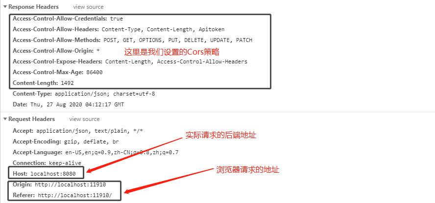

## 一、什么是跨域

#### 1. 同源策略

所谓同源是指：域名、协议、端口相同，而浏览器实现了同源策略，这里引用百度百科的解释：

>同源策略（Same origin policy）是一种约定，它是浏览器最核心也最基本的安全功能，如果缺少了同源策略，则浏览器的正常功能可能都会受到影响。可以说Web是构建在同源策略基础之上的，浏览器只是针对同源策略的一种实现。

#### 2. 同源策略分类

同源策略分为两种：

- DOM 同源策略：禁止对不同源页面 DOM 进行操作。这里主要场景是 iframe 跨域的情况，不同域名的 iframe 是限制互相访问的。

- XMLHttpRequest 同源策略：禁止使用 XHR 对象向不同源的服务器地址发起 HTTP 请求。

#### 3. 同源策略的作用

同源策略解决了浏览器的安全问题，如果没有同源策略，那么你可能会遇到下面的网络攻击：

（1）基于 iframe 的网站伪装

黑客可以通过在 iframe 中嵌套一个银行网站，通过调整边框之类的参数，让用户看不出来任何问题，这样用户输入的个人信息就会被黑客窃取，去做一些违法的事情。

（2）CSRF 攻击

CSRF（Cross-site request forgery），中文名称：跨站请求伪造，这种攻击方式实质上是攻击者盗用了你的身份，以你的名义发送恶意请求。比如你登陆了银行网站，浏览器在本地生成了 Cookie，同时你又登陆了黑客的钓鱼网站，钓鱼网站向你登陆的银行网站发送请求，请求默认会把本地存储的 Cookie 也同时发送过去，这样他就可以盗用你的身份，去做一些违法的事情了。

#### 4. 跨域

同源策略在解决浏览器访问安全的同时，也带来了跨域问题，当一个请求url的**协议、域名、端口**三者之间任意一个与当前页面url不同即为跨域。

## 二、使用cors解决跨域问题

> CORS（Cross-origin resource sharing，跨域资源共享）是一个 W3C 标准，定义了在必须访问跨域资源时，浏览器与服务器应该如何沟通。CORS 背后的基本思想，就是使用自定义的 HTTP 头部让浏览器与服务器进行沟通，从而决定请求或响应是应该成功，还是应该失败。CORS 需要浏览器和服务器同时支持。
>
> 整个CORS通信过程，都是浏览器自动完成，不需要用户参与。对于开发者来说，CORS通信与同源的AJAX通信没有差别，代码完全一样。浏览器一旦发现AJAX请求跨源，就会自动添加一些附加的头信息，有时还会多出一次附加的请求，但用户不会有感觉。
>
> 浏览器将CORS请求分成两类：简单请求（simple request）和非简单请求（not-so-simple request）。

#### 1. 简单请求

简单请求是指满足下面两大条件的请求：

- 请求方法为 HEAD、GET、POST中的一种。
- HTTP头信息不超过一下几种：
  - [ ] Accept
  - [ ] Accept-Language
  - [ ] Content-Language
  - [ ] Last-Event-ID
  - [ ] Content-Type（只限于三个值`application/x-www-form-urlencoded`、`multipart/form-data`、`text/plain`）

对于简单请求，浏览器回自动在请求的头部添加一个 Origin 字段来说明，本子请求来自那个源（协议 + 域名 + 端口），服务端则通过这个值判断是否接收本次请求。如果 Origin 在许可范围内，则服务器返回的响应会多出几个头信息：

```
Access-Control-Allow-Credentials: true
Access-Control-Allow-Headers: Content-Type, Content-Length
Access-Control-Allow-Origin: *
Content-Type: text/html; charset=utf-8
```

我们就是通过配置这些参数来处理跨域请求的，下面会做详细介绍。


#### 2. 非简单请求

非简单请求是那种对服务器有特殊要求的请求，比如请求方法是 **PUT** 或 **DELETE** ，或者 **Content-Type** 字段的类型是 **application/json**。

非简单请求的CORS请求，会在正式通信之前，增加一次HTTP查询请求，称为"预检"请求（preflight）。

预检请求其实就是我们常说的 **OPTIONS** 请求，表示这个请求是用来询问的。头信息里面，关键字段 **Origin** ，表示请求来自哪个源，除 **Origin** 字段，"预检"请求的头信息包括两个特殊字段：

- Access-Control-Request-Method

  ```bash
  该字段是必须的，用来列出浏览器的CORS请求会用到哪些HTTP方法
  ```

- Access-Control-Request-Headers

  ```bash
  该字段是一个逗号分隔的字符串，指定浏览器CORS请求会额外发送的头信息字段.
  ```

浏览器先询问服务器，当前网页所在的域名是否在服务器的许可名单之中，以及可以使用哪些HTTP动词和头信息字段。只有得到肯定答复，浏览器才会发出正式的  **XMLHttpRequest**  请求，否则就报错。


#### 3. 配置 CORS 解决跨域问题

上面我们了解了两种跨域请求，其中出现了几种特殊的 Header 字段，CORS 就是通过配置这些字段来解决跨域问题的，下面详细介绍一下这些字段的含义：

**（1）Access-Control-Allow-Origin**

该字段是必须的。它的值要么是请求时`Origin`字段的值，要么是一个`*`，表示接受任意域名的请求。

**（2）Access-Control-Allow-Methods**

该字段必需，它的值是逗号分隔的一个字符串，表明服务器支持的所有跨域请求的方法。注意，返回的是所有支持的方法，而不单是浏览器请求的那个方法。这是为了避免多次"预检"请求。

**（3）Access-Control-Allow-Headers**

如果浏览器请求包括`Access-Control-Request-Headers`字段，则`Access-Control-Allow-Headers`字段是必需的。它也是一个逗号分隔的字符串，表明服务器支持的所有头信息字段，不限于浏览器在"预检"中请求的字段。

**（4）Access-Control-Expose-Headers**

该字段可选。CORS请求时，`XMLHttpRequest`对象的`getResponseHeader()`方法只能拿到6个基本字段：`Cache-Control`、`Content-Language`、`Content-Type`、`Expires`、`Last-Modified`、`Pragma`。如果想拿到其他字段，就必须在`Access-Control-Expose-Headers`里面指定。

**（5）Access-Control-Allow-Credentials**

该字段可选。它的值是一个布尔值，表示是否允许发送Cookie。默认情况下，Cookie不包括在CORS请求之中。设为`true`，即表示服务器明确许可，Cookie可以包含在请求中，一起发给服务器。这个值也只能设为 true，如果服务器不要浏览器发送Cookie，删除该字段即可。

**（6）Access-Control-Max-Age**

该字段可选，用来指定本次预检请求的有效期，单位为秒，在此期间，不用发出另一条预检请求。


#### 4. 实际测试

这里我以 Go 语言的 gin 框架为例，配置跨域请求的中间件：

```go
func CORS() gin.HandlerFunc {
	return func(context *gin.Context) {
        // 允许 Origin 字段中的域发送请求
		context.Writer.Header().Add("Access-Control-Allow-Origin",  *)
        // 设置预验请求有效期为 86400 秒
		context.Writer.Header().Set("Access-Control-Max-Age", "86400")
        // 设置允许请求的方法
		context.Writer.Header().Set("Access-Control-Allow-Methods", "POST, GET, OPTIONS, PUT, DELETE, UPDATE, PATCH")
        // 设置允许请求的 Header
		context.Writer.Header().Set("Access-Control-Allow-Headers", "Content-Type, Content-Length，Apitoken")
        // 设置拿到除基本字段外的其他字段，如上面的Apitoken, 这里通过引用Access-Control-Expose-Headers，进行配置，效果是一样的。
		context.Writer.Header().Set("Access-Control-Expose-Headers", "Content-Length, Access-Control-Allow-Headers")
        // 配置是否可以带认证信息
		context.Writer.Header().Set("Access-Control-Allow-Credentials", "true")
        // OPTIONS请求返回200
		if context.Request.Method == "OPTIONS" {
			fmt.Println(context.Request.Header)
			context.AbortWithStatus(200)
		} else {
			context.Next()
		}
	}
}
```

测试跨域请求：



我们可以看到我们在浏览器访问的的地址端口为11910，请求的后台地址端口是8080，满足跨域产生的条件，但是通过配置cors，我们可以成功请求要数据。