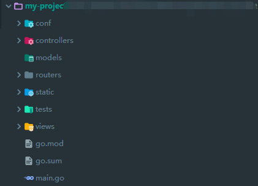
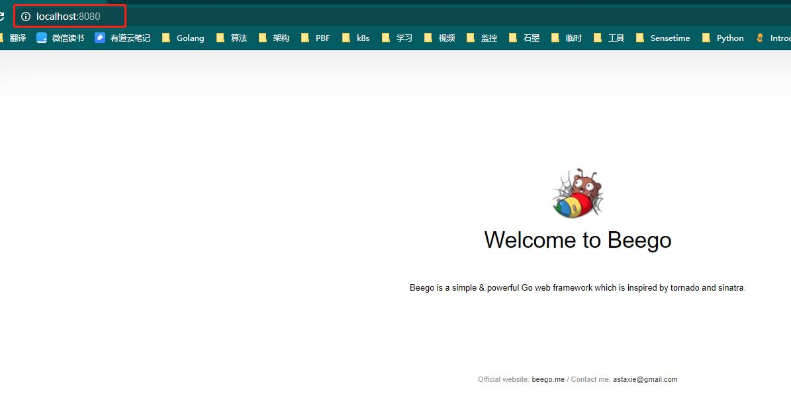

> beego 框架介绍

### 一、创建项目

#### 1. 安装 bee 工具

#### 2. 生成项目

使用`bee`命令生成项目模板：

```bash
$ bee new my-project
```

执行命令后，在当前目录下就会生成一个`beego`项目框架：



使用 `bee` 启动项目：

```bash
$ bee run
______
| ___ \
| |_/ /  ___   ___
| ___ \ / _ \ / _ \
| |_/ /|  __/|  __/
\____/  \___| \___| v1.12.0
2021/01/28 14:35:03 WARN     ▶ 0001 Running application outside of GOPATH
2021/01/28 14:35:03 INFO     ▶ 0002 Using 'my-project' as 'appname'
2021/01/28 14:35:03 INFO     ▶ 0003 Initializing watcher...
......
2021/01/28 14:35:23 SUCCESS  ▶ 0004 Built Successfully!
2021/01/28 14:35:23 INFO     ▶ 0005 Restarting 'my-project.exe'...
2021/01/28 14:35:23 SUCCESS  ▶ 0006 './my-project.exe' is running...
2021/01/28 14:35:23.899 [I] [asm_amd64.s:1337]  http server Running on http://:8080
```

访问 http://localhost:8080 ，可以看到 beego 项目的初始化页面：



### 二、

