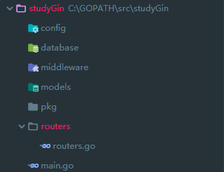
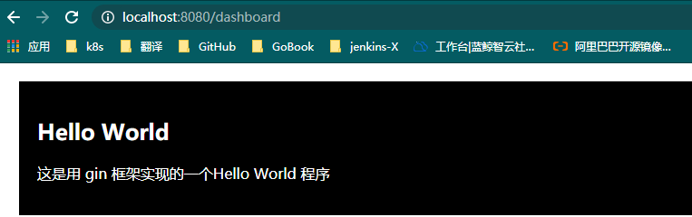
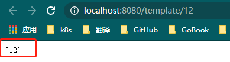
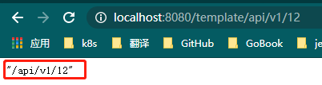
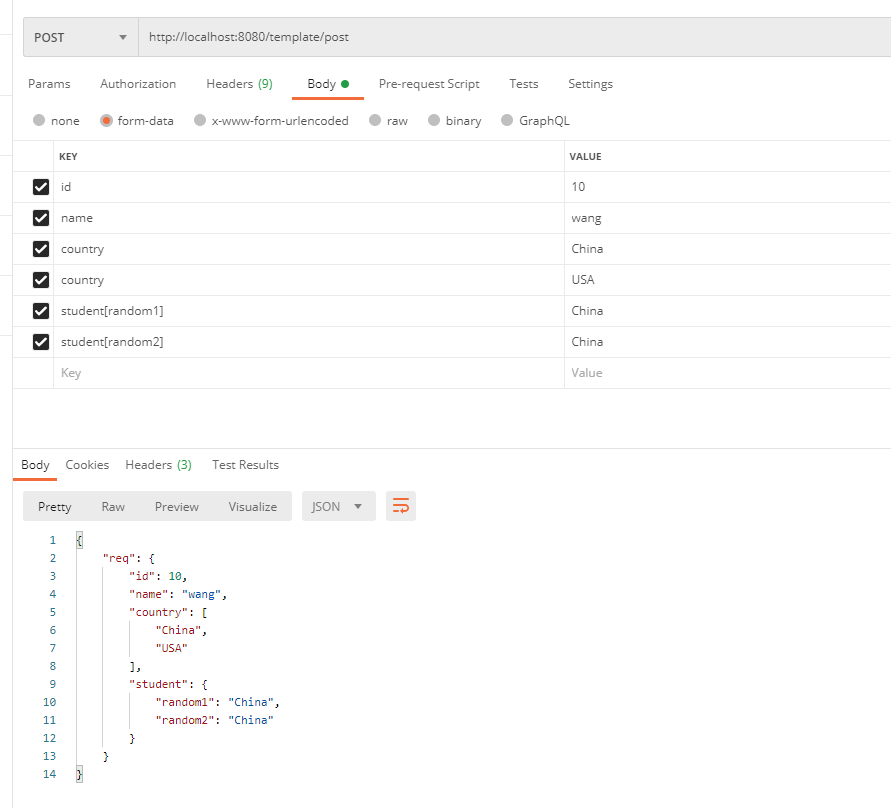
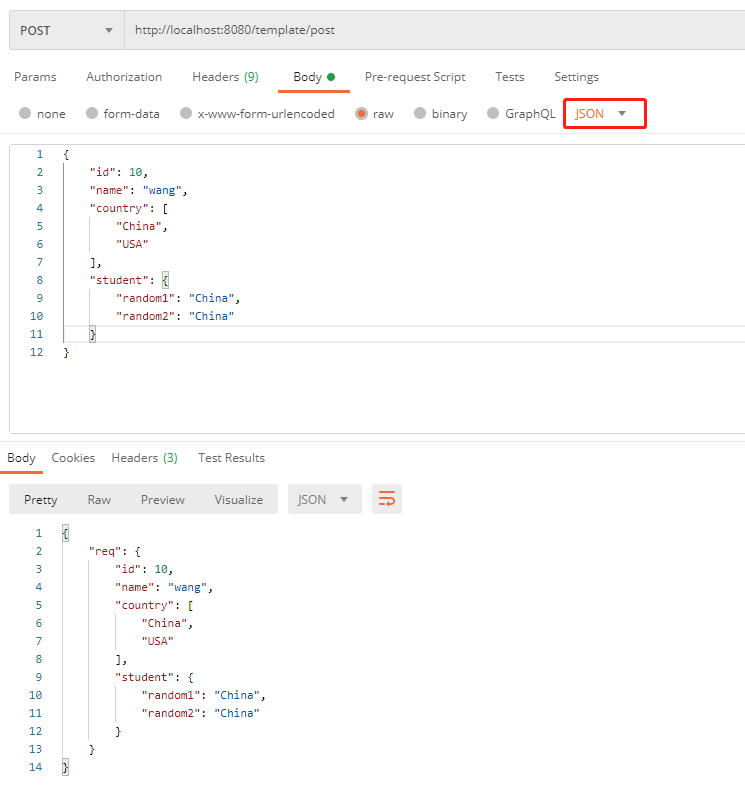
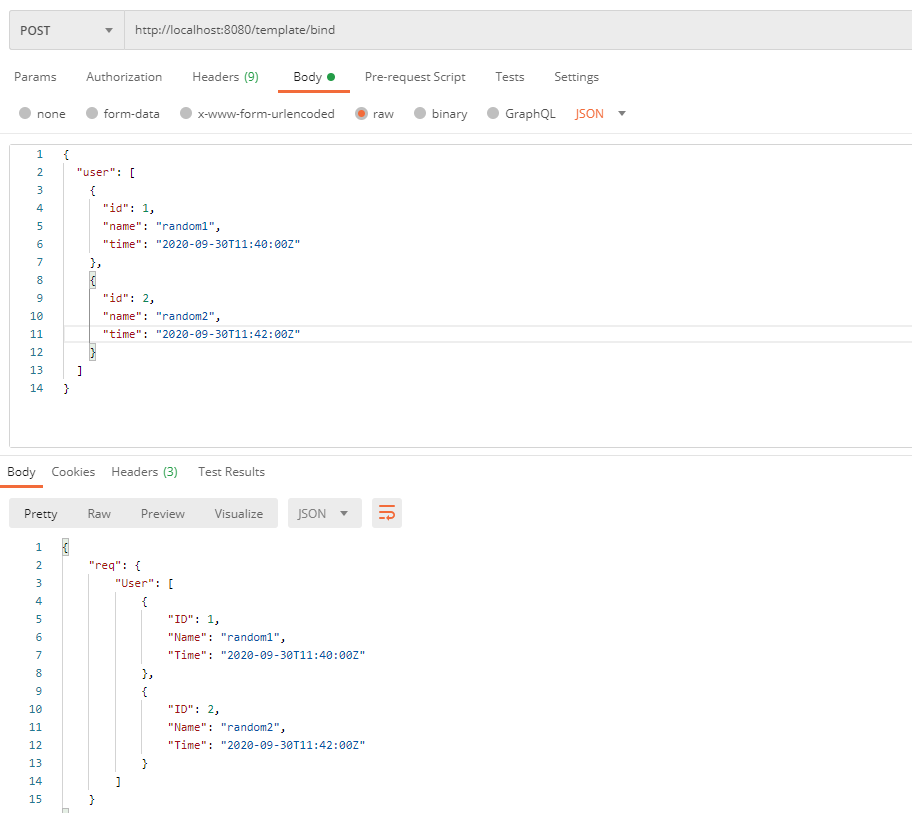
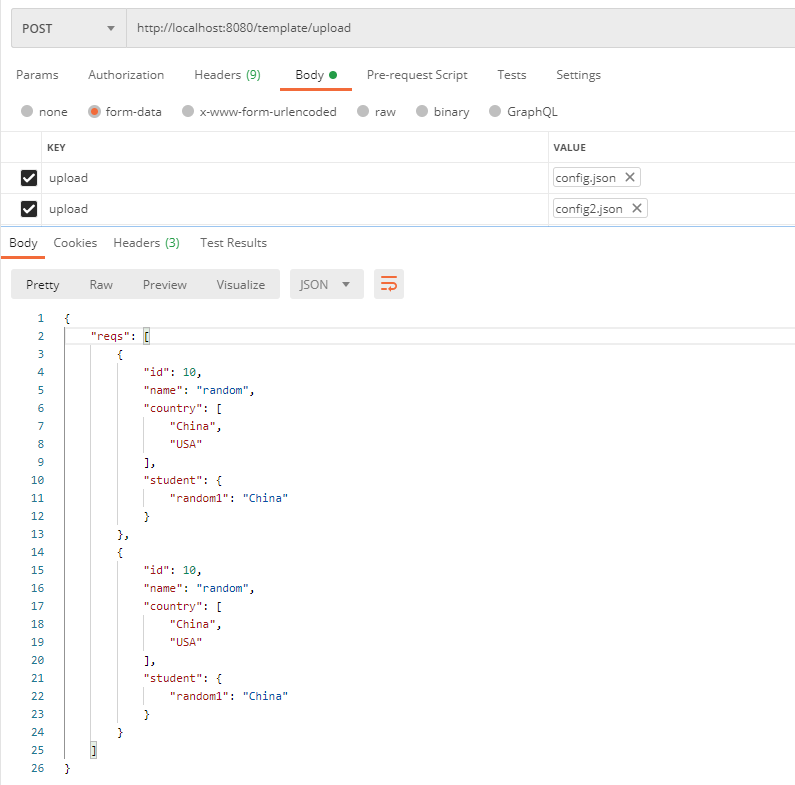
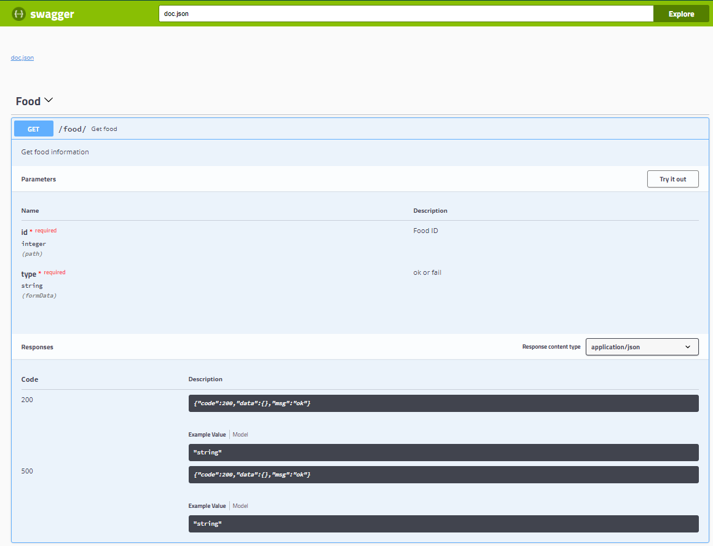

> Gin 框架是 Go 语言 Web 开发中比较常用的框架，Gin 框架具有很高的灵活性和扩展性，用户可以根据项目需要编写中间件，Gin 框架也有强大的路由机制，我们可以按需设计路由。

##  一、安装 Gin 框架

#### 1.  安装

Gin 框架的安装十分简单，通过下面的命令可以一键安装：

```bash
go get -u github.com/gin-gonic/gin
```

#### 2. 创建项目

安装完 gin 框架后，我们创建一个项目 studyGin，目录结构如下：



项目目录的功能介绍如下：

- config 用来存放配置文件
- database 用来设置数据库连接
- middleware 编写中间件
- models 用来做模型定义
- pkg 项目功能在这里开发
- routers 项目中的路由在这里定义
- main.go 函数入口

#### 3. Hello World

有了项目框架，按照惯例，我们来编写一个 Hello World 程序。

##### 3.1 创建配置文件

我们在 config 目录创建一个config.json 文件：

```jso
{
  "RunMode": "debug",
  "Server": {
    "HttpPort": 8080,
    "ReadTimeout": 600,
    "WriteTimeout": 600
  }
}
```

配置文件包含两部分内容，Debug 用来表示是否开启 debug 模式，Server 用来配置 Web 服务器的端口以及超时时间。

##### 3.2 加载配置文件

我们在 studyGin/pkg 目录下创建一个setting 目录，并在 setting 目录里面创建一个 setting.go 文件，我们在 setting.go 文件中实现编写读取配置文件的功能，代码如下：

首先我们创建 Configure 对象保存配置信息：

```go
// config.json 文件的内容被解析到Configure
type Configure struct {
	RunMode string `json:"RunMode"`
	Server  Server `json:"Server"`
}

// Server 用来获取Web服务器配置
type Server struct {
	HttpPort     int           `json:"HttpPort"`
	ReadTimeout  time.Duration `json:"ReadTimeout"`
	WriteTimeout time.Duration `json:"WriteTimeout"`
}
```

解析 config.json 文件：

```go
// 定义全局变量，配置文件只需要加载一次
var c Configure

// 程序运行的时候加载配置文件
func init() {
	LoadConfig()
}

func LoadConfig() {
	// 获取配置文件地址
	pwd, err := os.Getwd()
	if err != nil {
		log.Fatal(err.Error())
	}
	ConfigFile := filepath.Join(pwd, "config", "config.json")
	// 读取配置文件内容
	f, err := os.Open(ConfigFile)
	defer f.Close()
	if err != nil {
		log.Fatal(err.Error())
	}
	// 将配置文件内容解析到Conf
	if err := json.NewDecoder(f).Decode(&c); err != nil {
		log.Fatal(err.Error())
	}
}

func RunMode() string {
	return c.RunMode
}

func Server() ServerConfig {
	return c.Server
}
```

##### 3.3 设置路由

在 studyGin 目录下创建 templates 目录，然后再templates目录创建 dashboard.html 文件，文件内容如下：

```html
<!DOCTYPE html>
<html lang="en">
<head>
    <meta charset="UTF-8">
    <title>Hello World</title>
    <style>
        .cities {
            background-color:black;
            color:white;
            margin:20px;
            padding:20px;
        }
    </style>
</head>
<body>
    <div class="cities">
        <h2>Hello World</h2>
        <p>这是用 gin 框架实现的一个Hello World 程序</p>
    </div>
</body>
</html>
```

在 routers 目录下面创建 api/v1 两级目录，然后在 v1 目录下面创建 dashboard.go 文件，文件内容如下：

```go
package v1

import (
	"github.com/gin-gonic/gin"
	"net/http"
)

// 当访问dashboard页面时返回dashboard.html页面
func Dashboard(c *gin.Context) {
	c.HTML(http.StatusOK, "dashboard.html", gin.H{})
}
```

在 routers.go 文件中创建路由：

```go
package routers

import (
	"github.com/gin-contrib/cors"
	"github.com/gin-gonic/gin"
	"studyGin/pkg/setting"
	"studyGin/routers/api/v1"
)

func Router() *gin.Engine {
	r := gin.New()
	r.LoadHTMLGlob("templates/*")  // 加载模板文件
    r.Use(gin.Logger())            // 打印请求日志
	r.Use(gin.Recovery())          // gin.Recovery() 可以在程序报panic的时候将返回码改为500
	r.Use(cors.Default())          // 跨域策略
	gin.SetMode(setting.RunMode()) // 设置RunMode
    r.GET("/dashboard", v1.Dashboard)        // 配置路由 http://IP:Port/dashboard
	return r
}
```


##### 3.4 启动服务

编写 main.go 启动服务，代码如下：

```go
package main

import (
	"fmt"
	"studyGin/routers"

	"net/http"
	"studyGin/pkg/setting"
)

func main() {
	// 加载路由
	r := routers.Router()
	// 配置Web服务
	s := &http.Server{
		Addr:           fmt.Sprintf(":%d", setting.Server().HttpPort),
		Handler:        r,
		ReadTimeout:    setting.Server().ReadTimeout,
		WriteTimeout:   setting.Server().WriteTimeout,
		MaxHeaderBytes: 1 << 20,
	}
	// 监听Web服务请求
	_ = s.ListenAndServe()
}
```

运行代码：

```bash
$ go run main.go
[GIN-debug] [WARNING] Running in "debug" mode. Switch to "release" mode in production.
 - using env:   export GIN_MODE=release
 - using code:  gin.SetMode(gin.ReleaseMode)

[GIN-debug] Loaded HTML Templates (2):
        -
        - dashboard.html

[GIN-debug] GET    /dashboard                --> studyGin/routers/api/v1.Dashboard (3 handlers)

```

##### 3.5 访问 Dashboard

在浏览器访问 http://localhost:8080/dashboard



## 二、编写路由

#### 1. 编写路由

gin 框架的路由和其他 web 框架的定义方式类似，它也支持常见的各种请求方法，请求中的参数会通过上下问的方式保存在 gin.Context 中。在编写 Hello World程序的时候我们已经用到了路由的定义，gin 框架中路由的定义总共有三种方式，分别是静态路由、带路径参数的路由和带`*`的路由。

在 gin 框架中有一个 IRoutes 接口定义了常用的请求方法：

```go
// IRoutes defines all router handle interface.
type IRoutes interface {
	Use(...HandlerFunc) IRoutes

	Handle(string, string, ...HandlerFunc) IRoutes
	Any(string, ...HandlerFunc) IRoutes
	GET(string, ...HandlerFunc) IRoutes
	POST(string, ...HandlerFunc) IRoutes
	DELETE(string, ...HandlerFunc) IRoutes
	PATCH(string, ...HandlerFunc) IRoutes
	PUT(string, ...HandlerFunc) IRoutes
	OPTIONS(string, ...HandlerFunc) IRoutes
	HEAD(string, ...HandlerFunc) IRoutes

	StaticFile(string, string) IRoutes
	Static(string, string) IRoutes
	StaticFS(string, http.FileSystem) IRoutes
}
```

从源码中我们可以看到每一种请求都包含两类参数，路径和请求处理的方法，我们以 dashboard 接口为例：

```go
 r.GET("/dashboard", v1.Dashboard)        // 配置路由 http://IP:Port/dashboard
```

我们定义了路由 http://IP:Port/dashboard 的请求方法为 GET 请求，请求处理方法为 v1.DashBoard：

```go
// 当访问dashboard页面时返回dashboard.html页面
func Dashboard(c *gin.Context) {
	c.HTML(http.StatusOK, "dashboard.html", gin.H{})
}
```

v1.DashBoard 方法是一个 `type HandlerFunc func(*Context)` 类型的函数，用来处理请求，因此我们定义路由的时候需要注意三个地方：

- [ ] 请求的方法：GET、POST、DELETE、 PATCH 、PUT 、OPTIONS 、HEAD
- [ ] URL 地址
- [ ] 路由处理函数

##### 1.1 静态路由

我们之前写的 http://localhost:8080/dashboard 就是一个静态路由，在静态路由中，URL路径中不带任何路径参数。下面三个路由都是静态路由：

```go
 r.GET("/dashboard", v1.Dashboard)
 r.GET("/api/v1/test", v1.Test)
 r.POST("/auth", v1.Auth)
```


##### 1.2 带参数的路由

如下面两个路由为带参数的路由：

```go
r.GET("/api/:version/dashboard", v1.Dashboard)
r.DELETE("/template/:tpl_id", v1.DeleteTemplate)
```

带参数的路由就是在URL定义的时候通过冒号加参数名称的方式代替一些不确定的路径，比如第一个路由，我们可以通过 version 参数判断返回哪一个版本的 Dashboard，第二个路由我们可以通过 tpl_id 知道要删除那个模板，模板ID和版本信息我们可以通过上下文获取：

```go
func Dashboard(c *gin.Context) {
    v := c.Param("version")     // 通过c.Param("version") 获取版本信息
	.....
}
func DeleteTemplate(c *gin.Context) {
    tid := c.Param("tpl_id")   // 通过c.Param("tpl_id") 获取模板ID
	.....
}
```


##### 1.3 带星号的路由

带星号（*）模糊匹配参数的url路径，这种路由不是很常见，这里做一下简单介绍，以下面的路由为例：

```go
r.GET("/api/*path", v1.Dashboard)
```

这个路由表示，所有以 /api 开头的路径请求都会转发给 v1.Dashboard 进行处理，可以通过path参数获取*号匹配的内容。


#### 2. 路由分组

在项目开发中我们经常会遇到路由分组的场景，比如导航栏中的每一栏中的操作我们可以定义为一个分组，下面我们创建一个模板分组路由：

```go
tpl := r.Group("template")
// 定义template后面的路径，访问的时候URL为http://IP:Port/template + 下面定义的URL
tpl.GET("/:tpl_id", v1.GetTemplate)
tpl.DELETE("/:tpl_id", v1.DeleteTemplate)
```


#### 3. 解决跨域问题

跨域问题的处理方式有很多，但最常用的就是通过 cors 处理跨域请求了，这里可以参考我的另一篇博客：[超级详细的跨域问题解决方法指南——以gin框架为例，解决跨域问题](https://blog.csdn.net/random_w/article/details/108258735)


## 三、获取 Request 中的数据 

#### 1. 获取路径参数

这里举两个例子，一个是带参数的路由，一个是带星号的路由。

##### 1.1 带参数的路由

编写路由：

```go
func Router() *gin.Engine {
	r := gin.New()
	tpl := r.Group("template")
	tpl.GET("/:tpl_id", v1.GetTemplate)
	return r
}
```

在 GetTemplate方法中获取模板ID：

```go
func GetTemplate(c *gin.Context) {
	tid := c.Param("tpl_id")
	c.JSON(http.StatusOK, tid)
}
```

运行服务后我们访问 http://localhost:8080/template/12 ,12 为模板ID：



##### 1.2 带星号的路由

编写路由：

```go
func Router() *gin.Engine {
	r := gin.New()
	tpl := r.Group("template")
	tpl.GET("/*path", v1.Path)
	return r
}
```

在 Path 方法中获取请求路径：

```go
func Path(c *gin.Context) {
	path := c.Param("path")
	c.JSON(http.StatusOK, path)
}
```

访问 http://localhost:8080/template/api/v1/12 , /api/v1/12 为我们指定的路由：



#### 2. 获取Query 中的数据

gin 框架中获取 Query 参数的方法有下面几种：

```go
func (c *Context) Query(key string) string // 对GetQuery的封装，获取key对应的值，所有类型都以字符串类型返回
func (c *Context) QueryArray(key string) []string  // 对GetQueryArray的封装，获取key对应的值，返回字符串类型的列表
func (c *Context) QueryMap(key string) map[string]string // 对GetQueryMap的封装，获取key对应到的值，返回字符串类型的键值对
func (c *Context) DefaultQuery(key, defaultValue string) string // 对GetQuery的封装，获取key对应的值，如果没有获取到则返回defaultValue
```

我们通过下面的例子来学习这五种方式的使用方法：

定义一组 template 路由：

```go
func Router() *gin.Engine {
	r := gin.New()
	tpl := r.Group("template")
	tpl.GET("/test", v1.Test)
	return r
}
```

定义 Test 方法处理请求：

```go
// RequestQuery 注意：这里定义的字段必须与请求的字段相同才能获取到，如Query中的ID和Name可以获取到，id或name则不能
type RequestQuery struct {
	ID      int               `json:"id"`
	Name    string            `json:"name"`
	Country []string          `json:"country"`
	Student map[string]string `json:"student"`
}

func Test(c *gin.Context) {
	var req RequestQuery
	// 通过Query获取
	req.ID, _ = strconv.Atoi(c.Query("ID"))
	// 通过DefaultQuery获取
	req.Name = c.DefaultQuery("Name", "random")
	// 通过QueryArray获取
	req.Country = c.QueryArray("Country")
	// 通过QueryMap获取
	req.Student = c.QueryMap("Student")
	c.JSON(http.StatusOK, gin.H{
		"req": req,
	})
}
```

有的小伙伴可能在测试的时候遇到这样一个问题，Query中列表和字典该如何写呢？

在 Query 中多个相同 key 对应的值可以被读取到同一个列表中，比如上面的 Country 我们可以这样定义：

```bash
http://localhost:8080/template/test?Country=China&Country=USA
```

我们通过解析可以获取到 Country 的值为：

```bash
["China","USA"]
```

在 Query 中字典的表示方法为`dict[key]=value`，dict为字典名称，多个键值对通过`&`连接起来即可，比如上面的 Student 我们可以这样定义：

```bash
http://localhost:8080/template/test?Student[random1]=China&Student[random2]=China
```

我们通过解析可以获取到 Student 的值为：

```bash
{"random1":"China","random2":"China"}
```


#### 3. 获取 Body 中的数据

在进行 Post 请求的时候我们会通过 Body 传递参数，常见的有下面几种类型：

- application/json
- text/html
- application/xml
- text/xml
- application/x-www-form-urlencoded
- multipart/form-data

这几种类型可以分为两类，一种是表单形式，一种是非表单形式。

##### 3.1 表单

以 `multipart/form-data` 类型传递的参数为表单形式，我们可以通过下面四种方式获取表单的值：

```go
func (c *Context) PostForm(key string) string // 对GetPostForm的封装，返回key对应的值，key的类型为字符串
func (c *Context) DefaultPostForm(key, defaultValue string) string // 对GetPostForm的封装，返回key对应的值，key为空则返回defaultValue
func (c *Context) PostFormArray(key string) []string // 对GetPostFormArray的封装，返回key对应的列表，列表类型为字符串
func (c *Context) PostFormMap(key string) map[string]string  // 对GetPostFormMap的封装，返回key对应的键值对，键值对类型为字符串
```

这里需要注意的是表单传递列表和字典的方式和Query是类似的，我们定义一个 Post 请求：

```go
func Router() *gin.Engine {
	r := gin.New()
	tpl := r.Group("template")
	tpl.POST("/post", v1.Post)
	return r
}
```

定义 Post 方法处理请求：

```go
type RequestPostForm struct {
	ID      int               `form:"id" json:"id"`
	Name    string            `form:"name" json:"name"`
	Country []string          `form:"country" json:"country"`
	Student map[string]string `form:"student" json:"student"`
}

func Post(c *gin.Context) {
	var req RequestPostForm
	// 通过 PostForm 获取
	req.ID, _ = strconv.Atoi(c.PostForm("id"))
	// 通过 DefaultPostForm 获取
	req.Name = c.DefaultPostForm("name", "random")
	// 通过 PostFormArray 获取
	req.Country = c.PostFormArray("country")
	// 通过 PostFormMap 获取
	req.Student = c.PostFormMap("student")
	c.JSON(http.StatusOK, gin.H{
		"req": req,
	})
}
```

通过 Postman 发送 Post 请求：



##### 3.2 非表单

非表单数据我们可以从Request.Body获取，通常会读取Body数据后，解析到对应的对象，下面举个例子：

同样使用上面的接口，我们改一下 Post 方法：

```go
type RequestPostForm struct {
	ID      int               `form:"id" json:"id"`
	Name    string            `form:"name" json:"name"`
	Country []string          `form:"country" json:"country"`
	Student map[string]string `form:"student" json:"student"`
}

func Post(c *gin.Context) {
	var req RequestPostForm
	Body := c.Request.Body
	// 将Body中的Json数据解析到req
	if err := json.NewDecoder(Body).Decode(&req); err != nil {
		log.Println(err)
	}
	c.JSON(http.StatusOK, gin.H{
		"req": req,
	})
}
```

通过 Postman 发送 Post 请求：



#### 4. 请求参数校验

在 Gin 框架中我们可以在结构体成员的 tag 中配置参数校验功能其中需要有下面几种 tag：

- form 定义表单字段名称
- uri 定义uri字段名称
- bind 如果必须要传改参数则可以配置为required，如果没有该参数则会报错
- time_format 时间格式化
- time_utc 是否是UTC时间

##### 4.1 绑定校验

我们看下面的例子：

我们定义一个/template/bind路由：

```go
func Router() *gin.Engine {
	r := gin.New()
	tpl := r.Group("template")
	tpl.POST("/bind", v1.Bind)
	return r
}
```

编写需要绑定的结构体以及校验规则：

```go
type BindStudy struct {
	// required表示必须要有这个参数，User是个结构体，要对他进行校验必须加dive
	User []User `form:"user" bind:"required,dive"`
}

type User struct {
	// "-" 表示忽略
	ID int `form:"id" bind:"-"`
	// required 表示必须要有这个参数，否则报错
	Name string `form:"name" bind:"required"`
	// time_format 表示格式化时间，time_utc 表示UTC时间
	Time time.Time `form:"time" bind:"required" time_format:"2006-01-02 15:04:05" time_utc:"1"`
}

func Bind(c *gin.Context) {
	var u BindStudy
	if err := c.Bind(&u); err != nil {
		c.JSON(http.StatusBadRequest, gin.H{
			"error": err.Error(),
		})
		return
	}
	c.JSON(http.StatusOK, gin.H{
		"req": u,
	})
	return
}
```

测试一下，如果没有按照校验规则传输数据则会报错，下面是正确的时候访问结果：



##### 4.2 自定义验证器

自定义校验器这里使用比较多的是[validator](https://github.com/go-playground/validator)，我们通过下面的命令安装v10版本：

```bash
go get github.com/go-playground/validator/v10
```

在使用前我们先学习一下如何这个包定义验证规则：

- required ：必填
- email：验证字符串是email格式；例："email"
- url：这将验证字符串值包含有效的网址;例："url"
- max：字符串最大长度；例："max=20"
- min:字符串最小长度；例："min=6"
- excludesall:不能包含特殊字符；例："excludesall=0x2C"//注意这里用十六进制表示。
- len：字符长度必须等于n，或者数组、切片、map的len值为n，即包含的项目数；例："len=6"
- eq：数字等于n，或者或者数组、切片、map的len值为n，即包含的项目数；例："eq=6"
- ne：数字不等于n，或者或者数组、切片、map的len值不等于为n，即包含的项目数不为n，其和eq相反；例："ne=6"
- gt：数字大于n，或者或者数组、切片、map的len值大于n，即包含的项目数大于n；例："gt=6"
- gte：数字大于或等于n，或者或者数组、切片、map的len值大于或等于n，即包含的项目数大于或等于n；例："gte=6"
- lt：数字小于n，或者或者数组、切片、map的len值小于n，即包含的项目数小于n；例："lt=6"
- lte：数字小于或等于n，或者或者数组、切片、map的len值小于或等于n，即包含的项目数小于或等于n；例："lte=6"

##### 跨字段验证

- `eqfield=Field`: 必须等于 Field 的值；
- `nefield=Field`: 必须不等于 Field 的值；
- `gtfield=Field`: 必须大于 Field 的值；
- `gtefield=Field`: 必须大于等于 Field 的值；
- `ltfield=Field`: 必须小于 Field 的值；
- `ltefield=Field`: 必须小于等于 Field 的值；
- `eqcsfield=Other.Field`: 必须等于 struct Other 中 Field 的值；
- `necsfield=Other.Field`: 必须不等于 struct Other 中 Field 的值；
- `gtcsfield=Other.Field`: 必须大于 struct Other 中 Field 的值；
- `gtecsfield=Other.Field`: 必须大于等于 struct Other 中 Field 的值；
- `ltcsfield=Other.Field`: 必须小于 struct Other 中 Field 的值；
- `ltecsfield=Other.Field`: 必须小于等于 struct Other 中 Field 的值；

知道了这些我们就可以在结构体中定义字段的校验规则了，请看下面的例子：

首先还是定义一个/template/bind路由：

```go
func Router() *gin.Engine {
	r := gin.New()
	tpl := r.Group("template")
	tpl.POST("/bind", v1.Bind)
	return r
}
```

编写需要绑定的结构体以及校验规则：

```go
// 自定义校验函数
var bookableDate validator.Func = func(fl validator.FieldLevel) bool {
	date, ok := fl.Field().Interface().(time.Time)
	if ok {
		today := time.Now()
		if today.After(date) {
			return false
		}
	}
	return true
}

func Router() *gin.Engine {
	r := gin.New()
	// 注册验证其
	if v, ok := binding.Validator.Engine().(*validator.Validate); ok {
		_ = v.RegisterValidation("bookabledate", bookableDate)
	}
	tpl := r.Group("template")
	tpl.POST("/bind", v1.Bind)
	return r
}

```

编写处理请求的方法：

```go
// Booking 包含绑定和验证的数据。
type Booking struct {
	// bookableDate 对参数进行校验
	CheckIn time.Time `form:"check_in" binding:"required,bookabledate" time_format:"2006-01-02"`
	// bookableDate 对参数进行校验，并且CheckOut必须大于CheckIn
	CheckOut time.Time `form:"check_out" binding:"required,gtfield=CheckIn,bookabledate" time_format:"2006-01-02"`
}

func Bind(c *gin.Context) {
	var b Booking
	if err := c.ShouldBindWith(&b, binding.Query); err == nil {
		c.JSON(http.StatusOK, gin.H{"message": "Booking dates are valid!"})
	} else {
		c.JSON(http.StatusBadRequest, gin.H{"error": err.Error()})
	}
}
```

这样不满足校验规则的请求服务端在绑定参数的时候就会报错。

#### 5. 通过 Bind 获取请求参数

Gin 框架中提供了将请求主体绑定到结构体的方法，目前支持JSON、XML、YAML和标准表单值(foo=bar&boo=baz)的绑定，因此字典类型的表单值无法直接绑定到结构体中，Gin还提供了两套绑定方法：

##### 5.1 MustBind

MustBind 相关的方法如下：

```go
func (c *Context) Bind(obj interface{}) error       // 只支持Content-Type="application/json"或者"application/xml"
func (c *Context) BindHeader(obj interface{}) error // 将Header中的数据解析到结构体
func (c *Context) BindJSON(obj interface{}) error   // 将Body中的Json数据解析到结构体
func (c *Context) BindYAML(obj interface{}) error   // 将Body中的Yaml数据解析到结构体
func (c *Context) BindXML(obj interface{}) error    // 将Body中的xml数据解析到结构体
func (c *Context) BindQuery(obj interface{}) error  // 将Query中的数据解析到结构体
```

这些方法底层使用 `MustBindWith`，如果存在绑定错误，请求将被以下指令中止 `c.AbortWithError(400, err).SetType(ErrorTypeBind)`，响应状态代码会被设置为400，请求头`Content-Type`被设置为`text/plain; charset=utf-8`。注意，如果你试图在此之后设置响应代码，将会发出一个警告 `[GIN-debug] [WARNING] Headers were already written. Wanted to override status code 400 with 422`，如果你希望更好地控制行为，请使用`ShouldBind`相关的方法

因此第四部分中 Post 请求的处理方法可以改为：

```go
func Post(c *gin.Context) {
	var req RequestPostForm
	if err := c.Bind(&req); err != nil {
		log.Println(err)
	}
	c.JSON(http.StatusOK, gin.H{
		"req": req,
	})
}
```


当然 Gin 框架给我们提供了更灵活的绑定方式——自定义绑定：

```go
func (c *Context) BindWith(obj interface{}, b binding.Binding) error 
```

解析对象由我们自定义，但我们需要实现Binding 接口：

```go
// Binding describes the interface which needs to be implemented for binding the
// data present in the request such as JSON request body, query parameters or
// the form POST.
type Binding interface {
	Name() string
	Bind(*http.Request, interface{}) error
}
```


##### 5.2 ShouldBind

ShouldBind 相关的方法如下：

```go
func (c *Context) ShouldBind(obj interface{}) error       // 只支持Content-Type="application/json"或者"application/xml"
func (c *Context) ShouldBindHeader(obj interface{}) error // 将Header中的数据解析到结构体
func (c *Context) ShouldBindJSON(obj interface{}) error   // 将Body中的Json数据解析到结构体
func (c *Context) ShouldBindYAML(obj interface{}) error   // 将Body中的Yaml数据解析到结构体
func (c *Context) ShouldBindXML(obj interface{}) error    // 将Body中的xml数据解析到结构体
func (c *Context) ShouldBindQuery(obj interface{}) error  // 将Query中的数据解析到结构体
```

这些方法底层使用 `ShouldBindWith`，如果存在绑定错误，则返回错误，开发人员可以正确处理请求和错误。

因此第四部分中 Post 请求的处理方法也可以改为：

```go
func Post(c *gin.Context) {
	var req RequestPostForm
	if err := c.ShouldBind(&req); err != nil {
		log.Println(err)
	}
	c.JSON(http.StatusOK, gin.H{
		"req": req,
	})
}
```

同样 ShoudBind 也提供了自定义绑定的方法：

```go
func (c *Context) ShouldBindWith(obj interface{}, b binding.Binding) error
```

解析对象由我们自定义，但我们需要实现Binding 接口：

```go
// Binding describes the interface which needs to be implemented for binding the
// data present in the request such as JSON request body, query parameters or
// the form POST.
type Binding interface {
	Name() string
	Bind(*http.Request, interface{}) error
}
```


#### 6. 上传文件

在项目开发中我们经常会遇到文件的上传和下载，那么在 Gin 框架中我们改如何上传文件呢？

##### 6.1 单文件上传

文件上传需要使用 HTTP 请求的 Post 请求，上传文件时Content-Type设置为multipart/form-data，参数类型为 File，发送请求后，服务端可以通过FormFile方法读取上传的文件信息，请看下面的例子：

首先我们定义一个上传文件的接口，并限制上传文件的大小：

```go
func Router() *gin.Engine {
	r := gin.New()
	r.MaxMultipartMemory = 64 << 20   // 限制上传文件大小为 64 MiB
	tpl := r.Group("template")
	tpl.POST("/upload", v1.Upload)
	return r
}
```

我们通过Upload方法处理请求：

```go
type Request struct {
	ID      int               `json:"id"`
	Name    string            `json:"name"`
	Country []string          `json:"country"`
	Student map[string]string `json:"student"`
}
// Upload
func Upload(c *gin.Context) {
	var req Request
	FormFile, err := c.FormFile("upload")
	if err != nil || HandleUploadFile(&req, FormFile) != nil {
		c.JSON(http.StatusBadRequest, gin.H{
			"error": err.Error(),
		})
		return
	}

	c.JSON(http.StatusOK, gin.H{
		"req": req,
	})
	return
}

// HandleUploadFile 处理上传的文件，这里我将他解析到Request结构体，你也可以进行其他操作
func HandleUploadFile(req *Request, FormFile *multipart.FileHeader) error {
	f, err := FormFile.Open()
	if err != nil {
		return err
	}
	return json.NewDecoder(f).Decode(&req)
}
```

这样我们就可以通过Post请求http://IP:Port/template/upload 上传文件了。


##### 6.2 多文件上传

多文件上传我们只需要将Upload方法做一些更改：

```go
func Upload(c *gin.Context) {
	var reqs []Request
	form, _ := c.MultipartForm()
	files := form.File["upload"]
	for _, f := range files {
		var req Request
		if err := HandleUploadFile(&req, f); err != nil {
			c.JSON(http.StatusBadRequest, gin.H{
				"error": err.Error(),
			})
			return
		}
		reqs = append(reqs, req)
	}
	c.JSON(http.StatusOK, gin.H{
		"reqs": reqs,
	})
	return
}
```

测试一下：



#### 7. 提供静态文件

```go
func main() {
	router := gin.Default()
	router.Static("/assets", "./assets")
	router.StaticFS("/more_static", http.Dir("my_file_system"))
	router.StaticFile("/favicon.ico", "./resources/favicon.ico")

	// Listen and serve on 0.0.0.0:8080
	router.Run(":8080")
}
```


## 四、编写 Response

#### 1.  返回 JSON 数据

返回 json 数据在上面的例子中都有用到，gin.Context 中提供了多个返回 json 的方法：

```go
// IndentedJSON 会将 Content-Type 设置为 "application/json"，官方不建议在生产环境中使用，因为他会占用大量带宽和内存
func (c *Context) IndentedJSON(code int, obj interface{})  
// SecureJSON会将 Content-Type 设置为 "application/json"
// 使用 SecureJSON 防止 json 劫持。如果给定的结构是数组值，则默认预置 "while(1)," 到响应体。
func (c *Context) SecureJSON(code int, obj interface{})
// JSONP会将 Content-Type 设置为 "application/json"
// 使用 JSONP 向不同域的服务器请求数据。如果查询参数存在回调，则将回调添加到响应体中。
func (c *Context) JSONP(code int, obj interface{})
// JSON会将 Content-Type 设置为 "application/json" 这个最常用
func (c *Context) JSON(code int, obj interface{})
// 使用 AsciiJSON 生成具有转义的非 ASCII 字符的 ASCII-only JSON。
func (c *Context) AsciiJSON(code int, obj interface{})
// 通常，JSON 使用 unicode 替换特殊 HTML 字符，例如 < 变为 \ u003c。
// 如果要按字面对这些字符进行编码，则可以使用 PureJSON。Go 1.6 及更低版本无法使用此功能。
func (c *Context) PureJSON(code int, obj interface{})
```

这里举一个简单的例子，其他方法的使用都类似：

```go
func Bind(c *gin.Context) {
	var u BindStudy
	if err := c.Bind(&u); err != nil {
		c.JSON(http.StatusBadRequest, gin.H{
			"error": err.Error(),
		})
		return
	}
    // gin.H是一个Map，当然你也可以传其他类型的数据，最终都会被转换为json
	c.JSON(http.StatusOK, gin.H{
		"req": u,
	})
	return
}
```


#### 2. 返回 Html 页面

##### 2.1 返回HTML页面

我们可以使用使用 LoadHTMLGlob() 或者 LoadHTMLFiles()进行HTML模板渲染，

- LoadHTMLGlob 可以直接指定目录，也可以使用通配符*
- LoadHTMLFiles 必须是文件

两者使用方法如下：

```go
func main() {
	router := gin.Default()
	router.LoadHTMLGlob("templates/*")
	//router.LoadHTMLFiles("templates/template1.html", "templates/template2.html")
	router.GET("/index", func(c *gin.Context) {
		c.HTML(http.StatusOK, "index.tmpl", gin.H{
			"title": "Main website",
		})
	})
	router.Run(":8080")
}
```

这里的模板可以是html文件，也可以是模板文件，c.HTML方法的第三个参数会被渲染到模板，如本例中“{{ .title }}”将被替换成我们定义的"Main website"：

```html
<html>
	<h1>
		{{ .title }}
	</h1>
</html>
```

##### 2.2 自定义模板渲染

我们可以使用 Go 内建的 template 标准库，自定义渲染模板，如下面的例子：

```go
import "html/template"

func main() {
	router := gin.Default()
	html := template.Must(template.ParseFiles("file1", "file2"))
	router.SetHTMLTemplate(html)
	router.Run(":8080")
}
```

##### 2.3  自定义分隔符

```go
r := gin.Default()
r.Delims("{[{", "}]}")
r.LoadHTMLGlob("/path/to/templates")
```

##### 2.4 自定义模板功能

```go
import (
    "fmt"
    "html/template"
    "net/http"
    "time"

    "github.com/gin-gonic/gin"
)

func formatAsDate(t time.Time) string {
    year, month, day := t.Date()
    return fmt.Sprintf("%d/%02d/%02d", year, month, day)
}

func main() {
    router := gin.Default()
    router.Delims("{[{", "}]}")
    router.SetFuncMap(template.FuncMap{
        "formatAsDate": formatAsDate,
    })
    router.LoadHTMLFiles("./testdata/template/raw.tmpl")

    router.GET("/raw", func(c *gin.Context) {
        c.HTML(http.StatusOK, "raw.tmpl", map[string]interface{}{
            "now": time.Date(2017, 07, 01, 0, 0, 0, 0, time.UTC),
        })
    })

    router.Run(":8080")
}
```

raw.tmpl 文件可以是这样：

```html
Date: {[{.now | formatAsDate}]}
```

加载模板的时候系统会自动将now传给formatAsDate方法，并用方法的返回值替换now位置的值


#### 3. 下载文件

文件下载使用的请求方法是GET请求，下载的文件是通过二进制流的方式将服务端的文件下载到客户端的，请看下面的代码：

```go
c.Writer.WriteHeader(http.StatusOK) // 设置响应码
c.Header("Content-Disposition", "attachment; filename="+FileName) // 这里可以配置下载下来的文件名称
c.Header("Content-Type", "application/octet-stream")  // 配置Content-Type
c.Header("Accept-Length", fmt.Sprintf("%d", len(zipBuffer.Bytes()))) // 配置Accept-Length为文件大小
_, _ = c.Writer.Write(Buffer.Bytes()) // 这里的Buffer是我要发送给客户端的数据，将他写入上下文中，这样用户通过Get请求就可以下载服务端提供的内容了
```

这里我介绍一下 Content-Disposition 参数含义，在常规的HTTP应答中，`**Content-Disposition**` 响应头指示回复的内容该以何种形式展示，是以**内联**的形式（即网页或者页面的一部分），还是以**附件**的形式下载并保存到本地。

在multipart/form-data类型的应答消息体中， **`Content-Disposition`** 消息头可以被用在multipart消息体的子部分中，用来给出其对应字段的相关信息。各个子部分由在[`Content-Type`](https://developer.mozilla.org/zh-CN/docs/Web/HTTP/Headers/Content-Type) 中定义的**分隔符**分隔。用在消息体自身则无实际意义。

Content-Disposition消息头最初是在MIME标准中定义的，HTTP表单及[`POST`](https://developer.mozilla.org/zh-CN/docs/Web/HTTP/Methods/POST) 请求只用到了其所有参数的一个子集。只有`form-data`以及可选的`name`和`filename`三个参数可以应用在HTTP场景中。

在HTTP场景中，第一个参数或者是`inline`（默认值，表示回复中的消息体会以页面的一部分或者整个页面的形式展示），或者是`attachment`（意味着消息体应该被下载到本地；大多数浏览器会呈现一个“保存为”的对话框，将`filename`的值预填为下载后的文件名，假如它存在的话）。

接下来我们看一下完整的示例：

```go
func Download(c *gin.Context) {
	resp := `{
  "user": [
    {
      "id": 1,
      "name": "random1",
      "time": "2020-09-30 11:40:00"
    },
    {
      "id": 2,
      "name": "random2",
      "time": "2020-09-30 11:42:00"
    }
  ]
}`
	c.Writer.WriteHeader(http.StatusOK)
	c.Header("Content-Disposition", "attachment; filename=test.txt")
	c.Header("Content-Type", "application/octet-stream")
	c.Header("Accept-Length", fmt.Sprintf("%d", len([]byte(resp))))
	_, _ = c.Writer.Write([]byte(resp))
	return 
}
```

除了直接将数据写入 gin.Context 文外，我们还可以直接将本地文件进行下载，gin 框架提供了两个相关到的方法：

```go
// File writes the specified file into the body stream in a efficient way.
func (c *Context) File(filepath string) {
	http.ServeFile(c.Writer, c.Request, filepath)
}

// FileAttachment writes the specified file into the body stream in an efficient way
// On the client side, the file will typically be downloaded with the given filename
func (c *Context) FileAttachment(filepath, filename string) {
	c.Writer.Header().Set("content-disposition", fmt.Sprintf("attachment; filename=\"%s\"", filename))
	http.ServeFile(c.Writer, c.Request, filepath)
}
```

我们可以看到这两个方法其实都是对 ServerFile 的包装，FileAttachment 方法会将指定的文件以附件的方式下载下来，假设我们本地有一个config.json文件，那么我们可以通过下面的方式提供文件的下载功能：

```go
// 方法一
c.Writer.WriteHeader(http.StatusOK)
c.Header("Content-Type", "application/octet-stream")
c.FileAttachment("./config.json", "config.json")
// 方法二
c.Writer.WriteHeader(http.StatusOK)
c.Header("Content-Type", "application/octet-stream")
c.Header("Content-Disposition", "attachment; filename=test.json")
c.File("./config.json")
```

但是这两种方式下载后，返回的状态码是304：

```bash
16:15:25 app         | [GIN] 2020/09/30 - 16:15:25 | 304 |      1.0029ms |             ::1 | GET      /download
```

最后我再介绍一种方法我们可以通过 Data 方法实现文件的下载，代码如下：

```go
data, _ := ioutil.ReadFile("config.json")
c.Header("Content-Disposition", "attachment; filename=test.json")
c.Data(http.StatusOK, "application/octet-stream", data)
```

之前我还写过一篇博客和这个有关，感兴趣的小伙伴可以看一下：[Go语言标准库学习之archive/zip——Go语言自带的文件压缩利器](https://blog.csdn.net/random_w/article/details/108889072)。

#### 4. 其他方法

```go
func (c *Context) Data(code int, contentType string, data []byte) // 将data写入response
func (c *Context) String(code int, format string, values ...interface{}) // 将传入的字符串写入response
func (c *Context) ProtoBuf(code int, obj interface{}) // 将给定的结构作为ProtoBuf序列化到响应正文中。
func (c *Context) YAML(code int, obj interface{}) // 将给定的结构作为YAML序列化到响应正文中。
func (c *Context) XML(code int, obj interface{})  // 将给定的结构作为XML序列化到响应正文中，将 Content-Type 设置为 "application/xml"。
```

这里就不一一测试了，感兴趣的小伙伴可以自己去试试。

#### 5. 重定向

如果我们想要重定向一个请求该怎么做呢，在 gin 框架中很简单，gin.Context 提供了 Redirect 方法用来重定向，使用方法如下：

```go
r.GET("/redirect",Redirect(c *gin.Context) {
	c.Redirect(http.StatusMovedPermanently, "/hello")   // 访问/redirect接口的时候重定向到/hello
}
```

有时候我们还会用到路由重定向，如下面的例子，无论我们访问http://localhost:8080/test2 还是 http://localhost:8080/test 最终处理函数都是/test2接口的处理函数：

```go
r.GET("/test", func(c *gin.Context) {
    c.Request.URL.Path = "/test2"
    r.HandleContext(c)
})
r.GET("/test2", func(c *gin.Context) {
    c.JSON(200, gin.H{"hello": "world"})
})
```

<font color=red>注意：重定向时指定状态码会影响重定向的访问结果。</font>

## 五、通过 Swagger 生成接口文档

#### 1. 什么是 Swagger

Swagger 是一个规范和完整的框架，用于生成、描述、调用和可视化 RESTful 风格的 Web 服务。

总体目标是使客户端和文件系统作为服务器以同样的速度来更新。文件的方法、参数和模型紧密集成到服务器端的代码，允许 API 来始终保持同步。Swagger 让部署管理和使用功能强大的 API 从未如此简单。


#### 2. Swagger 安装

##### 2.1 安装 swag 命令

```bash
go get -u github.com/swaggo/swag/cmd/swag // swag 用于生成 docs 文件夹(swagger文档程序使用),安装完成后会在 ${GOPATH}/bin生成一个执行文件
```

##### 2.2 安装go-swagger

```bash
go get -u github.com/swaggo/gin-swagger
```

#### 3. 接口注释

官方提供了非常详细的注释方法，感兴趣的同学可以查看[Swager注释使用详解](https://github.com/swaggo/swag)，这里我向大家介绍常用的几种注释。

##### 3.1 接口描述相关的注释方法

- @Summary  接口的简短说明
- @Produce API可以产生的MIME类型 **(描述消息内容类型的因特网标准，MIME 消息能包含文本、图像、音频、视频以及其他应用程序专用的数据。）**列表，常见的MIME类型如下表：
- @Description  接口的详细说明。
- @Tags 每个API操作的标签列表，以逗号分隔，相同标签的为一组接口，类似于接口定义的组的概念。
- @Router 路由地址，格式为 path`,`[httpMethod]

举个例子，如果我们要定义一个/project 接口请求方法为GET，那么我们可以这样写他的注释

```go
// @Summary 获取项目信息
// @Description 获取项目信息
// @Produce  json
// @Router /project [GET]
```


##### 3.2 接口请求相关的注释方法

@Param 可以定义HTTP请求的所有参数类型，注释的格式为：

`// @Param  参数名称  参数类型  数据类型  是否必须  描述`

举个例子：我们定义一个接口，需要接收的是一个query类型的参数，数据类型为string，必须要传递我们就可以这样写：

```go
// @Param ProjectID query string true "项目编号"
```

**Param支持的参数类型有**：

- query
- path
- header
- body
- formData，

**Param支持的数据类型有**：

- string（string）

- integer (int, uint, uint32, uint64)
- number (float32)
- boolean (bool)
- user defined struct

##### 3.3 返回值相关的注释方法

- Success 成功相应返回值格式 return code`,`{param type}`,`data type`,`comment

  ```go
  // @Success 200  {string} json "{"code":200,"data":{},"msg":"ok"}"
  ```

  

- Failure 错误响应返回值格式 return code`,`{param type}`,`data type`,`comment

  ```go
  // @Failure 500  {string} json "{"code":500,"data":{},"msg":"ok"}"
  ```

  

#### 4. 生成文档

Swagger 文档是通过浏览器访问的，经过下面三步就可以看到生成的文档了：

（1）执行`swag init` ，读取接口注释并生成相关接口文档。

（2）运行程序`go run main.go`，这里需要注意的是，我们要在 main.go 文件中导入上一步生成的 docs 库，这里分两种情况：

第一种情况：不配置接口文档，这种情况直接匿名导入就好了，如：

```go
 import  _ "studyGin/docs"
```

第二种情况：配置接口文档，我们导入docs后，进行配置即可，如：

```go
// 方法一: 通过注释进行配置
// @Title Swagger Example API
// @Version 1.0
// @Description This is a sample server Petstore server.
// @Host 127.0.0.1:9009
// @BasePath "/v2"
func main() {	
	r := gin.New()

	// use ginSwagger middleware to serve the API docs
	r.GET("/swagger/*any", ginSwagger.WrapHandler(swaggerFiles.Handler))

	r.Run()
}

// 方法二: 通过导入的库配置
func main() {

	// programmatically set swagger info
	docs.SwaggerInfo.Title = "Swagger Example API"
	docs.SwaggerInfo.Description = "This is a sample server Petstore server."
	docs.SwaggerInfo.Version = "1.0"
	docs.SwaggerInfo.Host = "petstore.swagger.io"
	docs.SwaggerInfo.BasePath = "/v2"
	docs.SwaggerInfo.Schemes = []string{"http", "https"}
		
	r := gin.New()

	// use ginSwagger middleware to serve the API docs
	r.GET("/swagger/*any", ginSwagger.WrapHandler(swaggerFiles.Handler))

	r.Run()
}
```

（3）访问`http://127.0.0.1:8080/swagger/index.html` 查看文档，这里文档有时候加载比较慢，页面会出现空白页面，多刷新几次就可以了。

#### 5. 举个例子

首先定义接口：

```go
package routers

import (
	"github.com/gin-gonic/gin"
	"github.com/swaggo/gin-swagger"
	"github.com/swaggo/gin-swagger/swaggerFiles"
	"studyGin/routers/api/v1"
)

func Router() *gin.Engine {
	r := gin.New()
	r.Use(gin.Logger())             // 打印请求日志
	r.Use(gin.Recovery())           // gin.Recovery() 可以在程序报panic的时候将返回码改为500
	// use ginSwagger middleware to serve the API docs
	r.GET("/swagger/*any", ginSwagger.WrapHandler(swaggerFiles.Handler))
	food := r.Group("/food")
	food.GET("/{id}", v1.GetFood)
	return r
}

```

在接口处理函数上添加 Swagger 注释：

```go
package v1

import (
	"github.com/gin-gonic/gin"
	"net/http"
	"strconv"
)

type Food struct {
	ID    int
	Name  string
	Price string
}

// GetFood godoc
// @Summary Get food
// @Description Get food information
// @Accept  json
// @Tags Food
// @Param id path int true "Food ID"
// @Param type formData string true "ok or fail"
// @Success 200 {object} Food
// @Failure 500 {string} json "{"code":200,"data":{},"msg":"ok"}"
// @Router /food/{id} [get]
func GetFood(c *gin.Context) {
	var f Food
	f.ID, _ = strconv.Atoi(c.PostForm("id"))
	f.Name = "Apple"
	f.Price = "100$"
	switch t := c.PostForm("type"); t {
	case "ok":
		c.JSON(http.StatusOK, f)
	case "fail":
		c.JSON(http.StatusOK, gin.H{
			"code": http.StatusOK,
			"data": "fail",
			"msg":  "fail",
		})
	default:
		c.JSON(http.StatusOK, f)
	}
}
```

生成文档：

```bash
$ swag init
2020/10/09 14:16:39 Generate swagger docs....
2020/10/09 14:16:39 Generate general API Info, search dir:./
2020/10/09 14:16:40 create docs.go at  docs/docs.go
2020/10/09 14:16:40 create swagger.json at  docs/swagger.json
2020/10/09 14:16:40 create swagger.yaml at  docs/swagger.yaml
```

运行程序后，访问http://127.0.0.1/swagger/index.html

<font color=red>注意：如果报错 Failed to load spec. 是因为没有导入docs库导致的，请参考第四小节第二步。</font>

我们可以看到已经生成的接口文档了，文档中的信息都是根据我们的注释生成的，我们也可以在接口文档中发送HTTP请求，只用起来十分方便。

