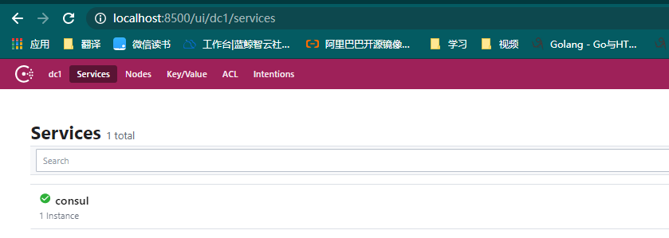

> 本文介绍什么时服务发现及注册，并介绍如何使用 consul 实现服务自发现。

### 一、服务发现和服务注册

### 二、使用 consul 实现服务发现

> 使用 go-kit 框架实现服务注册和发现。

#### 1. consul

> consul 是一个服务网格解决方案，提供了服务发现、配置和分段功能，这些功能可以根据需要单独使用，也可以一起使用以构建完整的服务网格。Consul附带了一个简单的内置代理，因此一切都可以直接使用，还支持Envoy等第三方代理集成。

在 consul 官方文档中对 consul 的各种功能都有详细的描述（不过是英文的），感兴趣的同学可以点击[这里](https://www.consul.io/docs/intro)去官网查看更详细的介绍文档，这里只对consul基本功能做简单介绍。

- 服务发现：consul 客户端可以向 consul 注册一个API 或 mysql 服务，其他客户端就可以通过 consul 发现服务，不论是DNS服务还是HTTP服务，程序都可以轻松的找到它依赖的服务。
- 健康检查：consul 提供了健康检查服务，包括与给定服务相关联（“ Web服务器是否返回200 OK”）或与本地节点相关联（“内存利用率是否低于90％”）。我们可以使用这个信息监控集群健康，同样我们可以通过这个功能不让用户请求出现故障的主机。
- 保存键值对：应用程序可以通过consul保存数据，这些数据可以用来进行动态配置、功能标记、协调、领导者选举等，consul提供了API接口，使用十分简单。
- 安全服务通讯：consul 可以生成和分发 TLS 证书并建立 TLS 通信
- 多数据中心：consul支持多数据中心。

我们可以通过多种方式安装 consul，官网提供了多种操作系统的安装包：点击[这里](https://www.consul.io/downloads)进入下载页面，这里介绍在windows 系统中安装consul：

下载链接：https://releases.hashicorp.com/consul/1.8.5/consul_1.8.5_windows_amd64.zip

下载完成后解压文件是一个可执行程序，进入解压目录执行：

```bash
$ ./consul.exe --version
Consul v1.8.3
Revision a9322b9c7
Protocol 2 spoken by default, understands 2 to 3 (agent will automatically use protocol >2 when speaking to compatible agents)
```

表示已经安装成功了，运行一个 server:

` ./consul.exe agent -dev`

访问http://localhost:8500，可以看到 consul 的前端页面：



#### 2. go-kit微服务框架

#### 3. 实现服务注册与发现功能

首先我们定义一个接口，用来实现服务发现、注册及注销功能：

```go
type DiscoveryClient interface {

	/**
	 * 服务注册接口
	 * @param serviceName 服务名
	 * @param instanceId 服务实例Id
	 * @param instancePort 服务实例端口
	 * @param healthCheckUrl 健康检查地址
	 * @param instanceHost 服务实例地址
	 * @param meta 服务实例元数据
	 */
	Register(serviceName, instanceId, healthCheckUrl string, instanceHost string, instancePort int, meta map[string]string, logger *log.Logger) bool

	/**
	 * 服务注销接口
	 * @param instanceId 服务实例Id
	 */
	DeRegister(instanceId string, logger *log.Logger) bool

	/**
	 * 发现服务实例接口
	 * @param serviceName 服务名
	 */
	DiscoverServices(serviceName string, logger *log.Logger) []interface{}
}
```

然后我们创建一个KitDiscoverClient实现上面的接口：

```go
import (
	"github.com/go-kit/kit/sd/consul"
	"github.com/hashicorp/consul/api"
	"github.com/hashicorp/consul/api/watch"
	"log"
	"strconv"
	"sync"
)

type KitDiscoverClient struct {
	Host   string // Consul Host
	Port   int    // Consul Port
	client consul.Client
	// 连接 consul 的配置
	config *api.Config
	mutex sync.Mutex
	// 服务实例缓存字段
	instancesMap sync.Map
}

func NewKitDiscoverClient(consulHost string, consulPort int) (DiscoveryClient, error) {
	// 通过 Consul Host 和 Consul Port 创建一个 consul.Client
	consulConfig := api.DefaultConfig()
	consulConfig.Address = consulHost + ":" + strconv.Itoa(consulPort)
	apiClient, err := api.NewClient(consulConfig)
	if err != nil {
		return nil, err
	}
	client := consul.NewClient(apiClient)
	return &KitDiscoverClient{
		Host:   consulHost,
		Port:   consulPort,
		config:consulConfig,
		client: client,
	}, err
}
```

服务注册：

```go
func (consulClient *KitDiscoverClient) Register(serviceName, instanceId, healthCheckUrl string, instanceHost string, instancePort int, meta map[string]string, logger *log.Logger) bool {

	// 1. 构建服务实例元数据
	serviceRegistration := &api.AgentServiceRegistration{
		ID:      instanceId,
		Name:    serviceName,
		Address: instanceHost,
		Port:    instancePort,
		Meta:    meta,
		Check: &api.AgentServiceCheck{
			DeregisterCriticalServiceAfter: "30s",
			HTTP:                           "http://" + instanceHost + ":" + strconv.Itoa(instancePort) + healthCheckUrl,
			Interval:                       "15s",
		},
	}

	// 2. 发送服务注册到 Consul 中
	err := consulClient.client.Register(serviceRegistration)

	if err != nil {
		log.Println("Register Service Error!")
		return false
	}
	log.Println("Register Service Success!")
	return true
}
```

服务注销：

```go
func (consulClient *KitDiscoverClient) DeRegister(instanceId string, logger *log.Logger) bool {

   // 构建包含服务实例 ID 的元数据结构体
   serviceRegistration := &api.AgentServiceRegistration{
      ID: instanceId,
   }
   // 发送服务注销请求
   err := consulClient.client.Deregister(serviceRegistration)

   if err != nil {
      logger.Println("Deregister Service Error!")
      return false
   }
   log.Println("Deregister Service Success!")

   return true
}
```

服务发现：

```go
func (consulClient *KitDiscoverClient) DiscoverServices(serviceName string, logger *log.Logger) []interface{} {

	//  该服务已监控并缓存
	instanceList, ok := consulClient.instancesMap.Load(serviceName)
	if ok {
		return instanceList.([]interface{})
	}
	// 申请锁
	consulClient.mutex.Lock()
	// 再次检查是否监控
	instanceList, ok = consulClient.instancesMap.Load(serviceName)
	if ok {
		return instanceList.([]interface{})
	} else {
		// 注册监控
		go func() {
			// 使用 consul 服务实例监控来监控某个服务名的服务实例列表变化
			params := make(map[string]interface{})
			params["type"] = "service"
			params["service"] = serviceName
			plan, _ := watch.Parse(params)
			plan.Handler = func(u uint64, i interface{}) {
				if i == nil {
					return
				}
				v, ok := i.([]*api.ServiceEntry)
				if !ok {
					return // 数据异常，忽略
				}
				// 没有服务实例在线
				if len(v) == 0 {
					consulClient.instancesMap.Store(serviceName, []interface{}{})
				}
				var healthServices []interface{}
				for _, service := range v {
					if service.Checks.AggregatedStatus() == api.HealthPassing {
						healthServices = append(healthServices, service.Service)
					}
				}
				consulClient.instancesMap.Store(serviceName, healthServices)
			}
			defer plan.Stop()
			plan.Run(consulClient.config.Address)
		}()
	}
	defer consulClient.mutex.Unlock()

	// 根据服务名请求服务实例列表
	entries, _, err := consulClient.client.Service(serviceName, "", false, nil)
	if err != nil {
		consulClient.instancesMap.Store(serviceName, []interface{}{})
		logger.Println("Discover Service Error!")
		return nil
	}
	instances := make([]interface{}, len(entries))
	for i := 0; i < len(instances); i++ {
		instances[i] = entries[i].Service
	}
	consulClient.instancesMap.Store(serviceName, instances)
	return instances
}
```

这样我们的服务发现与注册功能就完成了，接下来我们

