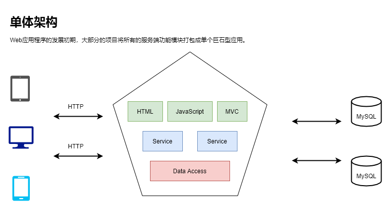

### 一、微服务的崛起

#### 1. 从单体架构

> 在微服务出现之前，人们提出了很多种架构思想，最开始的软件架构以单体架构应用最为广泛，在单体架构是一种垂直划分的架构，从前端展示到后台数据处理再到各种数据库组件，各模块之间相互依赖，在项目发展初期，单体架构具有开发、测试以及部署简单高效的特点，但是随着业务不断的扩大和需求不断的增加，代码变得越来越臃肿，每个模块之间相互依赖，单个模块的更新可能需要整个系统重启，系统优化需要大量的人力和沟通成本。

在 Web 应用程序发展早期，大部分项目将所有的服务端功能模块打包成单个巨石型应用，最终形成如下图所示的单体架构：

单体架构具有以下特点：

- 所有的功能集成在一个项目工程中。

- 所有的功能部署在同一台服务器上。

- 通过部署应用集群和数据库集群来提高系统的性能。

单体架构具有以下优点：

- 项目架构简单，前期开发成本低，周期短，小型项目的首选。

- 开发效率高，模块之间交互采用本地方法调用。

- 容易部署，运维成本小，直接打包为一个完整的包，拷贝到web容器的某个目录下即可运行。

- 容易测试：IDE都是为开发单个应用设计的、容易测试——在本地就可以启动完整的系统。

单体架构具有以下缺点：

- 全部功能集成在一个工程中，对于大型项目不易开发、扩展及维护。

- 版本迭代速度逐渐变慢，修改一个地方就要将整个应用全部编译、部署、启动，开发及测试周期过长。

- 无法按需伸缩，通过集群的方式来实现水平扩展，无法针对某业务按需伸缩。

#### 2. 垂直分层架构

当访问量逐渐增大，单机架构使用增加机器的方式带来的性能优化效用越来越小，单体架构不同业务部分所需要的机器数量和性能差异也越来越大，为了提升机器利用率和性能，单体架构往往会演化为垂直架构。`垂直架构就是以单体架构规模的项目为单位进行垂直划分，将大应用拆分为一个个单体结构的应用。`下图为分层架构的架构图：

但是，拆分后的单机架构之间存在数据冗余，耦合性较大等问题。垂直分层架构中项目之间的接口多为数据同步功能，如：不同项目之间的数据库，通过网络接口进行数据库同步。

分层是一个典型的对复杂系统进行结构化思考和抽象聚合的通用性方法。MVC 则是一种常见的三层结构架构模式。他将应用分为标准的三层：

- 数据访问层：用于定义数据访问接口，实现对真实数据库的访问。
- 服务层：用于对应用业务逻辑进行处理。
- Web 层：用于处理异常、逻辑跳转控制和页面渲染模板等。

垂直分层架构具有如下优点：

- 项目架构简单，前期开发成本低并且周期短，是小型项目的首选。
- 通过垂直拆分，原来的单体项目不至于无限扩大。

但是垂直分层架构也存在全部功能集成在一个工程中的问题，对于大型项目不易开发、扩展及维护；系统性能扩展只能通过扩展集群节点来实现，成本高并且有瓶颈。

#### 3. SOA面向服务架构

当垂直架构拆分的应用越来越多，就会出现多个应用都依赖的业务逻辑组件，并且各个应用进行的交互需求越来越频繁。此时，就需要将部分通用的业务组件独立出来，并定义好服务间交互的接口，向外提供能力，让其他服务调用，于是 SOA 面向服务架构应运而生。 SOA 是一个组件模型，他将应用程序的不同功能单元（称为服务）通过这些服务之间定义良好的接口和契约联系起来。SOA 中的接口独立于实现服务的硬件平台、操作系统和编程语言，采用独立的方式进行定义。这使得架构在各种各样系统中的服务可以以一种统一的通用方式进行交互，下图为 SOA 面向服务架构的架构图： 

SOA 架构的优点：

- 将重复的功能抽取为服务，提高开发效率，提高系统的可用性和可维护性。
- 可以针对不同服务的特点制定集群以及优化方案。
- 才有ESB（Enterprise Service Bus 服务总线）减少系统中的接口耦合。
- 借助现有的应用来组合产生服务的敏捷方式，提供给企业更好的灵活性来构建应用程序和业务流程。

SOA 架构适用于大型软件服务企业对外提供服务的场景，对于一般业务场景并不适用，其服务的定义、注册和调用都需要较为繁琐的编码或者配置实现，并且业务总线也容易导致系统的单点风险并拖累整体性能。

#### 4. 微服务架构 

微服务是一种架构模式，他提倡将单一应用程序划分为一组小的服务，服务之间互相协调、互相配合，为用户提供最终价值。微服务也是一种架构风格，他提倡大型复杂软件应用由一个或者多个微服务组成。系统中的各个微服务可以独立部署，每个微服务之间是松耦合的。每个微服务只关注于单一职责。在一般情况下，单一职责代表着一个小的高内聚的业务能力。与 SOA 架构相比，微服务不再强调 SOA 架构中比较重要的 ESB 企业服务总线，而是通过轻量级通信机制相互沟通，大大提高了开发效率和系统的可维护性 。

如`康威定律所言，任何组织在设计一套系统（广义概念）时，所交付的设计方案在结构上都与该组织的通信结构保持一致，微服务不仅仅是技术架构的变化，还包含了组织方式和沟通方式的变化，开发团队需要形成适合微服务开发的组织架构和沟通方式。`下图为微服务架构的架构图：

微服务架构具有如下特点：

- 系统服务层完全独立出来，并将服务层抽象为一个个微服务。
- 微服务遵循单一原则。
- 微服务之间采用RESTful等轻量通信协议。
- 微服务一般使用容器技术进行部署，运行在自己的独立进程中，合理分配其所需的系统资源。
- 每个微服务都有自己独立的业务开发活动和周期。
- 去中心化服务治理。

微服务架构具有如下优点：

- 服务拆分粒度更细，有利于资源重复利用，提高开发效率。
- 开发者可以更加方便的制定每个服务的优化方案，提高系统可维护性。
- 微服务架构采用去中心化思想，服务之间采用 RESTful 等轻量级协议通信，相比ESB更轻量级，更适用于互联网时代的产品敏捷迭代开发。

当然微服务也不是十全十美，它有如下缺点：

- 基础设施的建设、复杂度高

- 微服务应用是用分布式系统，由此会带来固有的复杂性。

- 分区的数据库架构，同时更新多个业务主体的事务很普遍。

- 测试一个基于微服务架构的应用也是很复杂的任务

- 服务模块间的依赖，应用的升级有可能波及多个服务模块的修改

- 对运维基础设施的挑战比较大

### 二、微服务架构设计

#### 1. 组件服务化

传统组件通过库实现组件，库和应用一起运行在进程中，库的局部变化意味着整个应用的重新部署。

- kit: 微服务框架
- service: 业务代码+kit依赖+第三方依赖组成微服务
- rpc+message queue：轻量级通讯 为什么轻量级

本质上等同于，多个微服务组合完成了一个完整的用户场景 DDD

#### 4. 按业务组织服务

康威定律

> you build it ,you fix it

B站模式： 大前端（移动/Web）——> 网关接入——> 业务服务——> 平台服务——> 基础设施（Paas/Saas）

开发团队对软件在生产环境的运行负全责。

#### 5. 去中心化

- 数据去中心化：每个服务独享自身的数据存储设施（缓存、数据库等）
- 治理去中心化：服务发现,nginx
- 技术去中心化：合适的语言做合适的事情

#### 6. 基础设施自动化

- CICD：Gitlab + Gitlab Hooks + k8s

- Testing：测试环境、单元测试、API自动化测试（yapi）
- 在线运行时：k8s， Promethes、 ELK 、Controil Panle

#### 7.  可用性和依赖性设计

`Design For Failure`思想

- 隔离
- 超时控制
- 负载保护
- 限流
- 降级
- 重试
- 负载均衡

布斯塔尔法则（发送时要保守，接收时要开放）

### 三、微服务设计

#### 1. API Gateway

在 Web 服务刚兴起的时候，前后端服务是一体的，客户端每次向服务端发送请求，服务端会返回一个渲染好的 HTML 页面，如下图：

随着业务发展，由后端反复送html到前端（后端渲染）的技术很难适应新的业务场景，于是出现了 API 网关的概念，客户端通过请求 API 网关获取数据，然后前端开发工程师将数据渲染到 HTML 页面，如下图：

但是随着 SOA 服务化的架构演进，按照垂直功能对架构进行了划分，对外暴漏了一批微服务，但是因为缺乏统一的出口面临了不少困难，如：

- 客户端到微服务直接通信，强耦合。
- 客户端需要多次请求服务端，进行数据聚合，工作量大，延迟高。
- 各部门之间微服务协议存在差异，不利于统一。
- 多终端兼容逻辑复杂，每个服务都需要处理。
- 统一逻辑无法收敛，比如安全认证、限流。

为了解决上面的问题，人们提出了 BFF（Back-end For Front-end） 架构，翻译过来就是服务于前端的后端，下图为 BFF 架构示例图：

BFF 对外提供统一的协议，并与 API 网关对接，BFF内部进行大量的数据聚合，按照业务场景来这几粗粒度的 API，这给后续服务的演进带来了很多优势，如：

- 轻量交互：协议精简、聚合。
- 差异服务：数据裁剪以及聚合、针对终端定制化API。
- 动态升级：原有系统兼容升级，更新服务而非协议。
- 沟通效率提升，协作模式演进为移动业务+网关小组。

BFF可以认为是一种适配服务，将后端的微服务进行适配（主要包括聚合裁剪和格式适配等逻辑），向无线端设备暴漏友好和统一的 API，方便无线设备接入访问后端服务。

但是上面的架构存在一个致命的问题，就是**BFF**服务属于**signal point of failure**，即单节点，严重代码缺陷或者流量洪峰可能引发集群宕机，总结一下，主要存在下面两种问题：

- 单个模块也会导致后续业务集成复杂度高，根据康威法则，单块的无线BFF和多团队之间就会出现不匹配问题，团队之间沟通成本高，交付效率低下。
- 很多跨横切面逻辑，比如安全认证、日志监控、限流熔断等。随着时间的推移，代码变得越来越复杂，技术债越来越多。

针对上面的问题，我们可以通过多集群的方式来解决，将原有的单节点**BFF**横向切分成多个模块，如下面的架构：

跨横切面（Cross-Cutting Concerns）的功能，需要协调更新框架升级发版（路由、认证、限流、安全），因此全部下沉，引入**API Gateway**，把业务集成度高的**BFF**层和通用功能服务层**API Gateway** 进行分层处理，如下图：

在新的架构中，网关承担了重要的角色，它是解耦拆分和后续升级迁移的利器。在网关的配合下，单块**BFF**实现了解耦拆分，各业务线团队可以独立开发和交付各自的微服务，研发效率大大提升。另外，把横切面逻辑从**BFF**剥离到网关上去后， **BFF**的开发人员可以更加专注业务逻辑交付，实现了架构上的关注分离（Separation of Concerns）。

如某视频网站的业务流量实际为：

移动端 -->API >Gateway -->BFF -->Microservice，在FE Web业务中，BFF可以是nodejs来做服务端渲染（SSR Service-Side Rendering）,z注意这里忽略了上有的CDN、4/7层负载均衡（ELB）

#### 2. MicroService 划分

- Business Capability 按照部门职能拆分
- Bounded Context 限界上下文是DDD中用来划分不同业务边界的元素。

**CQRS**（ Command Query Responsibility Segregation）：将应用程序分为两部分：命令端和查询端。

- 命令端负责处理程序创建、更新、删除请求，并在数据更改时发出事件。
- 查询端通过针对一个或者多个物化视图执行查询来处理查询，这些物化视图通过订阅数据更改时发出的事件流而保持最新。

订阅（Pull vs Push）

#### 3. MicroService 安全

API Gateway基于业务的Boss鉴权

API Gateway (Biz Auth)-> BFF(JWT) -> Service(Request Args) 

对于服务内部，一般要区分身份认证和授权：

- Full Trust（知道你是谁，通信加密）
- Half Trust（知道你是谁，通信不加密）
- Zero Trust（不知道你是谁，不加密）

### 四、gRPC 和 服务发现

#### RPC通信

#### 1.  什么是 gRPC 

**gRPC 简单介绍：**

 gRPC can use protocol buffers as both its Interface Definition Language (**IDL**) and as its underlying message interchange format.

**gRPC 核心理念：**

以上内容翻译自，**gRPC** 官网的介绍，关于 **gRPC** 在的更多详细介绍可以参考其[官网文档](https://www.grpc.io/docs/what-is-grpc/introduction/)。

- 语言中立
- 轻量级、高性能：序列化支持PB（Protocol Buffer）
- IDL 基于文件方式定义服务
- 设计理念
- 移动端：基于标准的HTTP2设计

#### 2. gRPC 健康检查

主动健康检查，可以在服务提供者不稳定时被消费者感知

- 平滑下线
- 平滑发布

两个心跳周期。

#### 3. 服务发现

- 客户端发现

一个服务实例被启动时，他的网络地址会被写入注册表

客户端使用一个负载均衡算法，去选择一个可用的服务实例来响应这个请求。

- 服务端发现

service mesh

### 五、多集群与多服务

#### 1. 多集群

LO服务，从下面角度思考多集群必要性：

- 从单一集群考虑，多个节点保证可用性，通常采用N+2的方式来冗余节点
- 从单一集群故障带来的影响面角度考虑冗余多套集群
- 单个机房内的机房故障导致的问题

XDS

## 问题：

1. ROW Format

2. 同一个领域后台管理和面向用户怎么拆分（Share Database架构思想）
3. 

