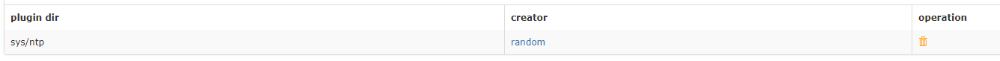

>agent是监控系统中比较重要的一块，小米的oprn-falcon采用rpc的方式与server端进行通信，点击[agent](https://github.com/open-falcon/falcon-plus/tree/master/modules/agent)可以看到源码，当然，后面随着代码commit，本文介绍的部分内容会与实际代码不同，但思路是不会变的。

## 一、 Agent 模块启动流程
#### 1. flag参数
main函数是整个agnet代码的入口，我们从这里开始进行分析。
```go
cfg := flag.String("c", "cfg.json", "configuration file")
version := flag.Bool("v", false, "show version")
check := flag.Bool("check", false, "check collector")

flag.Parse()
```
首先通过flag包接收参数，用来配置agent，它包括以下三个参数：
- v参数用来查看agent的版本。
- check会调用funcs.CheckCollector()来检查当前环境是否可用，并且输出输出检查结果：
- c参数用来指定配置文件
#### 2.初始化
加载完配置文件后，main函数调用下面三个函数进行初始化：
-	g.InitRootDir()  
```go
var Root string
// 这个函数用来获取当前路径PWD的值
func InitRootDir() {
	var err error
	Root, err = os.Getwd()
	if err != nil {
		log.Fatalln("getwd fail:", err)
	}
}
```
-	g.InitLocalIp()
```go
var LocalIp string
// 获取当前agent所在主机的IP
func InitLocalIp() {
	if Config().Heartbeat.Enabled {
		conn, err := net.DialTimeout("tcp", Config().Heartbeat.Addr, time.Second*10)
		if err != nil {
			log.Println("get local addr failed !")
		} else {
			LocalIp = strings.Split(conn.LocalAddr().String(), ":")[0]
			conn.Close()
		}
	} else {
		log.Println("hearbeat is not enabled, can't get localip")
	}
}
```
-	g.InitRpcClients()
```go
var (
	HbsClient *SingleConnRpcClient
)
# 初始化一个rpc客户端
func InitRpcClients() {
	if Config().Heartbeat.Enabled {
		HbsClient = &SingleConnRpcClient{
			RpcServer: Config().Heartbeat.Addr,
			Timeout:   time.Duration(Config().Heartbeat.Timeout) * time.Millisecond,
		}
	}
}
```
#### 3.更新CPU和硬盘信息
接着main函数创建了一个Goroutine，调用了cron.InitDataHistory()，这是一个定期更新CPU和硬盘信息的函数。
```go
func InitDataHistory() {
	for {
		funcs.UpdateCpuStat()
		funcs.UpdateDiskStats()
		time.Sleep(g.COLLECT_INTERVAL)
	}
}
```
#### 4.初始化一个FuncsAndInterval类型的切片
main函数调用funcs.BuildMappers()，初始化一个FuncsAndInterval类型的切片，这其实就是将具体的功能函数进行了一个包装。
#### 5.发送状态给server
在cron目录中有一个ReportAgentStatus()函数用来定期报告agent的状态
```go
func ReportAgentStatus() {
	if g.Config().Heartbeat.Enabled && g.Config().Heartbeat.Addr != "" {
		go reportAgentStatus(time.Duration(g.Config().Heartbeat.Interval) * time.Second)
	}
}

func reportAgentStatus(interval time.Duration) {
	for {
		hostname, err := g.Hostname()
		if err != nil {
			hostname = fmt.Sprintf("error:%s", err.Error())
		}

		req := model.AgentReportRequest{
			Hostname:      hostname,
			IP:            g.IP(),
			AgentVersion:  g.VERSION,
			PluginVersion: g.GetCurrPluginVersion(),
		}

		var resp model.SimpleRpcResponse
		// 这里使用net/rpc标准库与server进行通信 HBsClient在2中已经进行了初始化
		err = g.HbsClient.Call("Agent.ReportStatus", req, &resp)
		if err != nil || resp.Code != 0 {
			log.Println("call Agent.ReportStatus fail:", err, "Request:", req, "Response:", resp)
		}

		time.Sleep(interval)
	}
}
```
#### 6.加载自己编写的插件
cron.SyncMinePlugins()


## 二、Agent 数据采集机制

#### 1. 数据模型

```json
{
    metric: cpu.busy,               // 监控项名称
    endpoint: open-falcon-host,     // 目标服务器的主机名
    tags: srv=falcon,group=az1,     // tag标签，作用是聚合和归类，在配报警策略时会比较方便。
    value: 10,                      // 监控项数值
    timestamp: `date +%s`,          // 采集时间
    counterType: GAUGE,             // 监控项类型。 只能是COUNTER或者GAUGE二选一，前者表示该数据采集项为计时器类型，后者表示其为原值 (注意大小写)
    step: 60                        // 采集间隔。 秒。
}
```


#### 2. 数据采集与推送

open-falcon 提供了上百种监控数据的采集功能，基本上都是从 Linux 操作系统的系统文件种抓取数据，然后组合成规范的数据结构，最后通过 RPC 的方式发送给 transfer 组件。


#### 3. 如何编写自己的插件

首先我们来看一下 agent 加载 plugin 插件的流程：


我们可以看到，插件启动是通过 hbs 同步过来的，而 hbs 中的插件信息是需要在 partal 上面进行配置的：



在 partal 上只需要配置插件的目录，在 open-falcon 系统中，插件其实就是用户编写的信息采集脚本，这些脚本保存在 agent 工作目录的 plugin 目录下面，通过在 partal 中配置启动的插件目录实现插件启用，插件返回的数据格式是有限制的，必须满足下面的格式：

```json
{
    metric: cpu.busy,               // 监控项名称
    endpoint: open-falcon-host,     // 目标服务器的主机名
    tags: srv=falcon,group=az1,     // tag标签，作用是聚合和归类，在配报警策略时会比较方便。
    value: 10,                      // 监控项数值
    timestamp: `date +%s`,          // 采集时间
    counterType: GAUGE,             // 监控项类型。 只能是COUNTER或者GAUGE二选一，前者表示该数据采集项为计时器类型，后者表示其为原值 (注意大小写)
    step: 60                        // 采集间隔。 秒。
}
```

在 partal 上插件配置的方式有下面三种：

- 直接配置目录

  ```bash
  比如：sys/ntp
  这样配置只会读取满足插件命名规则的脚本文件，其他文件会被忽略
  ```

- 配置插件脚本文件

  ```bash
  比如：sys/ntp/60_ntp.py
  ```

- 配置插件脚本以及参数

  ```bash
  比如：sys/ntp/60_ntp.py(arg1,arg2)
  脚本文件后面括号里面的内容为传入的参数。
  ```

脚本文件的命名也是有要求的，**文件名是数字下划线打头的，这个数字代表的是step，即多长时间跑一次，单位是秒，比如60_a.py，就是在通过命名告诉agent，这个插件每60秒跑一次。sys/ntp目录下的子目录、其他命名方式的文件都会被忽略**。


#### 4. 白名单机制

启动 agent 的时候，系统会定期执行 **cron.SyncTrustableIps()**，用来同步白名单，这里的白名单并不是用来判断 agent 的安全性的，相反，他是用来限制非白名单主机访问 agent 组件的 http 服务的，比如下面的 exit 接口：

```go
http.HandleFunc("/exit", func(w http.ResponseWriter, r *http.Request) {
	if g.IsTrustable(r.RemoteAddr) {
		w.Write([]byte("exiting..."))
		go func() {
			time.Sleep(time.Second)
			os.Exit(0)
		}()
	} else {
		w.Write([]byte("no privilege"))
	}
})
```

系统会对一些重要接口做安全校验，校验的方法就是通过 trust ips 来与 remote ip 做比较，系统通过白名单机制保护了程序运行的安全性，平时很少见通过这种方式做限制的。


