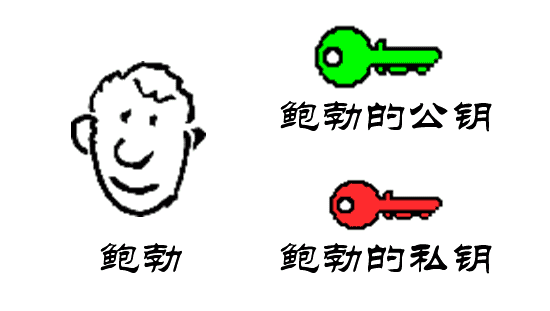

## 一、PKI 体系

## 二、数字证书

> 数字证书可理解为相当于护照、驾驶执照之类用以证明实体身份的证件。例如，护照可以证明实体的姓名、国籍、出生日期和地点、照片与签名等方面信息。类似地，数字证书也可以证明网络实体在特定安全应用的相关信息。数字证书就是一个用户的身份与其所持有的公钥的结合，在结合之前由一个可信任的权威机构CA来证实用户的身份，然后由该机构对该用户身份及对应公钥相结合的证书进行数字签名，以证明其证书的有效性。

#### 1. 数字证书基本概念

数字证书的结构在 Satyam 标准中定义，由国际电信联盟（ITU）推出，并放在 X.509 标准中，目前 X.509 数字证书最新版本为 v3 版本，数字证书结构中包括下面十一个基本字段：

| 字段                                                  | 描述                                                         |
| ----------------------------------------------------- | ------------------------------------------------------------ |
| 版本（Version）                                       | 标识本数字证书使用的 X.509 协议版本目前可取 1/2/3            |
| 证书序列（Certificate Serial Number）                 | 包含 CA 产生的唯一整数值                                     |
| 签名算法标识符（Signature Algorithm Identifier）      | 标识 CA 签名证书时使用的算法                                 |
| 签名者（Issuer Name）                                 | 标识生成、签名数字证书的 CA 的可去区分名（DN）               |
| 有效期（之前/之后）（Validity(Not Before/Not After)） | 包含两个日期时间值（之前/之后），指定数字证书有效的时间范围。通常指定日期、时间，精度到秒或则毫秒。 |
| 主体名（Subject Name）                                | 标识数字证书所指实体（即用户或者组织）的可区分名（DN）除非 v3 扩展中定义了替换名，否则该字段必须有值。 |
| 主体公钥信息（Subject Public Key Information）        | 包含主体的公钥与密钥相关的算法，该字段不能为空。             |
| 签发者唯一标识符（Issuer Unique Identifier）          | 在两个或多个 CA 使用相同签发者名时标识 CA                    |
| 主体唯一标识符（Subject Unique Identifier）           | 在两个或多个主体使用相同签发者名时标识 CA                    |
| 扩展信息（Extensions）                                | v3 版本新增，用来扩展证书描述信息                            |
| 签名值（Certification Authority's Digital Signature） | 将报文按双方约定的HASH算法计算得到一个固定位数的报文摘要，也叫数字签名。 |

#### 2. 生成数字证书

数字证书的生成和管理主要涉及的参与方有：最终用户、注册机构、证书机构。证书机构的任务繁多，如签发新证书、维护旧证书、撤销旧证书等，因此一部分证书生成和管理任务由第三方——注册机构（RA）完成，注册机构提供的服务有：接收与验证最终用户的注册信息、为最终用户生成密钥、接收与授权密钥备份与恢复请求、接收与授权证书撤销请求。下图为三者的关系：

数字证书的生成步骤如下图：

**第一步：密钥生成**

（1）主体（用户/组织）可采用特定软件生成公钥/私钥对，该软件通常是Web浏览器或Web服务器的一部分，也可以使用特殊软件程序。主体必须秘密保存私钥，并将公钥、身份证明与其他信息发送给注册机构。主体生成密钥的过程如下：

（2）当用户不知密钥对生成技术或要求注册机构集中生成和发布所有密钥，以便于执行安全策略和密钥管理时，也可由注册机构为主体（用户）生成密钥对。该方法的缺陷是注册机构知道用户私钥，且在向主体发送途中也可能泄露。注册机构生成密钥的过程如下：

**第二步：注册**

该步骤发生在第1步由主体生成密钥对情形下，若在第1步由RA为主体生成密钥对，则该步骤在第1步中完成。假设用户生成密钥对，则要向注册机构发送公钥和相关注册信息（如主体名，将置于数字证书中）及相关证明材料。用户在特定软件的导引下正确地完成相应输入后通过Internet提交至注册机构。证书请求格式已经标准化，称为证书签名请求（CSR，Certificate Signing Request）。

**第三步：验证**

接收到公钥及相关证明材料后，注册机构须验证用户材料，验证分为以下两个层面。

（1）RA要验证用户材料，以明确是否接受用户注册。若用户是组织，则RA需要检查营业记录、历史文件和信用证明；若用户为个人，则只需简单证明，如验证邮政地址、电子邮件地址、电话号码或护照、驾照等。

（2）确保请求证书的用户拥有与向RA的证书请求中发送的公钥相对应的私钥。这个检查被称为检查私钥的拥有证明（POP，Proof Of Possession）。主要的验证方法有如下几种。

- RA可要求用户采用私钥对证书签名请求进行数字签名。若RA能用该用户公钥验证签名正确性，则可相信该用户拥有与其证书申请中公钥一致的私钥。
- RA可生成随机数挑战信息，用该用户公钥加密，并将加密后的挑战值发送给用户。若用户能用其私钥解密，则可相信该用户拥有与公钥相匹配的私钥。
- RA可将CA所生成的数字证书采用用户公钥加密后，发送给该用户。用户需要用与公钥匹配的私钥解密方可取得明文证书——也实现了私钥拥有证明的验证。

**第四步：生成证书**

设上述所有步骤成功，则RA将用户的所有细节传递给证书机构。证书机构进行必要的验证，并生成数字证书。证书机构将证书发给用户，并在CA维护的证书目录（CertificateDirectory）中保留一份证书记录。然后证书机构将证书发送给用户，可附在电子邮件中；也可向用户发送一个电子邮件，通知其证书已生成，让用户从CA站点下载。数字证书的格式实际上是不可读的，但应用程序可对数字证书进行分析解释，例如，打开Internet Explorer浏览器浏览证书时，可以看到可读格式的证书细节。

#### 3. 数字证书的签名与验证

**数字证书签名：**

前面介绍过数字证书的最后一个字段证书机构的数字签名，在向用户签发数字证书前，CA首先要对证书的所有字段计算一个消息摘要（使用MD5或SHA-1等杂凑算法），而后用CA私钥加密消息摘要（如采用RSA算法），构成CA的数字签名。CA将计算出的数字签名作为数字证书的最后一个字段插入，类似于护照上的印章与签名。该过程由密码运算程序自动完成。数字签名过程如下：

**数字证书的验证**

验证步骤有六步：

（1）用户将数字证书中除最后一个字段以外的所有字段输入消息摘要算法（杂凑算法）。该算法与CA签发证书时使用的杂凑算法相同，CA会在证书中指定签名算法及杂凑算法，令用户知道相应的算法信息。

（2）由消息摘要算法计算数字证书中除最后一个字段外其他字段的消息摘要，设该消息摘要为MD1。

（3）用户从证书中取出CA的数字签名（证书中最后一个字段）。

（4）用户用CA的公钥对CA的数字签名信息进行解密运算。

（5）解密运算后获得CA签名所使用的消息摘要，设为MD2。

（6）用户比较MD1与MD2。若两者相符，即MD1=MD2，则可肯定数字证书已由CA用其私钥签名，否则用户不信任该证书，将其拒绝。

在网上看到一篇解释加解密互动过程的文章感觉写的挺好，这里摘录一下，文章出处为：[X.509数字证书的结构与解析](https://blog.csdn.net/xy010902100449/article/details/52145009)。

（1）鲍勃有两把钥匙，一把是公钥，另一把是私钥。

（2）鲍勃把公钥送给他的朋友们—-帕蒂、道格、苏珊—-每人一把。

（3）苏珊要给鲍勃写一封保密的信。她写完后用鲍勃的公钥加密，就可以达到保密的效果。

（4）鲍勃收信后，用私钥解密，就看到了信件内容。这里要强调的是，只要鲍勃的私钥不泄露，这封信就是安全的，即使落在别人手里，也无法解密。

（5）鲍勃给苏珊回信，**决定采用 “数字签名”**。他写完后先用Hash函数，生成信件的摘要（digest）。

（6）然后，鲍勃使用私钥，对这个摘要加密，生成”数字签名”（signature）。

（7）鲍勃将这个签名，附在信件下面，一起发给苏珊。

（8）苏珊收信后，取下数字签名，用鲍勃的公钥解密，得到信件的摘要。由此证明，这封信确实是鲍勃发出的。

（9）苏珊再对信件本身使用Hash函数，将得到的结果，与上一步得到的摘要进行对比。如果两者一致，就证明这封信未被修改过。

（10）复杂的情况出现了。道格想欺骗苏珊，他偷偷使用了苏珊的电脑，用自己的公钥换走了鲍勃的公钥。此时，苏珊实际拥有的是道格的公钥，但是还以为这是鲍勃的公钥。因此，道格就可以冒充鲍勃，用自己的私钥做成”数字签名”，写信给苏珊，让苏珊用假的鲍勃公钥进行解密。

（11）后来，苏珊感觉不对劲，发现自己无法确定公钥是否真的属于鲍勃。她想到了一个办法，要求鲍勃去找”证书中心”（certificate authority，简称CA），为公钥做认证。证书中心用自己的私钥，对鲍勃的公钥和一些相关信息一起加密，生成”数字证书”（Digital Certificate）。

（12）鲍勃拿到数字证书以后，就可以放心了。以后再给苏珊写信，只要在签名的同时，再附上数字证书就行了。

（13）苏珊收信后，用CA的公钥解开数字证书，就可以拿到鲍勃真实的公钥了，然后就能证明”数字签名”是否真的是鲍勃签的。

#### 4. 数字证书相关文件

在使用数字证书的过程中，我们经常会遇到各种类型的文件，如crt、key、crs、pem等等，这些文件是什么含义呢？我们都知道在生成数字证书的过程中会产生三种文件：私钥、公钥、数字证书，这些文件通常有两种编码格式：

- PEM - Privacy Enhanced Mail,打开看文本格式,以"-----BEGIN..."开头, "-----END..."结尾,内容是BASE64编码.
- DER - Distinguished Encoding Rules,打开看是二进制格式。

无论是公钥、私钥还是数字证书都可以采用这两种编码中的任意一种进行编码，常见的文件扩展名如下：

- CRT 数字证书，常见于UNIX系统,有可能是PEM编码,也有可能是DER编码,大多数应该是PEM编码
- CER 还是证书，常见于Windows系统，同样的,可能是PEM编码，也可能是DER编码,大多数应该是DER编码。
- KEY 通常用来存放一个公钥或者私钥，**并非X.509证书**。
- CSR Certificate Signing Request，即证书签名请求,这个并不是证书,而是向权威证书颁发机构获得签名证书的申请，其核心内容是一个公钥(当然还附带了一些别的信息),在生成这个申请的时候,同时也会生成一个私钥。
- PFX/P12  predecessor of PKCS#12,对UNIX服务器来说，一般CRT和KEY是分开存放在不同文件中的,但Windows的IIS则将它们存在一个PFX文件中。
- PEM 跟crt/cer的区别是它以Ascii来表示。

#### 5. 使用Go语言生成数字证书和密钥

#### 6. 使用 OpenSSL 生成数字证书和密钥

## 三、加密算法

#### 1. 对称加密

> 对称式加密就是加密和解密使用同一个[密钥](https://baike.baidu.com/item/密钥)，通常称之为“Session Key ”这种[加密技术](https://baike.baidu.com/item/加密技术)在当今被广泛采用，如美国政府所采用的DES加密标准就是一种典型的“对称式”[加密法](https://baike.baidu.com/item/加密法)，它的Session Key长度为56bits。

常见的对称加密算法：DES，AES，3DES等等。

#### 2. 非对称加密

> 非对称式加密就是加密和解密所使用的不是同一个[密钥](https://baike.baidu.com/item/密钥)，通常有两个密钥，称为“[公钥](https://baike.baidu.com/item/公钥)”和“[私钥](https://baike.baidu.com/item/私钥)”，它们两个必需配对使用，否则不能打开加密文件。这里的“[公钥](https://baike.baidu.com/item/公钥)”是指可以对外公布的，“[私钥](https://baike.baidu.com/item/私钥)”则不能，只能由持有人一个人知道。它的优越性就在这里，因为对称式的加密方法如果是在网络上传输加密文件就很难不把[密钥](https://baike.baidu.com/item/密钥)告诉对方，不管用什么方法都有可能被别[窃听](https://baike.baidu.com/item/窃听)到。而非对称式的加密方法有两个[密钥](https://baike.baidu.com/item/密钥)，且其中的“[公钥](https://baike.baidu.com/item/公钥)”是可以公开的，也就不怕别人知道，收件人解密时只要用自己的[私钥](https://baike.baidu.com/item/私钥)即可以，这样就很好地避免了密钥的传输安全性问题。

常见的非对称加密算法：RSA，ECC等等。

#### 3. 哈希算法

> 哈希算法又称杂凑运算或Hash函数，Hash函数（也称杂凑函数或杂凑算法）就是把任意长的输入消息串变化成固定长的输出串的一种函数。

在数字证书中就通过哈希算法提取信息摘要产生固定长度的输出串，杂凑算法主要有下面几种：

| 算法名称             | 输出大小 (bits)     | 内部大小 | 区块大小 | 长度大小 | 字符尺寸 | 碰撞情形   |
| -------------------- | ------------------- | -------- | -------- | -------- | -------- | ---------- |
| HAVAL                | 256/224/192/160/128 | 256      | 1024     | 64       | 32       | 是         |
| MD2                  | 128                 | 384      | 128      | No       | 8        | 大多数     |
| MD4                  | 128                 | 128      | 512      | 64       | 32       | 是         |
| MD5                  | 128                 | 128      | 512      | 64       | 32       | 是         |
| PANAMA               | 256                 | 8736     | 256      | 否       | 32       | 是         |
| RadioGatún           | Arbitrarily long    | 58 words | 3 words  | 否       | 1-64     | 否         |
| RIPEMD               | 128                 | 128      | 512      | 64       | 32       | 是         |
| RIPEMD-128/256       | 128/256             | 128/256  | 512      | 64       | 32       | 否         |
| RIPEMD-160/320       | 160/320             | 160/320  | 512      | 64       | 32       | 否         |
| SHA-0                | 160                 | 160      | 512      | 64       | 32       | 是         |
| SHA-1                | 160                 | 160      | 512      | 64       | 32       | With flaws |
| SHA-256/224          | 256/224             | 256      | 512      | 64       | 32       | 否         |
| SHA-512/384          | 512/384             | 512      | 1024     | 128      | 64       | 否         |
| Tiger(2)-192/160/128 | 192/160/128         | 192      | 512      | 64       | 64       | 否         |
| WHIRLPOOL            | 512                 | 512      | 512      | 256      | 8        | 否         |
| SM3                  | 256                 | 256      | 512      | 256      | 32       | 否         |