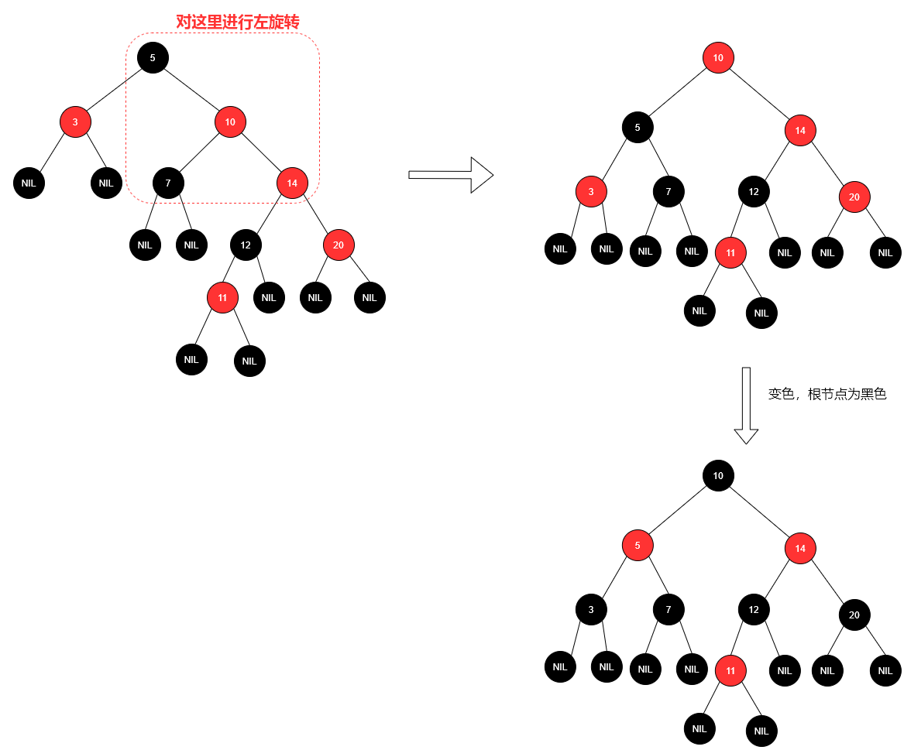

### 一、算法基本概念

#### 1. 算法

#### 2. 时间复杂度和空间复杂度

### 二、排序算法

#### 1. 插入排序

> 插入排序，一般也被称为直接插入排序。对于少量元素的排序，它是一个有效的算法  。插入排序是一种最简单的排序方法，它的基本思想是将一个记录插入到已经排好序的有序表中，从而一个新的、记录数增1的有序表。在其实现过程使用双层循环，外层循环对除了第一个元素之外的所有元素，内层循环对当前元素前面有序表进行待插入位置查找，并进行移动。

下图为插入排序的动态过程：


**时间复杂度：**O( n<sup>2</sup>)

**适用场景：**因为需要和每一个元素做比较，因此插入排序并不适合数据量较大的序列，插入排序比较**适合少量的数据进行排序**，另外对于基本有序的序列使用插入排序也是十分有效的。

**实现方法：**从序列的第二个元素开始，将元素与前面以排好序的序列进行比较，并插入已排好序的序列中。

下面分别用Go语言和Python实现该算法，Go语言：

```go
func InsertSort(data []int) []int {
	if len(data) <= 1 {
		return data
	}
	var temp int
	for i := 1; i < len(data); i++ {
		for j := 0; j < i; j++ {
			if data[i] < data[j] {
				temp = data[i]
				data[i] = data[j]
				data[j] = temp
			}
		}
	}
	return data
}
```

Python：

```python
#!/usr/bin/env python
# coding:utf-8

# --------------------------------
#  Author     : random_wz
#  Email      : 1214469162@qq.com
#  Version    : 1.0
#  Create_date: 2020/11/9 10:19
#  Description:
# --------------------------------


def insert_sort(data):
    if len(data) < 2:
        return data
    for i in range(1,len(data)):
        for j in range(i):
            if data[i] < data[j]:
                temp = data[i]
                data[i] = data[j]
                data[j] = temp
    return data
```


#### 2. 冒泡排序

> 冒泡排序是通过对相邻元素作比较，并按照从小到大（或从大到小）的顺序进行排列，并重复该操作，直到最后一个元素完成排序。

下图为冒泡排序的动态过程：


**时间复杂度：**O( n<sup>2</sup>)

**适用场景：**因为需要和每一个元素做比较，因此插入排序并不适合数据量较大的序列，插入排序比较**适合少量的数据进行排序**。

**实现方法：**从序列的第一个元素开始，将元素与后面相邻的元素进行比较，并按照从小到大（或从大到小）的顺序进行排列。

下面我们分别使用 Go 语言和 Python 来实现这个算法，Go 语言：

```go
// PopSort 从小到大排序
func PopSort(data []int) []int {
	if len(data) <= 1 {
		return data
	}
	var temp int
	for i := range data {
		for j := i + 1; j < len(data); j++ {
            // 将 data[i] 与所有的元素做比较
			if data[i] > data[j] {
				temp = data[j]
				data[j] = data[i]
				data[i] = temp
			}
		}
	}
	return data
}
```

Python 语言：

```python
#!/usr/bin/env python
# coding:utf-8

# --------------------------------
#  Author     : random_wz
#  Email      : 1214469162@qq.com
#  Version    : 1.0
#  Create_date: 2020/11/9 10:19
#  Description:
# --------------------------------


def pop_sort(data):
    if len(data) < 2:
        return data
    for i in range(len(data)):
        for j in range(len(data) - i - 1):
            if data[j] > data[j + 1]:
                temp = data[j + 1]
                data[j + 1] = data[j]
                data[j] = temp
    return data
```

#### 3. 选择排序

> 选择排序是通过在未排序的序列中找到最大（小）值，将该值添加到序列的末尾，依次循环，直到所有序列排好序。

选择排序动态演示图如下：


**时间复杂度：**O( n<sup>2</sup>)

**适用场景：**因为需要和每一个元素做比较，因此插入排序并不适合数据量较大的序列，插入排序比较**适合少量的数据进行排序**。

**实现方法：**从序列中找到最大（小）值，并将该值添加到序列末尾，依次循环，直到所有序列排好序。

下面我们分别使用 Go 语言和 Python 来实现这个算法，Go 语言：

```go
func SelectionSort(data []int) []int {
	if len(data) <= 1 {
		return data
	}
	var minIndex, temp int
	for i := 0; i < len(data) - 1; i++ {
		minIndex = i
		for j := i + 1; j < len(data); j++ {
			if data[j] < data[minIndex] {
				minIndex = j
			}
		}
		temp = data[minIndex]
		data[minIndex] = data[i]
		data[i] = temp
	}
	return data
}
```

Python:

```python
#!/usr/bin/env python
# coding:utf-8

# --------------------------------
#  Author     : random_wz
#  Email      : 1214469162@qq.com
#  Version    : 1.0
#  Create_date: 2020/11/9 10:19
#  Description:
# --------------------------------


def selection_sort(data):
    if len(data) < 2:
        return data
    for i in range(len(data) - 1):
        min_index = i
        for j in range(i + 1, len(data)):
            if data[j] < data[min_index]:
                min_index = j
        temp = data[i]
        data[i] = data[min_index]
        data[min_index] = temp
    return data
```

#### 4. 希尔排序

> 希尔排序是对插入排序的优化，对于中等规模的数据排序是十分高效的，希尔排序是把记录按下标的一定增量分组，对每组使用直接插入排序算法排序；随着增量逐渐减少，每组包含的关键词越来越多，当增量减至 1 时，整个文件恰被分成一组，算法便终止。

希尔排序动态图看起来不直观，我们可以看下面一组图来理解希尔排序的整个过程：

首先对序列进行分组：


对每一组数据进行插入排序，使数组变得基本有序：


设置增量为上次的一半，并进行分组：


第二次分组后排序：


然后重复上面的步骤直至增量为1，整个文件恰被分成一组，算法便终止。

图片来源于：https://blog.csdn.net/qq_39207948/article/details/80006224

**时间复杂度：**希尔排序的实现方式有很多种，时间复杂度因实现方法而不同，最坏情况回达到O( n<sup>2</sup>)

**适用场景：**希尔排序是对插入排序的优化，希尔排序没有快速排序算法快 O(n(logn))，因此中等大小规模表现良好，对规模非常大的[数据排序](https://baike.baidu.com/item/数据排序)不是最优选择。但是比O(n<sup>2</sup>)复杂度的算法快得多。

**实现方法：**

- 将序列按照一定增量进行分组。
- 对分组进行插入排序。
- 将增量减少为一半，重复上面两步，直到增量为1，这时整个序列排序完成。

下面我们分别用Go语言和Python来实现希尔排序，Go语言：

<font size=3 color=red>注意：希尔排序在实际代码中不需要完全按照一组插入排序完成后再进行另一组插入排序。</font>

```go
// ShellSort
func ShellSort(data []int) []int {
    // 分组
	for gap := len(data) / 2; gap > 0; gap /= 2 {
		for i := gap; i < len(data); i++ {
			insertSort(data, gap, i)
		}
	}
	return data
}
// insertSort 同过gap将序列进行分组，这样每组在插入排序时同时进行多组数据的插排
func insertSort(data []int, gap, index int) {
	var temp = data[index]
	var j int
    // 从前到后排序，index=gap时只有两个数字，后面数字会增加，但是他们前面的数已经经过了插排，因此基本有序，
    // 所以这里判断条件直接使用data[j] > temp，而不是与所有序列进行比较
	for j = index - gap; j >= 0 && data[j] > temp; j -= gap {
		data[j+gap] = data[j]
	}
	data[j+gap] = temp
}
```

Python语言：

```python

```


#### 5. 归并排序

> 归并排序是创建在归并操作上的一种有效的排序算法，该算法是采用分治法，将数据先进性分割（递归地把当前序列平均分割成两半），然后在进行合并（在保持元素顺序的同时将上一步得到的子序列集成到一起）。

归并排序动态过程如下：


**时间复杂度：**O( nlog<sup>n</sup>)

**适用场景：**归并排序是稳定的排序算法，当排序数量比较多的时候可以适用归并排序。

**实现方法：**

- 分割：递归地把当前序列平均分割成两半。
- 合并：在保持元素顺序的同时将上一步得到的子序列集成到一起。

下面我们分别使用 Go 语言和 Python 来实现这个算法，Go 语言：

```go
// MergeSort 入口函数
func MergeSort(data []int) []int {
	return MergeSort(data, 0, len(data)-1)
}
// mergeSort 分割：将数据分为两份，通过递归的方式进行排序
func mergeSort(data []int, left, right int) []int {
	if left < right {
		mid := (left + right - 1) / 2
		mergeSort1(data, left, mid)
		mergeSort1(data, mid+1, right)
		merge(data, left, mid, right)
	}
	return data
}
// merge 集成:将两组数据排序集成
func merge(data []int, left, mid, right int) []int {
    // 左侧序列长度和右侧序列长度
	var LLength = mid - left + 1
	var RLength = right - mid
    // 将左右两侧序列分别保存到临时数组
	var RData, LData []int
	for i := 0; i < LLength; i++ {
		LData = append(LData, data[left+i])
	}
	for i := 0; i < RLength; i++ {
		RData = append(RData, data[mid+i+1])
	}
    // 对两组数据进行排序
	var l, r, k = 0, 0, left
	for l < LLength && r < RLength {
		if LData[l] <= RData[r] {
			data[k] = LData[l]
			l++
		} else {
			data[k] = RData[r]
			r++
		}
		k++
	}
    // 将剩余元素添加到数组
	for l < LLength {
		data[k] = LData[l]
		k++
		l++
	}
	for r < RLength {
		data[k] = RData[r]
		k++
		r++
	}
	return data
}
```

Python语言：

```python

```


#### 6. 快速排序

> 快排是通过选择一个元素作为基准，将大于基准值的元素放在该元素左（右）边，将小于基准值的元素放到该元素的右（左）边，这样数据 就被分为两部分，再分别对这两部分数据以相同的方式进行排序分组，以此类推，就实现了元素的排序。

快速排序的动态演示图如下：


**时间复杂度：**O( nlog<sup>n</sup>)

**适用场景：**快速排序的最好情况下的时间复杂度为O(nlog<sup>n</sup>)，最坏情况下的时间复杂度为O(n<sup>2</sup>)，平均的时间复杂度为O(nlog<sup>n</sup>)。空间复杂度为O(1)，当然了，快速排序是属于不稳定排序。 综合以上情况的对比，快速排序适用于数据杂乱无章的场景，而且越乱，快速排序的效率越体现的淋漓尽致。

**实现方法：**

- 先从数列中取出一个数作为基准数。
- 分区过程，将比这个数大的数全放到它的右边，小于或等于它的数全放到它的左边。
- 再对左右区间重复第二步，直到各区间只有一个数。  

下面我们分别使用 Go 语言和 Python 来实现这个算法，Go 语言：

```go
// QuickSort 入口函数
func QuickSort(data []int) []int {
	return quickSort(data, 0, len(data)-1)
}
// quickSort 递归
func quickSort(data []int, start, end int) []int {
	if start < end {
		mid := partition(data, start, end)
		quickSort(data, start, mid-1)
		quickSort(data, mid+1, end)
	}
	return data
}
// partition 分区
func partition(data []int, start, end int) int {
    // 取第一个数为基准
	temp := data[start]
	for start < end {
		for start < end && data[end] > temp {
			end--
		}
		data[start] = data[end]

		for start < end && data[start] < temp {
			start++
		}
		data[end] = data[start]
	}
	data[start] = temp
	return start
}
```

Python:

```python

```

#### 7. 堆排序  

> 堆排序是一种利用堆这种数据结构设计的一种排序算法。堆是一种近似完全二叉树的数据结构，并同时满足堆积的性质：即子节点的键值或索引总是小于或者大于他的根父节点。在堆的数据结构中，堆中的最大值总是位于根节点（在优先队列中使用堆的话堆中的最小值位于根节点）。

堆中定义以下几种操作：

- 最大堆调整（Max Heapify）：将堆的末端子节点作调整，使得子节点永远小于父节点。
- 创建最大堆（Build Max Heap）：将堆中的所有数据重新排序。
- 堆排序（HeapSort）：移除位在第一个数据的根节点，并做最大堆调整的递归运算。

堆又分为两种：

- 大顶堆： **满足arr[i] >= arr[2i+1] && arr[i] >= arr[2i+2]**  ，即父节点大于子节点。
- 小顶堆：**满足arr[i] <= arr[2i+1] && arr[i] <= arr[2i+2]**  ，即父节点小于子节点。

**图解图排序的整个过程：**


**时间复杂度：**O(nlog<sup>n</sup>>)

**适用场景：**

**实现方法：**

以升序排序为例：

- 将待排序序列构造成一个大顶堆（升序采用大顶堆，降序采用小顶堆），此时，整个序列的最大值就是堆顶的根节点。
- 将其与末尾元素进行交换，此时末尾就为最大值。
- 然后将剩余n-1个元素重新构造成一个堆，这样会得到n个元素的次小值。如此反复执行，便能得到一个有序序列了。

下面分别使用Go语言和Python实现堆排序，Go语言：

```go
// HeapSort 堆排序
func HeapSort(data []int) []int {
	var length = len(data)
	// 构建最大堆
	for i := length - 1; 0 <= i; i-- {
		heapify(data, length, i)
	}
	// 将最大值（最大堆最后一个值最大）与序列第一个值进行交换，交换完成后使用剩下的数组成最大堆
	for i := length - 1; 0 < i; i-- {
		data[i], data[0] = data[0], data[i]
		heapify(data, i, 0)
	}
	return data
}
// heapify 组成最大堆
func heapify(data []int, length, i int) {
	var (
		largest = i
		l       = 2*i + 1
		r       = 2*i + 2
	)
	if l < length && data[i] < data[l] {
		largest = l
	}
	if r < length && data[largest] < data[r] {
		largest = r
	}
	// 如果父节点 i 不是最大值则通过递归找到最大值
	if largest != i {
		data[i], data[largest] = data[largest], data[i]
		heapify(data, length, largest)
	}
}
```

Python语言：

```python

```

#### 8. 计数排序

> 计数排序相对来说是一种比较简单的排序算法，它是一种非基于比较的排序算法，它的优势在于在对一定范围内的整数排序时，它的复杂度为Ο(n+k)（其中k是整数的范围），快于任何比较排序算法。当然这是一种牺牲空间换取时间的做法，而且当O(k)>O(nlog(n))的时候其效率反而不如基于比较的排序（基于比较的排序的时间复杂度在理论上的下限是O(nlog(n)), 如归并排序，堆排序）

**动图演示基数排序的过程：**


**时间复杂度：**Ο(n+k)（其中k是整数的范围）

**适用场景：**对一定范围内的整数排序时，它的复杂度为Ο(n+k)（其中k是整数的范围），快于任何比较排序算法。

**实现方法：**

- 找出序列中最大值和最小值
- 初始化一个统计序列
- 依次读取序列中的值，并将统计序列中对应位置的值加一
- 依次读取统计序列中的值，值的大小表示该索引的值在需要排序的序列中出现的次数，读取出来的值即为排序后的序列

下面分别使用Go语言和Python实现计数排序，Go语言：

```go
// CountingSort 计数排序
func CountingSort(data []int) []int {
	var max, min = data[0], data[0]
	for _, data := range data {
		if data > max {
			max = data
		}
		if data < min {
			min = data
		}
	}
	var CountingData = make([]int, max+1)
	for _, data := range data {
		CountingData[data]++
	}
	data = data[:0]
	for i := min; i <= max; i++ {
		for j := CountingData[i]; j > 0; j-- {
			data = append(data, i)
		}
	}
	return data
}
```

Python:

```python

```

#### 9. 桶排序

> **桶排序 (Bucket sort)**或所谓的**箱排序**，是一个排序算法，工作的原理是将数组分到有限数量的桶子里。每个桶子再个别排序（有可能再使用别的排序算法或是以递归方式继续使用桶排序进行排序）。桶排序是鸽巢排序的一种归纳结果。当要被排序的数组内的数值是均匀分配的时候，桶排序使用线性时间(Θ(n))。但桶排序并不是 比较排序，他不受到 O(nlog<sup>n</sup>) 下限的影响。

**桶排序过程演示：**


**时间复杂度：**O(N + C)

对于待排序序列大小为 N，共分为 M 个桶，主要步骤有：

- N 次循环，将每个元素装入对应的桶中
- M 次循环，对每个桶中的数据进行排序（平均每个桶有 N/M 个元素）

一般使用较为快速的排序算法，时间复杂度为 O(Nlog<sup>N</sup>)，实际的桶排序过程是以链表形式插入的。

整个桶排序的时间复杂度为：

*O*(N)+O(M(N/Mlog<sup>N/M</sup>))=O(N(log<sup>N/M</sup>+1))

当 N = M 时，复杂度为 O(N)

**适用场景：**

**实现方法：**

- 设置一个定量的数组当作空桶；
- 遍历输入数据，并且把数据一个一个放到对应的桶里去；
- 对每个不是空的桶进行排序；
- 从不是空的桶里把排好序的数据拼接起来。

下面分别使用Go语言和Python实现桶排序，Go语言：

```go
// BucketSort 桶排序
func BucketSort(data []int, bucketSize int) []int {
	// 计算最大值和最小值
	var max, min = data[0], data[0]
	for _, v := range data {
		if v > max {
			max = v
		}
		if v < min {
			min = v
		}
	}
	// 计算桶的数量
	var DefaultSize = 5
	if bucketSize == 0 {
		bucketSize = DefaultSize
	}
	var bucketCount = (max-min)/bucketSize + 1
	var bucketData = make([][]int, bucketCount)
	// 将值映射到对应的桶中
	for _, v := range data {
		bucketIndex := (v - min) / bucketCount
		bucketData[bucketIndex] = append(bucketData[bucketIndex], v)
	}
	// 使用快排对每个桶进行排序
	for i, v := range bucketData {
		bucketData[i] = InsertSort(v)
	}
	// 将所有的桶中的数据连接起来
	data = data[:0]
	for _, v := range bucketData {
		data = append(data, v...)
	}
	return data
}

// InsertSort 插入排序
func InsertSort(data []int) []int {
	if len(data) <= 1 {
		return data
	}
	var temp int
	for i := 1; i < len(data); i++ {
		for j := 0; j < i; j++ {
			if data[i] < data[j] {
				temp = data[i]
				data[i] = data[j]
				data[j] = temp
			}
		}
	}
	return data
}
```

Python语言：

```python

```


#### 10. 基数排序

>基数排序是一种非比较型整数排序算法，其原理是将整数按位数切割成不同的数字，然后按每个位数分别比较。由于整数也可以表达字符串（比如名字或日期）和特定格式的浮点数，所以基数排序也不是只能使用于整数。

**动图演示：**


**时间复杂度：**O(n*k) n为排序的个数，k的大小取决于数字位的选择

**适用场景：**

**实现方法：**

下面分别使用Go语言和Python实现基数排序，Go语言：

```go

```

Python语言：

```python

```

**基数排序可以解决生活中的很多排序问题，下面列出一些常见问题的解决思路：**

**（1）字符串排序**

比如我们需要对一组字符串进行排序，这些字符串的长度不确定，那我们该如何使用基数排序来解决这个问题呢？

- 第一步：我们可以找到字符串中长度最大的字符串，然后以该字符串的长度为基准，当其他字符串的长度小于该基准值时，给其末尾补零（排序时认为0<a）
- 第二步：然后从最后一位开始对所有字符串排序
- 第三步：重复第二步直到完成所有位的排序。

**（2）浮点数排序**


### 三、数据结构

#### 1. 栈和队列

> 栈和队列，严格意义上来说，也属于线性表，因为它们也都用于存储逻辑关系为 "一对一" 的数据，但由于它们比较特殊，因此将其单独作为一章，做重点讲解。使用栈结构存储数据，讲究“先进后出”，即最先进栈的数据，最后出栈；使用队列存储数据，讲究 "先进先出"，即最先进队列的数据，也最先出队列。

下面我们分别通过Go与语言和Python实现队列，Go语言：

```go
package main

import "fmt"

// 队列
type Queue []int

// 入队
func (q *Queue) InsertQueue(data int) {
	*q = append(*q, data)
}

// 出队
func (q *Queue) PopQueue() int {
	data := (*q)[0]
	*q = (*q)[1:]
	return int(data)
}

func main() {
	var q = new(Queue)
	for i := 0; i < 4; i++ {
		q.InsertQueue(i)
	}
	fmt.Println(*q)
	for i := 0; i < 4; i++ {
		fmt.Println(q.PopQueue())
	}
}
```

Python语言：

```python

```

下面我们分别通过Go与语言和Python实现栈，Go语言：

```go

```

Python语言：

```python

```

#### 2. 链表


#### 3. 指针和对象

#### 4. 树

#### 5. 散列表

> 在学习散列表之前，我们先来了解一下直接寻址表：`对于普通数组，我们可以通过直接寻址的方式访问我们想要的元素，时间复杂度为O(1)。`因此如果存储空间允许，我们可以提供一个数组，为每个可能的关键字保留一个位置，已利用其直接寻址技术的优势。当实际存储的关键字数目比全部的可能关键字总数要小时，采用散列表就成为直接寻址的一种有效替代。

散列表，是根据关键码值(Key value)而直接进行访问的数据结构。也就是说，它通过把关键码值映射到表中一个位置来访问记录，以加快查找的速度。这个映射函数叫做散列函数，存放记录的数组叫做散列表。给定表M，存在函数f(key)，对任意给定的关键字值key，代入函数后若能得到包含该关键字的记录在表中的地址，则称表M为哈希(Hash）表，函数f(key)为哈希(Hash) 函数。

散列表基本概念：

- 若关键字为**k**，则其值存放在**f(k)**的存储位置上。由此，不需比较便可直接取得所查记录。称这个对应关系**f**为散列函数，按这个思想建立的表为散列表。
- 对不同的关键字可能得到同一散列地址，即**k1≠k2**，而**f(k1)=f(k2)**，这种现象称为冲突（英语：Collision）。具有相同函数值的关键字对该散列函数来说称做同义词。综上所述，根据散列函数**f(k)**和处理冲突的方法将一组关键字映射到一个有限的连续的地址集（区间）上，并以关键字在地址集中的“像”作为记录在表中的存储位置，这种表便称为散列表，这一映射过程称为散列造表或散列，所得的存储位置称散列地址。
- 若对于关键字集合中的任一个关键字，经散列函数映象到地址集合中任何一个地址的概率是相等的，则称此类散列函数为均匀散列函数（Uniform Hash function），这就是使关键字经过散列函数得到一个“随机的地址”，从而减少冲突。


#### 6. 二叉搜索树

> 二叉搜索树（Binary Search Tree），（又：二叉查找树，二叉排序树）它或者是一棵空树，或者是具有下列性质的二叉树： 若它的左子树不空，则左子树上所有结点的值均小于它的根结点的值； 若它的右子树不空，则右子树上所有结点的值均大于它的根结点的值； 它的左、右子树也分别为二叉排序树。

二叉搜索树作为一种经典的数据结构，它既有链表的快速插入与删除操作的特点，又有数组快速查找的优势；所以应用十分广泛，例如在文件系统和数据库系统一般会采用这种数据结构进行高效率的排序与检索操作。

一棵二叉搜索树是以二叉树来组织的，可以使用一个链表数据结构来表示，其中每一个结点就是一个对象。一般地，除了key和卫星数据之外，每个结点还包含属性lchild、rchild和parent，分别指向结点的左孩子、右孩子和双亲（父结点）。如果某个孩子结点或父结点不存在，则相应属性的值为空（NIL）。根结点是树中唯一父指针为NIL的结点，而叶子结点的孩子结点指针也为NIL。如下图就是一个二叉搜索树：


二叉搜索树可以很快速的进行如下操作，不论哪一种操作，所花的时间都和树的高度成正比。因此，如果共有n个元素，那么平均每次操作需要O(logn)的时间。：

- 插入一个数值

- 查询是否包含某个数值

- 删除某个数值

二叉搜索数具有如下性质：

- 若任意结点的左子树不空，则左子树上所有结点的值均不大于它的根结点的值。

- 若任意结点的右子树不空，则右子树上所有结点的值均不小于它的根结点的值。

- 任意结点的左、右子树也分别为二叉搜索树。

接下来我们分别用Go语言和Python来实现二叉搜索树，Go语言：

```go

```

Python语言：

```python

```


#### 7. 红黑树

> 红黑树（Red Black Tree）是一种自平衡的二叉搜索树，可以说是对二叉搜索树的优化，它具备二叉搜索树的基本特性，红黑树也是一种特化的AVL树（平衡二叉树），都是在进行插入和删除操作时通过特定操作保持二叉树的平衡，从而获得较高的性能。它虽然是复杂的，但它的最坏情况运行时间也是非常良好的，并且在实践中是高效的：它可以在O(log<sup>n</sup>)实践内做查询，插入和删除，这里的n是树中元素的数目。

##### 7.1 红黑树的特性

红黑树有如下特性：

- 节点是红色或黑色。
- 根节点是黑色。
- 每个叶子节点都是黑色的空节点（NIL节点）。
- 每个红色节点的两个子节点都是黑色，也就是说，从叶子节点到根节点的所有路径上不能有两个连续的红色节点。
- 从任意节点到其他每个叶子节点的所有路径都包含相同数目的黑色节点。

如下图就是一颗红黑树：


在红黑树中有两个重要的知识就是旋转和变色，当对红黑树进行插入和删除操作的时候，对树做了修改可能会破坏红黑树的性质，为了继续保持红黑树的性质，可以通过对节点进行重新着色，或者对树进行相关的旋转操作来达到保证红黑树的性质和平衡。

##### 7.2 旋转与变色

红黑树的变色是为了重新符合红黑树的规则，尝试把红色节点变为黑色，或者把黑色节点变为红色。如下图我们向上图中的红黑树中插入11：


当然只进行变色是不能使红黑树继续保持原先的特性，因此还需要旋转来调整红黑树的结构，红黑树的旋转分为两种，分别是左旋转和右旋转，下图是`左旋转`的动态演示过程：


图片转载自：https://blog.csdn.net/qq_37600027/article/details/84493443

下图是`右旋转`的动态演示过程：


图片转载自：https://blog.csdn.net/qq_37600027/article/details/84493443

我们接着对上面变色后的红黑树进行旋转和变色，使它的结构满足红黑树的性质，如下图，将看成5左旋转中的E，将10看成左旋转中的S节点，进行左旋转，旋转后，为了使根节点为黑色，我们需要进行变色操作，变色后，可以看到，插入11后，红黑树的特性依然保持：



##### 7.3 插入和删除

了解了这些之后，我们来看，红黑树是如何进行插入和删除操作的。

**插入算法：**

- 首先是根据一般二叉查找树的插入步骤， 把新节点 z 插入到 某个叶节点的位置上，然后将 z 着 为红色。 
- 为了保证红黑树的性质能继续保 持，再对有关节点重点着色并旋转。

**举个例子：**

```go

```

**删除算法：**与红黑树的的插入算法一样，对一个节点的删除算法要花 O(log n)时间，只是删 除算法略微复杂些，删除算法如下：

- 分三种情况：

  - 第一种情况：要删除节点的右子节点均为NIL，则将NIL节点移动到要删除的节点的位置，从而实现删除操作。

  - 第二种情况：要删除节点的子节点中有一个是NIL，使用要删除节点的非NIL节点替代要删除的节点，从而实现删除操作。

  - 第三种情况：要删除节点的子节点均为非NIL，将红黑树中序遍历中要删除节点的后继节点赋值给要删除的节点，从而实现删除操作。

- 若删除的节点是红色，则不做任何操作，红黑树的任何属性都不会被破坏；若删除的节点是黑色的，显然它所 在的路径上就少一个黑色节点，红黑树的性质就被破坏了，这时需要通过旋转和着色保证红黑树的性质。 

**举个例子：**

```go

```


#### 8. 数据结构的扩张

### 四、高级设计与分析技术

### 五、高级数据结构

### 六、图算法